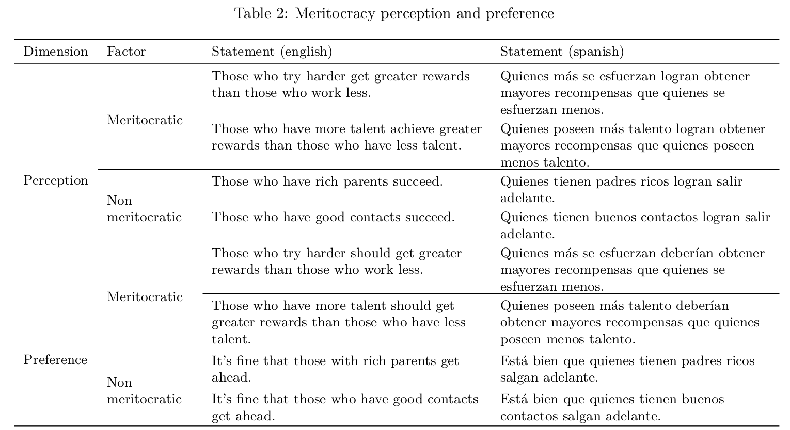
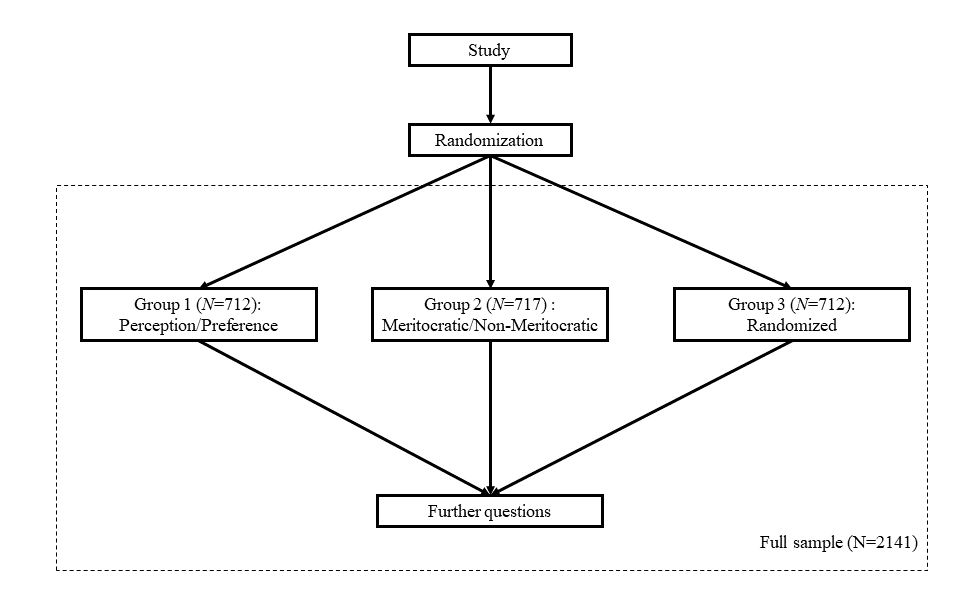
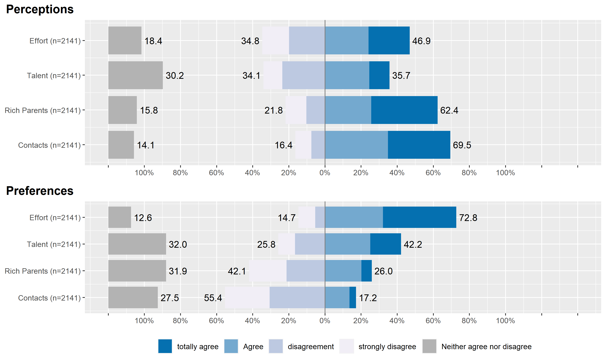

```{r setup, include=FALSE}
knitr::opts_chunk$set(warning = FALSE,message = FALSE, cache = FALSE)
knitr::opts_knit$set(root.dir = "../")
options(scipen=999)
rm(list=ls())
options(knitr.kable.NA = '')
```

```{r message=FALSE, warning=FALSE, include=FALSE}
library(knitr)
library(kableExtra)
library(dplyr)
#install.packages("captioner")
library(captioner)
```

```{r message=FALSE, warning=FALSE, include=FALSE}
table_nums<-captioner(prefix = "Table")
plot_nums<-captioner(prefix = "Figure")
diam_nums<-captioner(prefix = "Diagram")
anx_nums<-captioner(prefix = "Annexed")

table_nums("ta", "Dimensions of meritocratic beliefs.")
table_nums("tb", "Items according to dimension.")
table_nums("tc", "Descriptive statistics of the scale.")
table_nums("td", "Factor loads and model fit.")
table_nums("te", "Comparison between model fit.")

diam_nums("da", "Survey flow")
diam_nums("db", "Theorical model")

plot_nums("fa", "Descriptive boxplot of the scale.")
plot_nums("fb", "Polychoric correlation.")

anx_nums("aa", "Representativeness of the sample.")
```


<div style="text-align: justify">

# Introducción

La desigualdad económica se ha vuelto un tema que genera creciente preocupación y malestar alrededor del mundo. Esto se ha expresado en una serie de protestas como la emblemática "occupy wall street" el año 2011, así como también en una serie de análisis críticos respecto del desarrollo del capitalismo y sus consecuencias [@PikettyCapitalTwentyFirstCentury2014b]. En este contexto, el estudio de las visiones, preferencias y percepciones respecto de la desigualdad han adquirido relevancia en las ciencias sociales, en temas como las preferencias redistributivas [@alesina_Fairness_2005; @dimick_Models_2018] la legitimación de la desigualdad económica [@schroder_Income_2017]  y el funcionamiento de la meritocracia [@Duru-BellatWhoMeritocracyIndividual2012b; @MijsParadoxInequalityIncome2019b; @ReynoldsPerceptionsMeritocracyLand2014b].

En general, la meritocracia se define como un sistema de distribución de recursos y recompensas basados en el mérito individual, que en su concepción original es una suma de talento y esfuerzo [@young_rise_1962] y que pone en un lugar secundario interferencia de factores estructurales como la herencia o los contactos [@breenClassInequalityMeritocracy1999; @saundersMightBritainBe1995; @yairMeritocracy2007; @landWeSatTable2006; @youngRiseMeritocracy1994]. Una serie de estudios han realizado críticas a la realización de este estándar moral de distribución, planteando que es una promesa incumplida dada la influencia preponderante de otros elementos más allá del mérito en el estatus individual [@WitteveenReconsideringmeritocraticpower2020a; @arrow_meritocracy_2000; @goldthorpe_myth_2003; @markovits_Meritocracy_2019]. Por otro lado, desde la psicología social y la sociología se han estudiado las características y consecuencias de las creencias en la meritocracia, en general basados en la hipótesis que mayor creencia en la meritocracia lleva a una mayor legitimación de las desigualdades [@PremingerMeritocracyserviceethnocracy2020; @TrumpWhenwhyeconomic2020; @Meredithsocietydivisibleblessed2020; @hadjar_meritokratie_2008; @MadeiraPrimesConsequencesSystematic2019].

Debido al rol que cumplen las creencias meritocráticas dentro del pensamiento neoliberal [@Bay-ChengTrackingHomoOeconomicus2015], han surgido múltiples investigaciones que evalúan la relación entre creencias meritocráticas y diversos ámbitos sociales de la actualidad. Se han desarrollado estudios que vinculan la meritocracia con el reforzamiento de estereotipos socioeconómicos, de género y de etnias [@MadeiraPrimesConsequencesSystematic2019; @GirerdNeoliberalismIdeologicalBarrier2020; @PremingerMeritocracyserviceethnocracy2020]. Igualmente, se han desarrollado líneas de investigación que evalúan el efecto de las creencias meritocráticas en el contexto educativo [@GenerettStoriesWeTell2020; @ReayPerilsPenaltiesMeritocracy2020; @OwensENGINESSOCIALMOBILITY2020]. y en el contexto organizacional de las empresas [@PerezAdvancingcareersmerit2020; @AielloNewevidencefirmuniversity2019]

Para poder dar cuenta de los niveles de creencia en la meritocracia los estudios a la fecha generalmente han utilizado algunos indicadores de encuestas ya existentes, y en el menor de los casos se han creado instrumentos ad-hoc. Sin embargo, y como mostraremos más adelante, las formas de medición de meritocracia varían extremadamente entre estudios. Muchas veces fenómenos similares se asocian a indicadores distintos, y también ocurre que fenómenos distintos son medidos con indicadores similares, todo lo cual hace dificulta la comparabilidad entre estudios y el poder avanzar en la comprensión del concepto de meritocracia.

Basados en el análisis crítico de las formas de medición de meritocracia a la fecha, el presente estudio propone un instrumento para medir y relacionar dos aspectos claves en el estudio de la meritocracia: percepciones y preferencias. Además, como un segundo eje de análisis considera la generación de indicadores respecto de aspectos meritocráticos y anti-meritocráticos, demostrando que no son los dos polos de un mismo continuo como muchos estudios anteriores parecen sugerir. La propuesta de medición además está orientada a generar un instrumento lo más breve posible de manera que pueda ser utilizado en encuestas de opinión.

# La medición de los aspectos subjetivos de la meritocracia

A continuación se presenta una revisión de una serie de investigaciones que se han abocado al estudio de la meritocracia y que para ello han hecho una propuesta de medición. El primer eje de análisis tiene que ver con el uso del concepto "creencias" para referir a distintos aspectos subjetivos relacionados con meritocracia. El segundo eje tiene que ver con el uso de indicadores sobre aspectos anti-meritocráticos como el polo opuesto de los meritocráticos.

## La caja negra de las creencias en la meritocracia

Para ejemplificar la confusión del uso de creencias en meritocracia consideremos en primer lugar un artículo reciente de Mijs, donde se expresa la siguiente definición: "when I discuss meritocracy beliefs, I am referring to citizens’ belief in the importance of hard work relative to structural factors." [@mijs_paradox_2019, pg.9]. In the operationalization, this is associated with the following indicator: "how important you think it is for getting ahead in life: (a) hard work", scored in a 1 to 5 likert scale. There are several assumptions behind this decision that are worth discussing:

a. Dimensionality: the item used by Mijs is part of an battery present in several international surveys usually called "get ahead", which presents a series of indicators related to what people consider important to get ahead in life: hard work, education, ambition, wealthy family, right connections, religion, race and gender. For Mijs, other aspects as education, that could be associated to talent, are not meritocratic: "Hard work is arguably the
most meritocratic part of Michael Young’s equation, ‘Merit = Intelligence + Effort’, for the simple fact that intelligence itself is conditioned by a nonmeritocratic factor: who your parents happen to be" (p.5). This is a very strong assumption: effort would not depend on parents influence, and talent is not meritocratic. A similar approach only considering effort as the main element of meritocracy is taken by other authors ho only included effort as an indicator of meritocratic beliefs [@MaitnerEmotionalreactionsunequal2015;@MajorPerceiveddiscriminationworldview2007; @BubakPerceptionsmeritocracynote2019; @solt_economic_2016]. We suggest here is that questions such as whether talent is not meritocratic (or less meritocratic than effort) should be open to empirical scrutiny and not disregarded upfront based on scholars' assumptions. Besides, the use of single indicators for measurement a construct is based on the assumption of a measurement without error.

b. Beliefs: the "get ahead" battery refers to "how important you think it is", considered by Mijs as a belief in meritocracy. Nevertheless, another version of this same battery asks about "how important you think it _should_ be". Which one of both is the "belief"? If we consider belief as related to a normative content, actually the more close version is the "should be", being the other one more close to the perception of the situation. Such distinction was already made by @duru-bellat_whos_2012, who used the item "how important should the number of years spent in education and training be in deciding how much money people ought to earn?" for "desired" meritocracy, whereas for "perceived" meritocracy they use two items: “Would you say that in your country, people are rewarded for their efforts?” and “... people are rewarded for their skills?”. Is the belief in meritocracy a perception or a preference? A comprehensive measurement should be in line with what @duru-bellat_whos_2012 did, in order to open up possibilities of analyzing whether perceptions and preferences are actually the same (i.e. correlation close to 1) or they are different aspects of the same phenomenon. Therefore, two main drawbacks of the term "beliefs" are that (i) it hides different operationalizations of the concept of meritocracy, and (ii) it blurs the distinction between perceptions and preferences. We argue that perceptions and preferences should be disentangled and used together, specially when analyzing preferences. As @son_hing_merit_2011-1 have pointed out, "People can believe that outcomes ought to be distributed on the basis of merit and yet vary in their perceptions of whether this is how society currently operates" (p. 435). In other words, preferences should be interpreted in the context of perception: a large preference for meritocracy certainly means something totally different for someone perceiving high meritocracy than for someone perceiving low meritocracy.

c. Non-meritocratic aspects: @mijs_paradox_2019 make reference to some non-meritocratic aspects as talent, letting this out of the measurement. A different approach was followed by @kunovich_systems_2007, who decide to include non-meritocratic elements in the measurement of meritocracy. Using the items’ battery listing a number of reasons about “How important should be in deciding pay...” (as @duru-bellat_whos_2012 for desired meritocracy), he decided that reasons as education and responsibility are meritocratic and pointed 1 if considered essential, whereas reasons such as having a family and children were pointed 1 if they were considered "not important at all" (i.e. reverse coded). A similar approach was taken by @newman_false_2015, reverse-coding non-meritocratic items, similarly to what occurs with the "Preference for the Merit Principle Scale" [@davey_preference_1999]. The assumption that meritocratic and non-meritocratic elements are the poles of the same continuum was analyzed by @reynolds_perceptions_2014 using the same "get ahead" perceptions' battery items. They consider education, ambition and hard work as meritocratic and other reasons such as wealthy family and right connections and non-mertitocratic. Nevertheless, despite making this distinction the author ends up substracting one dimension from the other, assuming that they are two poles of the same continuum as @kunovich_systems_2007 did.

d. Accounting for measurement error: finally, most of the studies in meritocracy so far have not incorporated the issue of measurement error @brown_confirmatory_2006, using single indicators and/or composite indexes for measuring meritocracy. This means assuming that the construct is measured perfectly by the indicators chosen, going as far as proposing that "we decided to rely on a summative index. In choosing this strategy of index construction, we argue that *support for meritocracy is not a latent variable* [@kunovich_systems_2007 p.653-654]. Some advances were done by @reynolds_perceptions_2014 by doing a principal component analysis of meritocratic and non-meritocratic dimensions, but somewhat contradictorily they end up in a sum index despite proving multidimensionality.

## An instrument proposal

Based on the previous limitations in the measurement of meritocracy presented in the previous section, in this paper we propose and test an instrument with the following characteristics:

- Multidimensional, incorporating previous distinctions between preferences and perceptions as well as between meritocratic and non-meritocratic aspects.
- Multiple indicators for each dimension, in order to account for measurement error in a confirmatory factor analysis context.
- Based on previous indicators as far as possible, for the sake of comparability between studies
- Brief, as to be used in a regular survey. In this point it differs for instance from the proposal of the "Preference for the Merit Principle Scale" [@davey_preference_1999], as they use 15 items just for one dimension (besides the problem of reverse-coding non-meritocratic items).

The proposed measurement framework is based on two axis of analysis, as depicted in Table 1:

`r table_nums("ta")`

|                  	  | Perceptions 	| Preferences 	|
|:-----------------	  |-------------	|-------------	|
| _Meritocracy_     	|             	|             	|
| _Non-meritocracy_ 	|             	|             	|

The first axis distinguishes between different types of "beliefs", using instead the terms perceptions and preferences for meritocracy [@duru-bellat_whos_2012; @son_hing_merit_2011-1]. Perceptions refers to the extent to which people see meritocracy working in their society, which in terms of measurement relates to the "reasons to get ahead" battery, whereas preferences refer to normative expectations that are usually linked to a "should" expression (e.g. whether hard work should be related to payment). The second axis consider the distinction between meritocratic and non-meritocratic dimensions [@reynolds_perceptions_2014]. This aspect has been usually treated as different ends of a same continuum in part of the previous research, an assumption that requieres empirical scrutiny. These non-meritocratic elements usually refer to the use of personal contacts or family advantages to get ahead in life.

Regarding the selection of indicators, most of them some adaptations of previous items that where streamlined in order to a better fit with the specific dimensions. For meritocratic indicators we use effort and talent as the main components of the traditional concept of merit as defined by @young_rise_1962, whereas for non-meritocratic dimensions we use having rich parents and good contacts. The description of the specific items is presented in the methodology section.

**Hypotheses**

* H1. The perception of meritocracy is a latent variable based on indicators of the importance attributed to talent and the effort to get ahead in life.

* H2. The non-meritocratic perception is a latent variable that derives from two indicators related to the agreement with the statement that people with contacts and rich parents manage to get ahead.

* H3. Meritocratic preferences behave as the latent variable based on a normative value of effort and talent.

* H4. Non-meritocratic preferences behave as a latent variable based on the normative value of the use of personal contacts and having rich parents.


# Methodology

## Data collection

The data was obtained through an online questionnaire which was part of a larger study on meritocracy and preferences developed in Chile in 2019 and funded by the national scientific agency FONDECYT. The questionnaire was programmed in Qualtrics and the fieldwork was in charge of an external online survey agency ([netquest.cl](www.netquest.cl))during December 2019 and January 2020. The sample was selected from a non-probabilistic design in three large cities in Chile. The quota method based on age, sex and educational level was used. Quotas were generated based on the survey of the Public Studies Center (CEP, 2019), which has a high prestige in the country and is also the counterpart agency of ISSP (International Social Survey Programme) in Chile. A total sample of 2141 people was collected, excluding those who did not answer the questions on the scale and those who did not accept informed consent. As it usually occurs online samples, there were some limitations in achieving the quotas for lower educational levels.

## Instrument design

The proposed scale of perceptions and preferences about meritocracy consists of 8 indicators that are grouped into 4 dimensions referred above: Perceptions (meritocratic/nonmeritocratic) and preferences (meritocratic/non-meritocratic). In order to achieve at least some comparability with previous studies, the questions were adapted from the items battery "reasons to get ahead" (ISSP/GSS), which are mostly used for operationalizing meritocracy in previous empirical studies [@mijs_paradox_2019; @duru-bellat_whos_2012; @reynolds_perceptions_2014]. The eight items ordered according to dimensions are presented in Table 2. These 8 likert-type items have 5 response alternatives ranging from "Completely disagree"(1) to "Completely agree" (5).

`r table_nums("tb")`



1 XX ojo con esta imagen, titularla en el documento, no en la imagen misma

## Administration sets

With the objective of evaluating the effect of the order of the indicators, the respondents (_n = 2141_) were randomly divided into three groups as explained in __Diagram 1__. The scale was presented to the first group (_n = 712_) in the order that appears in Table 2, in such a way that the items of the same factor are found together. The second group (_n = 717_)was presented with the scale with the items of the same factor separated from each other, in such a way that they were consulted at the same time for their perceptions and preferences of a particular topic (e.g. distribution according to effort). Finally, in the third group (_n = 712_) the items were completely randomized.

2 XX agregar número de sujetos por grupo

3 XX referenciar y titular figuras y tablas compatible con html/pdf

`r diam_nums("da")`



## Methods

For testing the scale's underlying constructs we estimate confirmatory factor analysis models (CFA). The model estimates one factor for each dimension, as represented in the following figure:

`r diam_nums("db")`


CFA was conducted using the `lavaan` package (version 0.6-3; Rosseel, 2020) with diagonally weighted least squares (DWLS) estimation due to the items’ ordinal level of measurement (Kline, 2016; Rosseel, 2020). As recommended by Brown (2008), we assessed model fit by jointly considering the comparative fit index and Tucker-Lewis Index (CFI and TLI; acceptable fit > 0.95), Root of the average squared residual approximation (RMSEA; acceptable fit < 0.08),  Chi-square: (p-value; acceptable fit > 0.05, and Chi-square ratio:> 3).

# Results

## Descriptive analysis

<!-- [Descriptive Table for the PPM-S, by group or the full sample] -->
`r table_nums("tc")`

```{r echo=FALSE}
#load(file = "output/tables/sumdat04.RData");sumdat04
```

4 XX producir tabla y llamar directamente desde la fuente o como imagen [__Pendiente__]
5 XX Agregar gráficos de frecuencia , puede ser tipo trellis 2 x 4, arriba percepción abajo preferencias; la idea es generar un input más claro para la siguiente idea: 

`r plot_nums("fa")`




En general se observa que hay una mayor percepción de aspectos no meritocráticos que meritocráticos, mientras que en el caso de preferencias ocurre lo opuesto. En cuanto a las preferencias, llama la atención el rol preponderante del esfuerzo por sobre el talento.

`r plot_nums("fb")`

```{r echo=FALSE}
load(file = "output/images/correlation.RData")
library(corrplot)
corrplot(cor04$rho,method = "color", type = "upper", tl.col = "black", addCoef.col = "black",diag = FALSE)
```


6 - XX Sobre tablas en general, entonces:
- dejar tabla de descriptivos que ahora aparece junto a la de correlaciones [_Pendiente_ ]
- agregar gráficos (listo)
- reemplazar tabla de correlaciones por un corrplot, creo que se aprecia más claramente el sentido de las asociaciones (listo)


## Models estimation

7 XX En tabla de cargas factoriales, los fit aparecen corridos hacia la izquierda [__Pendiente__]


En una primera instancia se probó el ajuste del modelo con tres distintos órdenes de los ítems, los cuales fueron aplicados a un tercio de la muestra de la primera ola cada uno. El primer orden de los ítems corresponde al orden de de la tabla 2, en el que primero se pregunta a los encuestados por todas las percepciones y después por todas las preferencias, en el segundo orden se les pregunta seguidamente por percepciones y preferencias respecto a un mismo tema, por ejemplo, al papel del esfuerzo, y en el tercero, los ítems aparecen de manera aleatoria.

`r table_nums("td")`

```{r echo=FALSE}
#load(file = "output/tables/tb.fm01.RData");tb.fm01
```


Todos los modelos independiente de los órdenes obtuvieron un ajuste adecuado. con CFI superiores a .95 y RMSEA inferiores a .8, por contraparte ni un modelo logró un chi-square no significativo, aunque tanto el modelo aleatorio como el primero obtuvieron un adecuado chi-square ratio menor a 3. El primero de los órdenes fue el que obtuvo mejor ajuste (CFI=0.998, TLI= 0.995,RMSEA=0.037, χ2(df=14)=28,03, p = 0.014), seguido por el orden aleatorio de los ítems (CFI=0.992, TLI=0.984,RMSEA=0.051, χ2(df=14)=39.09, p < 0.001).  Por su parte, la escala ordenada por temáticas parece generar un efecto framing en el cual la relación entre las percepciones y las preferencias parecen sobreestimadas, afectando de esta manera el ajuste (CFI=0.984, TLI=0.968,RMSEA=.071, χ2(df=14)=64.156, p < 0.001).


8 XX explicar mejor lo que viene: invarianza de qué y por qué se realiza.

Si bien  todas las pruebas obtuvieron indicadores relativamente adecuados, las diferencias mencionadas entre los ajustes de los modelos según orden son estadísticamente significativas, lo cual fue evaluado a partir de un análisis de invarianza. Se concluye que entre los tres órdenes no existe invarianza configuracional, es decir, no poseen la misma dimensionalidad y por ello no ajustan igualmente al modelo teórico [@vandenbergReviewSynthesisMeasurement2000]. Esto se debe al efecto producido por la aparición conjunta de los ítems de un mismo factor en el orden 1, lo cual aumenta el ajuste del modelo.  Además, en el orden 2, al preguntarse seguidamente por la percepción y la preferencia en torno al mismo indicador, aumentan las relaciones cruzadas disminuyendo el ajuste del modelo. De modo coherente, el modelo aleatorio presentó un ajuste intermedio entre el orden 1 y el orden 2.

`r table_nums("te")`

|           | Contrast Model 1 Factor | theoretical model 4 Factors | Model with M.I. |
|:---------:|:-----------------------:|:---------------------------:|:---------------:|
| **n**     |           1769          |             1769            |       1769      |
| **CFI**   |          0.595          |            0.988            |      0.994      |
| **TLI**   |          0.433          |            0.976            |      0.985      |
| **RMSEA** |          0.226          |            0.047            |      0.036      |
| **χ2**    |         1830.839        |            68.661           |      40.250     |
| **p**     |           .000          |             .000            |       .000      |
| **χ2/gl** |          65.38          |             4.90            |       3.32      |

EL modelo teórico propuesto de cuatro factores ajustó, como se observa en la tabla 4, mejor que el modelo de contraste de 1 factor. El modelo teórico ajustó de manera relativamente adecuada, pues muestra indicadores óptimos para CFI= 0.987, TLI = 0.975 y RMSEA=.041, aunque posee indicadores deficientes para la prueba χ2(df=14)=67.6, p-value=.000. Para evaluar posibles mejoras de la escala, se analizaron las relaciones propuestas por los índices de modificación. Estos indican la existencia de dos cargas cruzadas no especificadas. Cuando se generó un modelo siguiendo estas recomendaciones, hubo una mejora considerable del modelo, aunque el nuevo modelo tampoco obtuvo un X2 ratio menor a 3 y obtuvo cargas factoriales muy bajas ʎ < 0.15, por lo tanto, siguiendo las recomendación de Brown (2006) de solo aceptar las propuesta de los índices de modificación cuando se posee teoria y evidencia sólida, se ha decidido no incorporar estos parámetros al modelo.

* agregar cuáles fueron las cargas sugeridas.


# Conclusión

Considerando la ventaja del orden, respecto aleatorio despeja la posibilidad del efecto framing, es decir, de que el resultado del modelo se deba al orden de las preguntas, se ha decidido seguir utilizando el orden 3.

# Conclusiones

uso conjunto percepciones-preferencias

<div/>

# Anexos
`r anx_nums("aa")`

|                     | Sample  |   CEP  |
|---------------------|:-------:|:------:|
| __gender__          |         |        |
| Men                 | 49,82%  | 50,52% |
| Women               | 50.18%  | 49,47% |
| __Age__             |         |        |
| 18 - 24             | 18,55%  | 18,17% |
| 25 - 34             | 18,86%  | 17,48% |
| 35 - 44             | 19.09%  | 19,98% |
| 45 - 54             | 17,96%  | 19,23% |
| 55 - or more        | 25,54%  | 25.11% |
| __Education__       |         |        |
| Primary  or less    | 2,93%   | 15,88% |
| Hig school          | 43,23%  | 37,04% |
| Non university      | 32,63%  | 28,93% |
| university or more  | 21,21%  | 18,13% |


# Bibliografía
