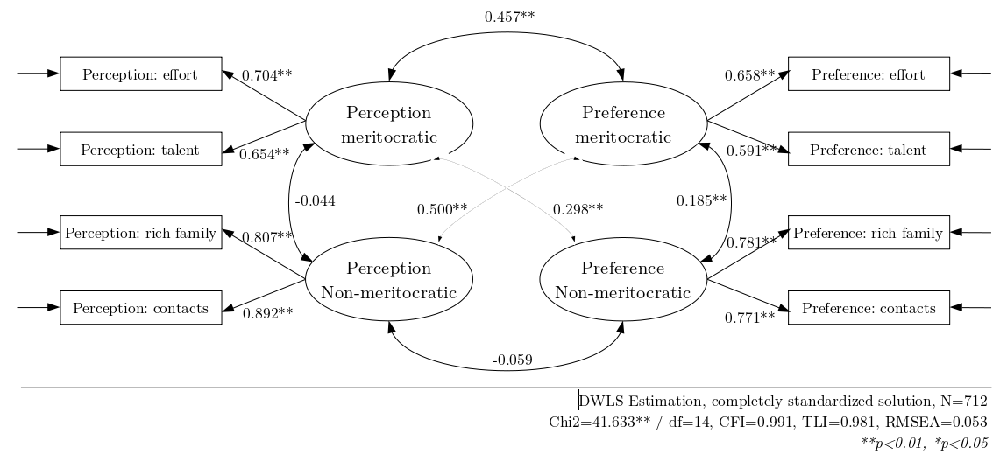

```{r eval=FALSE, include=FALSE}
 # for render in pdf run rmarkdown::render_site("docs/paper.Rmd", output_format = "all")
 # clean #in the yml
 rmarkdown::render("paper-blinded.Rmd", output_format = "bookdown::pdf_document2")
 rmarkdown::render("paper-blinded.Rmd", output_format = "bookdown::html_document2")
 rmarkdown::render("paper-blinded.Rmd", output_format = "bookdown::word_document2")
```

```{r setup, include=FALSE}
 knitr::opts_chunk$set(echo=FALSE, warning = FALSE,message = FALSE, cache = TRUE,out.width = '85%',fig.pos= "H", fig.align = 'center')
 # knitr::opts_knit$set(base.url = "../") #relative path for .html output file
 # knitr::opts_knit$set(root.dir = "../") #relative path for chunks within .rmd files
 options(scipen=999)
 options(kableExtra.auto_format = FALSE)
 rm(list=ls())
 options(knitr.kable.NA = '')
 options(knitr.graphics.error = FALSE)
 Sys.setlocale("LC_ALL", "ES_ES.UTF-8")
```

<!---
\pagebreak

# Acknowledgments

The authors recognize the support of ANID/FONDECYT grant 1160921 and of  the Center for Conflict and Social Cohesion Studies (COES)  grant ANID/FONDAP 1513009.

\pagebreak

--->

\selectlanguage{USenglish} 

# Introduction

Economic inequality and income concentration have become topics of growing concern over the last years, leading to a series of social upheavals in different societies as well as diverse critical analyses regarding the development of capitalism and its consequences [@streeck_politics_2014; @piketty_capital_2014].  In such a context, the study of views, preferences, and perceptions of inequality has acquired relevance in the social sciences, in topics such as redistributive preferences [@alesina_fairness_2005; @dimick_models_2018], the legitimization of economic inequality [@schroder_income_2017] and the functioning of meritocracy [@duru-bellat_who_2012; @mijs_paradox_2019; @reynolds_perceptions_2014; @atria_economic_2020]. Within this research area, and particularly in times of economic and health crises, the ideal of meritocracy has been strongly challenged as an unfulfilled promise of modern societies that allows the perpetuation of social inequalities [@sandel_tyranny_2020; @goldthorpe_myth_2003].

In general, meritocracy has been defined as a system of distribution of resources and rewards based on individual merit, which in its original conception is a combination of talent and effort [@young_rise_1962]. This traditional conception of merit places in a secondary position the possible interference of structural or non-meritocratic factors, such as inheritance, personal contacts, and luck [@breen_class_1999; @saunders_might_1995; @yair_meritocracy_2007; @land_we_2006; @young_rise_1962]. Social psychology and sociology have studied the characteristics and consequences of beliefs in meritocracy, under the general hypothesis that a greater belief in meritocracy emphasizes the role of the individual over structural factors in personal achievements, leading to greater legitimization of inequalities [@preminger_meritocracy_2020; @trump_when_2020; @hadjar_meritokratie_2008; @madeira_primes_2019]. Such research has raised criticism of meritocracy as a moral standard of distribution given the preponderant weight of non-meritocratic elements upon the individual status and social mobility [@sandel_tyranny_2020; @witteveen_reconsidering_2020; @arrow_meritocracy_2000; @goldthorpe_myth_2003; @markovits_meritocracy_2019; @khan_privilege_2013].

Due to the role that meritocratic beliefs play in the justification of individual achievement (or failure) in contemporary societies [@hadjar_meritokratie_2008; @markovits_meritocracy_2019; @sandel_tyranny_2020], multiple studies have evaluated the relationship between meritocratic beliefs and personal and (or) contextual characteristics. For example, some studies have linked meritocracy to the reinforcement of socio-economic, gender, and ethnic stereotypes [@madeira_primes_2019; @girerd_neoliberalism_2020; @girerd_neoliberalism_2020], as well as the effects of meritocratic beliefs in educational [@generett_stories_2020; @owens_engines_2020] and organizational contexts [@perez_advancing_2020; @aiello_new_2019]. Most of such studies so far have used indicators from existing standard social surveys, such as the International Social Survey Programme (ISSP), to measure meritocracy. However, as we will show later, the concepts and instruments used for measuring meritocracy vary extensively among studies. In many cases, similar phenomena are associated with different indicators, and conversely, different phenomena are measured with similar indicators. Such approaches limit the comparability of studies and the capacity to understand the effects of meritocratic beliefs across different disciplines and lines of research.

Based on a critical analysis of different approaches to the measurement of meritocracy to date, this article proposes a conceptual and measurement framework that considers two of the main aspects in the study of meritocracy: perceptions and preferences. Furthermore, it distinguishes between meritocratic and non-meritocratic dimensions, as they would not be two poles of the same continuum as previous studies suggest. This conceptual framework is oriented to develop a measurement instrument as simple and brief as possible, suitable for public opinion surveys and thus allowing to integrate meritocratic beliefs in studying different social phenomena.

## The black box of meritocratic beliefs {-#blackbox}

In the following, we discuss four critical aspects in studies conceptualizing and measuring meritocracy, based upon which we develop a conceptual and measurement proposal.

a. _Conceptual components_: Is merit only effort?

One recent definition of meritocracy by @mijs_paradox_2019 is the following: "When I discuss meritocracy beliefs, I am referring to citizens' belief in the importance of hard work relative to structural factors." [@mijs_paradox_2019, pg.9]. In the subsequent operationalization, this is associated with the following question and indicator: "how important you think it is for getting ahead in life: (a) hard work", scored on a likert scale. The assumptions behind such a definition are worth discussing in light of the conceptual meaning of meritocracy and its possibilities of operationalization.

The item used by @mijs_paradox_2019 is part of an item's battery which is available in several international surveys, usually called "reasons to get ahead." This battery displays a series of indicators related to what people consider important to get ahead: hard work, education, ambition, a wealthy family, the right connections, religion, race, and gender. Therefore, considering only one of the items means that other aspects associated with talent, such as education, would not be deemed meritocratic. As he points out: "Hard work is arguably the most meritocratic part of Michael Young's equation: 'Merit = Intelligence + Effort', for the simple fact that intelligence itself is influenced by a non-meritocratic factor: who your parents happen to be" (p.5).

In this conceptual and measurement approach of meritocratic beliefs, we can observe a couple of strong conceptual assumptions: a) effort would not depend on parental influence (at least not as strongly as intelligence), and b) talent (as innate ability) is not meritocratic (contrary to Michael Youngs' original conceptualization). This conceptual and measurement-based assumption is found in other studies, which also assume effort to be the main and only aspect of meritocracy [@girerd_neoliberalism_2020; @bubak_perceptions_2019], raising the question: Is effort the only (or main) dimension behind the concept of meritocracy? We argue that whether talent (as intelligence and ability) is or is not considered meritocratic is an interesting topic to discuss from a philosophical point of view, but it also requires empirical evidence in studies focused on the subjective aspects of inequality. Furthermore, considering talent as part of meritocracy certainly opens some interesting avenues of research, for instance, some studies suggest that for the elites meritocracy is related to talent, whereas effort is more characteristic of the meritocracy of the middle and lower classes [@atria_economic_2020]. Therefore, we propose that a concept (and measure) of meritocracy benefits from including both talent and effort as in the original Young's conception.

b. _Beliefs?_

Several approaches to the empirical study of meritocracy based on public opinion surveys refer to the concept of _beliefs_, but with wide differences in meanings and operationalizations. To illustrate this point let us consider the commonly used "reasons to get ahead" battery, mentioned above. Some versions of this battery ask "how important you think it is for getting ahead in life" and then list several factors, whereas another version of this same battery - sometimes presented along the previous one - asks about "how important you think it _should_ be ...", and then listing the same concepts.  Therefore, the question raised here is: Which one of both is a "belief": what _is_ (the first one) or what it _should_ be (the second one)?

The term belief has an ambiguous character in the literature, conceived as "idea-elements" by @converse_nature_1964 or "considerations" by @zaller_nature_1992. As @kluegel_beliefs_1986 pointed out about the scope of beliefs: "This usage encompasses such more specific social-psychological concepts as values, perceptions, and attitudes" (p.30). Therefore, beliefs use to cover almost anything related to subjective factors. In this regard, a relevant distinction in the field of inequality beliefs was made by @janmaat_subjective_2013: "Perceptions refer to subjective estimates of existing inequality (i.e., thoughts about what is). Beliefs are here defined as normative ideas about just inequality (i.e., thoughts about what should be)"(p.359). Several papers dealing with meritocracy use the term beliefs (i.e. what should be), while referring to perceptions (i.e., what is). For instance,  in @reynolds_perceptions_2014, the term belief is used to talk about what @janmaat_subjective_2013 refers to as perceptions, whereas other authors use general terms such as attitudes [@kunovich_systems_2007]. The first attempt to shed light on this issue in meritocracy research was made by @duru-bellat_who_2012, who used the question "how important should the number of years spent in education and training be in deciding how much money people ought to earn?" as a proxy for "desired" meritocracy (normative beliefs). They then determined "perceived" meritocracy, using the questions: "Would you say that in your country, people are rewarded for their efforts?" and "... people are rewarded for their skills?".

Is the belief in meritocracy a perception or a preference with normative meaning? To expand the analytical conceptual framework, we believe that both dimensions should be considered, as proposed by @duru-bellat_who_2012. Such an approach opens up the possibility of analyzing whether perceptions and preferences are related (i.e., have a high correlation), or constitute independent aspects of the same phenomenon. As @sonhing_merit_2011 has pointed out, "People can believe that outcomes ought to be distributed based on merit and yet vary in their perceptions of whether this is how society currently operates" (p. 435). In other words, normative beliefs should be considered while taking perceptions into account: a strong normative belief in meritocracy may mean something different to someone perceiving high meritocracy than to someone perceiving low meritocracy. To avoid the confusion generated by the term "belief", we propose the terms meritocratic preferences ("what should be"), and meritocratic perceptions ("what is"), as they better reflect the two facets of meritocracy under scrutiny [@castillo_meritocracia_2019].

c. _Non-meritocratic aspects_

Some research in meritocracy considers aspects usually opposed to effort and talent for personal achievement, for instance, family status and the use of personal advantages (such as contacts or having a wealthy family) to get ahead in life. This distinction refers to the classical achieved and ascribed status dimension from @linton_study_1936.  For instance, @kunovich_systems_2007 used an items' battery following the question “How important each should be in deciding pay..." (as @duru-bellat_who_2012 for desired meritocracy). They consider factors such as education and responsibility as meritocratic, giving them a value of 1 is considered "essential" in the scale response, whereas factors such as having a family or children are valued as 1 when rated as "not important at all" (i.e. reverse coded). The assumption behind this approach is that rejecting a supposed ascribed or non-meritocratic aspect (such as having family and/or children) implies a stronger belief in meritocracy. A similar approach of reverse-coding non-meritocratic items was taken by @newman_false_2015, using the same principles applied in the "Preference for the Merit Principle Scale" [@davey_preference_1999]. 

The assumption that meritocratic and non-meritocratic elements are poles of the same continuum was tested by @reynolds_perceptions_2014 using the "get ahead" perceptions' battery items mentioned above. They considered education, ambition, and hard work as meritocratic, whereas factors such as family wealth and connections were classified as non-meritocratic. Despite making this distinction, in the operationalization the authors end up subtracting one dimension from the other, thus coming back to the assumption that they are two poles of the same continuum, as @kunovich_systems_2007 also did. Similarly, @roex_attitudes_2018 used ISSP indicators for perceived meritocracy and non-meritocracy to build a single score by reverse coding the non-meritocratic items. Therefore, the treatment of non-meritocratic items has been rather inconsistent across studies and the assumption that they are the simple opposite of meritocracy certainly requires further conceptual elaboration and empirical assessment. For instance, a such distinction could open the door to studying to what extent different and contradictory views of meritocracy can coexist, to what extent individuals and societies differ in this regard, and of course the associated factors to such differences. Although the use of the concept "non-meritocratic" is very broad, we prefer to use it instead of other terms like ascription, given that this last one leaves out aspects such as the use of personal relationships as a way to achieve success.

d. _Accounting for measurement error_

Finally, most meritocracy studies have not adequately considered the issue of latent structures and measurement error [@brown_confirmatory_2015; @bollen_structural_1989; @ansolabehere_strength_2008], as they mostly use single indicators and/or simple average indexes for measuring meritocracy. Such a strategy assumes that the latent construct is measured perfectly (i.e., no error or residual variance) by the selected indicators, going as far as to propose that "... In choosing this strategy of index construction, we argue that support for meritocracy is not a latent variable" [@kunovich_systems_2007 p.653-654]. Although Reynolds and Xian [-@reynolds_perceptions_2014] made advances by conducting a principal component analysis of meritocratic and non-meritocratic dimensions, they finally chose to build a sum index despite proving a multidimensional latent structure.

There is a relevant trade-off regarding measurement error estimation in survey scales. Including multiple items per conceptual dimension opens the possibility of validity studies (at least in terms of the construct) by using factor analysis techniques, particularly confirmatory ones. However, increasing the number of items reduces the probability of usability of the scale in survey research given space limitations. This validity-usability conundrum is not easy to solve and, as we will show later in the methods section, we opted for a minimalistic approach oriented to the usability of the scale but that still gives the possibility of confirmatory factor analysis, although with some limitations.

## A conceptual proposal for studying meritocracy {-#instrumentprop}

Based on the previous assumptions and limitations identified in the empirical study of meritocracy, we propose a conceptual and measurement framework with the following characteristics:

- _Multidimensionality_, incorporating previous distinctions between preferences and perceptions, as well as between meritocratic and non-meritocratic aspects.

- Multiple indicators for each dimension to _account for measurement error_ in a confirmatory factor analysis context.

- Based on _previous indicators_ as much as possible to keep comparability between studies. As most of the survey research on meritocracy so far has been made with the inequality module of the ISSP survey, we propose an operationalization suitable for this dataset, as well as a novel scale that attempts to rescue as much as possible the original wording of ISSP items.

- _Brief_, as to be used in regular public opinion surveys [@davidov_measurement_2009]. In this regard, it differs from the proposal of  "Preference for the Merit Principle Scale" [@davey_preference_1999], as they use 15 items for just one dimension (aside from the problem of reverse-coding non-meritocratic items).

The proposed conceptual and measurement framework is depicted in Figure \@ref(fig:merit-model):

```{r merit-model, echo=FALSE, fig.cap = "Conceptual Model of perception and preferences for meritocracy and non-meritocracy", fig.align='center'}
 
```

The columns "Perceptions" and "Preferences" represent the distinction between these two concepts, usually confused under the label "beliefs" [@castillo_meritocracia_2019]. Perceptions refer to the extent to which people observe that meritocracy functions or apply in their society, which relates to items such as "Hard work is important to get ahead in society". Preferences refer to normative expectations that are usually linked to a "should" expression (e.g. whether hard work should be related to payment). The rows in Figure \@ref(fig:merit-model) consider the distinction between meritocratic and non-meritocratic dimensions [@reynolds_perceptions_2014], usually treated as different ends of the same continuum in previous research. Non-meritocratic elements refer to the use of resources such as personal contacts and/or family advantages to get ahead in life.

# Methodology

```{r message=FALSE, warning=FALSE, include=FALSE, echo=FALSE}
  #RUN THIS BEFORE THE ANALYSIS
  pacman::p_load(knitr)
  table_format = if(is_html_output()) {
    "html"
  } else if(is_latex_output()) {
    "latex"
  }

  table_format2 = if(is_html_output()) {
    T
  } else if(is_latex_output()) {
    F
  }
```

The analysis is organized into three studies. Study 1 serves as a background to our instrument proposal by attempting to operationalize the meritocracy conceptual model with available secondary data from the inequality module of the International Social Survey Programme (ISSP). Study 2 consists of the proposal of a new scale for measuring meritocratic perceptions and preferences. Finally, in Study 3 we perform an additional validity analysis of the meritocracy scale.

# Study 1: Analyzing meritocracy with ISSP data

## Data

The data corresponds to the social inequality module from the International Social Survey Programme (ISSP), the most specialized international comparative survey in perceptions, attitudes, and beliefs about inequality-related issues [  @issp-research-groupInternationalSocialSurvey2017]. This wave corresponds to 2009 and covers attitudes towards a series of topics dealing with social inequality across 41 countries and 56,021 individuals. Although there is data available from this module for a more recent wave (2019), the 2009 wave contains relevant items for studying meritocracy that unfortunately are not present in the last wave. Table \@ref(tab:countries) shows details about the sample of countries.

## Variables

There are a series of indicators in the ISSP survey that in the following we attempt to classify in our meritocracy conceptual scheme, as presented below in Table \@ref(tab:table-issp):

```{r table-issp, echo=FALSE}
 # if (!require("pacman")) install.packages("pacman")
 # remotes::install_github('haozhu233/kableExtra@a6af5c0')  # for problems with collapse_rows()
library(knitr)
library(kableExtra)
library(dplyr)
#  pacman::p_load(knitr, kableExtra, dplyr)
  table_format = if(knitr::is_html_output()) {
    "html"
  } else if(knitr::is_latex_output()) {
    "latex"
  }

  tableissp <- read.csv(file = "input/tables/table-issp.csv",header = 1,sep = ";",encoding = "UTF-8") # call file generated externally for the table
  cnames <- c("Component", "Dimensions","Item")
  cap <- "Items of the ISSP meritocratic perceptions and preferences measures"

  knitr::kable(tableissp, table_format, booktabs = T, linesep = "",col.names = cnames, caption = cap) %>%
    kableExtra::kable_styling(
      full_width = F,
      latex_options = c("hold_position"),
      position = "center",
      font_size = 10,
      bootstrap_options=c("striped", "bordered")) %>%
    kableExtra::column_spec(column = 1, width = "2cm", ) %>%
    kableExtra::column_spec(column = 2,width = "5cm") %>%
    kableExtra::column_spec(column = 3,width = "8cm") %>%
    kableExtra::collapse_rows(columns = 1:2,valign = "middle")
```

- _Perception of meritocracy/non-meritocracy_: for operationalizing perceptions the closest set of ISSP's indicators comes from the question asking about perceptions for opportunities to get ahead, which are usually considered as "meritocratic beliefs" in previous studies. The general heading of the battery is: _"To begin we have some questions about opportunities for getting ahead. Please tick one box for each of these to show how important you think it is for getting ahead in life."_ This is followed by a list of statements to be rated from 1 to 5: essential, very important, fairly important, not very important, not important at all.

The classification of the items is based on criteria of internal motivation (meritocratic) and structural constraints (non-meritocratic). There were two items from the battery that were excluded from the analysis as they would not fit into the classification. The first one was "having good education yourself" since it was not clear whether this could be due to individual motivation or system opportunities, and the second was "giving bribes", as introduced elements of criminality that were beyond a non-meritocratic perception.

- _Preferences for meritocracy-non meritocracy_: for the operationalization of normative preferences we used a list of items related to reasons for pay battery. The ISSP question was: _In deciding how much people ought to earn, how important should each of these things be, in your opinion_, rated in the same _essential-non important at all_ scale (1 to 5) as the questions for meritocratic perceptions.

## Methods

The estimation of the measurement model was performed using Confirmatory Factor Analysis (CFA). CFA was conducted using the `lavaan` R package (version 0.6-3; @rosseel_lavaan_2012a), with diagonally weighted least squares (DWLS) estimation due to the items' ordinal level of measurement [@kline_principles_2016; @rosseel_lavaan_2012a]. As recommended by @brown_confirmatory_2015, we assessed model fit by jointly considering the comparative fit index and Tucker-Lewis Index (CFI and TLI; acceptable fit > 0.95), Root of the average squared residual approximation (RMSEA; acceptable fit < 0.08),  Chi-square: (p-value; acceptable fit > 0.05, and Chi-square ratio > 3).

## Results

### Descriptive analyses

Figure \@ref(fig:likert-issp) shows the distribution of responses across the selected items in their corresponding dimensions. On the one side, we observe a high degree of importance attributed to factors such as hard work and ambition for getting ahead, concentrating 94.9% and 92.8% in the _fairly important_ to _essential_ categories, respectively. By contrast, the perception of non-meritocratic aspects is rated lower than the meritocratic ones, particularly for gender, race, and political connections. Regarding normative preferences, we observe that the meritocratic ones are deemed as important (from fairly to essential) for nearly the whole sample, decreasing slightly for the non-meritocratic ones. Still, we have to consider that the preferences for non-meritocratic aspects, in this case, refer to the distributive principle of need rather than personal background (as in the perceptions of non-meritocracy), which certainly is one of the limitations of this set of items for the operationalization of the proposed conceptual framework with this dataset.

```{r build-likert}
  load(file = "input/data/proc/data_s1.RData")
  if (!require("pacman")) install.packages("pacman")
  pacman::p_load(dplyr,sjPlot, ggplot2, sjlabelled,sjmisc, ggpubr)
  likert_issp<- data_s1 %>%
    dplyr::select(hwork,ambition,wealthy,pareduc,
                  race,gender,people,polcone,
                  welljob,hardjob,family,child) %>% na.omit() #Subset variables
  # Set labels for each variable
  likert_issp <- sjlabelled::set_label(likert_issp,
                                       label = c("Hard work",
                                                 "Having ambition",
                                                 "Wealthy family",
                                                 "Educated parents",
                                                 "Race",
                                                 "Gender",
                                                 "Knowing people",
                                                 "Political connections",
                                                 "Well job",
                                                 "Hard job",
                                                 "Support family",
                                                 "Has children"))
  #Reverse coding (ONLY) for plot
  likert_issp <- sjmisc::rec(likert_issp, rec="rev", append=FALSE)
  #Set value labels for plot
  likert_issp <-
    sjlabelled::set_labels(likert_issp,
                           labels = c("Essential","Very important","Fairly important",
                                      "Not very important","Not important at all"))

  # Declare ggplot2 features
  ggplot2::theme_set(ggplot2::theme(panel.background = ggplot2::element_rect(fill = "gray85",
                                                                             colour = "gray85"),
                                    panel.border = ggplot2::element_blank(),
                                    axis.text.y = ggplot2::element_text(size = 13,
                                                                        hjust = 1),
                                    title = ggplot2::element_text(size = 13,
                                                                  face = "bold"),
                                    legend.text = ggplot2::element_text(size = 12),
                                    plot.caption = ggplot2::element_text(size = 10,
                                                                         face = "plain",
                                                                         hjust = 1)))
  #Plot 1: Perception meritocratic
  p1<- likert_issp %>%
    dplyr::select(hwork_r:ambition_r) %>%
    sjPlot::plot_likert(geom.colors = "PuBu",
                        grid.range  =  c (1.2 , 1.2),
                        title = "a. Perception meritocratic",
                          geom.size = c(0.62),
                          catcount = 5,
                          expand.grid = T,
                          values  =  "sum.outside",
                          reverse.colors = T,
                          reverse.scale = F,
                          show.n = FALSE) +
    ggplot2::theme(legend.position = "none")
  #Plot 2: Perception Non-meritocratic
  p2<-likert_issp %>%
    dplyr::select(wealthy_r:polcone_r) %>%
    sjPlot::plot_likert(geom.colors = "PuBu",
                        grid.range  =  c (1.2 , 1.2),
                        title = "b. Perception Non-meritocratic",
                          geom.size = c(0.9),
                          catcount = 5,
                          expand.grid = T,
                          values  =  "sum.outside",
                          reverse.colors = T,
                          reverse.scale = F,
                          show.n = FALSE)  +
    ggplot2::theme(legend.position = "none")
  #Plot 3: Preference meritocratic
  p3<-likert_issp %>%
    dplyr::select(welljob_r:hardjob_r) %>%
    sjPlot::plot_likert(geom.colors = "PuBu",
                        grid.range  =  c (1.2 , 1.2),
                        title = "c. Preference meritocratic",
                          geom.size = c(0.62),
                          catcount = 5,
                          expand.grid = T,
                          values  =  "sum.outside",
                          reverse.colors = T,
                          reverse.scale = F,
                          show.n = FALSE) +
    ggplot2::theme(legend.position = "none")
  #Plot 4: Preference Non-meritocratic
  p4<-likert_issp %>%
    dplyr::select(family_r:child_r) %>%
    sjPlot::plot_likert(geom.colors = "PuBu",
                        grid.range  =  c (1.2 , 1.2),
                        title = "d. Preference Non-meritocratic",
                          geom.size = c(0.62),
                          catcount = 5,
                          expand.grid = T,
                          values  =  "sum.outside",
                          reverse.colors = T,
                          reverse.scale = F,
                          show.n = FALSE) +
    ggplot2::theme(legend.position = "none")

  #Legend: Extract legend for the final plot using ggpubr
  leg<- ggpubr::as_ggplot(
    ggpubr::get_legend(
      dplyr::select(likert_issp, family_r:child_r) %>%
        sjPlot::plot_likert(geom.colors = "PuBu", catcount = 5) +
        ggplot2::scale_fill_brewer(
          breaks = c(5:1),
          direction = -1,
          labels = c("Not important at all","Not very important","Fairly important",
                     "Very important","Essential")) +
        ggplot2::theme(legend.position = "bottom")
      )
    )
```

```{r likert-issp,fig.height=11,fig.width=11,fig.cap="Distribution of responses in the ISSP meritocracy items", out.width='80%'}
  # dev.copy(png,'output/images/Fig2.plotlikert-study1.png', width = 800, height = 600) # save image
  if (!require("pacman")) install.packages("pacman")
  pacman::p_load(cowplot, dplyr)
  #Final plot
  cowplot::add_sub(
    cowplot::plot_grid(p1,p2,p3,p4,leg, #plot 1,2,3,4 and legend (bottom)
      align = "hv",
      axis = "a",
      nrow = 5, #5 plots
      ncol = 1, #1 column
      rel_heights = c(1,2,1,1,0.25) #fig size within plot
      ),
    label = paste0(
      "Source: Authors calculation based on International Social Survey Programme - Social Inequality 2009",
      " (n=",dim(likert_issp)[1],")"
      ),        # Caption: source and sample size
    size = 10,  # Caption font size
    hjust = 0.25# Caption align
    ) %>%
    cowplot::ggdraw()
    # dev.off()
```

In terms of the association between the indicators, Figure \@ref(fig:corr-issp) shows the polychoric correlation matrix. Firstly, we observe in general that the moderate to high associations are between the pairs of items representing each of the dimensions as described in Table \@ref(tab:table-issp). The exception here is the dimension of non-meritocratic perception, in which six items appear mostly associated by pairs according to their specific topics (family background, personal background, and connections). Still, between this same set of items, moderate correlations (around 0.3) could anticipate a single latent factor underlying non-meritocratic perception, which is tested next through confirmatory factor analysis.

```{r corr-issp,fig.cap = "Perceptions and preferences for ISSP  meritocracy items' polychoric correlations", fig.align='center',fig.height=6,fig.width=8}
  # dev.copy(png,'output/images/Fig3.plotcor-study1.png', width = 800, height = 600) # save image
  load(file = "input/data/proc/data_s1.RData")
  if (!require("pacman")) install.packages("pacman")
  pacman::p_load(dplyr, corrplot, lavaan)
  # create polychoric correlation matrix
  cor_issp<-
    data_s1 %>%
    dplyr::select(hwork,ambition,wealthy,pareduc,
                  race,gender,people,polcone,
                  welljob,hardjob,family,child) %>%
    lavaan::lavCor(., ordered=names(.))
  diag(cor_issp) = NA #set diagonal values to NA
  # Set Row names of the matrix
  rownames(cor_issp) <- c("A. Hard work",
                         "B. Having ambition",
                         "C. Wealthy family",
                         "D. Educated parents",
                         "E. Race",
                         "F. Gender",
                         "G. Knowing people",
                         "H. Political connections",
                         "I. Well job",
                         "J. Hard job",
                         "K. Support family",
                         "L. Has children")
  #set Column names of the matrix
  colnames(cor_issp) <-c("(A)", "(B)","(C)","(D)","(E)","(F)","(G)",
                         "(H)", "(I)","(J)","(K)","(L)")

  #Plot the matrix using corrplot
  corrplot::corrplot(cor_issp,
    method = "color",
    addCoef.col = "#000390",
    type = "upper",
    tl.col = "black",
    col=colorRampPalette(c("white","#0068DC"))(12),
    bg = "white",
    na.label = "-")
    # dev.off()
```

### Confirmatory Factor Analysis

Table \@ref(tab:sum-fit-issp) shows the results of the estimation of two confirmatory models. The first one (First Order) corresponds to a model that estimates four factors, each for one of the dimensions presented in  Table \@ref(tab:table-issp), with only regular fit indicators (CFI=0.959, TLI=0.944, RMSEA=0.098, $\chi^2$(df=48)= 21308.535). Further analysis showed that the sources for poor fit were mostly related to the items of the non-meritocratic perceptions, which as mentioned above displayed correlations among them not taken into account in this model specification.

```{r sum-fit-issp}
  load(file = "input/data/proc/data_s1.RData")
  if (!require("pacman")) install.packages("pacman")
  pacman::p_load(dplyr, kableExtra, knitr,lavaan)
  table_format = if(knitr::is_html_output()) { #conditional instructions for kable
    "html" #if html set "html" in format
  } else if(knitr::is_latex_output()) {
    "latex"#if latex set "latex" in format
  }

  # meassurement model: First order
  cfa_perpref1 <- '
  	  # latent variables
  	  percmerit =~ hwork + ambition
  	  percnmerit=~ wealthy + pareduc +race + gender +people + polcone
  	  prefmerit =~ welljob + hardjob
  	  prefnmerit=~ family + child
  	  '
  # Model fit: First order
  fit_perpref1 <- lavaan::cfa(cfa_perpref1, data = data_s1,ordered = T)

  # meassurement model: Second order
  cfa_perpref2 <- '
  	  # latent variables
  	  percmerit =~ hwork + ambition
  	  parents =~ wealthy + pareduc
  	  backgrd =~ race + gender
  	  networks=~ people + polcone
  	  percnmerit=~ parents + backgrd + networks
  	  prefmerit =~ welljob + hardjob
  	  prefnmerit=~ family + child
  	  '
  # Model fit: second order
  fit_perpref2 <- lavaan::cfa(cfa_perpref2, data = data_s1,ordered = T)

  # extract fit indices from models and add to table
  sum_fit_issp<- dplyr::bind_rows(
    lavaan::fitmeasures(fit_perpref1)[c("chisq","df","cfi","tli","rmsea")],
    lavaan::fitmeasures(fit_perpref2)[c("chisq","df","cfi","tli","rmsea")]
    )

  # Customize object
  sum_fit_issp$mod <- c("First order","Second order")
  sum_fit_issp$nobs <- c(lavaan::nobs(fit_perpref2),lavaan::nobs(fit_perpref2))
  sum_fit_issp$est <- c("DWLS","DWLS")
  sum_fit_issp <- dplyr::select(sum_fit_issp,mod,nobs,est,dplyr::everything())
  colnames <- c("Model","$N$","Estimator","$\\chi^2$","df","CFI","TLI","RMSEA")

  # Create table
  table_issp_fits <-
    knitr::kable(sum_fit_issp, format=table_format, digits=3, booktabs=T,
                 col.names=colnames,
                 caption = "Summary fit indices according to model",
                 escape = FALSE) %>%
    kableExtra::kable_styling(font_size = 10,
                              full_width = F,
                              latex_options = "HOLD_position",
                              bootstrap_options=c("striped", "bordered"))
  table_issp_fits
```

Attending to the sources of poor fit from the first estimated confirmatory model, we specified a second model that keeps the basic four-factor structure but generates an additional model for the non-meritocratic perceptions as depicted in Figure \@ref(fig:meas02-issp). In this model, the pairs of items in this dimension form three latent factors which at the same time generate a second-order factor of non-meritocratic perceptions, improving the fit of the model.

```{r meas02-issp, echo=FALSE, fig.cap = "Descriptive plot", fig.align='center',fig.cap="Second-order confirmatory factor analysis model using ISSP indicators of Perceptions and Preferences for Meritocracy"}
 knitr::include_graphics('output/images/figure4.PNG')
```

Regarding the correlations between the factors in Figure \@ref(fig:meas02-issp), we observe that perceptions are correlated with preferences, but more strongly for the meritocratic ($r=0.46$) than for the non-meritocratic ($r=0.27$) dimensions. Secondly, both perceptual dimensions (meritocratic and non-meritocratic) depict a moderate correlation ($r=0.30$), suggesting that they are not the opposite poles of the same continuum. Something similar occurs for the correlation between the two dimensions of preferences ($r=0.25$).

Based on the measurement validation, we asses if the proposed measurement strategy can be used in cross-national comparisons. In this line, Figure \@ref(fig:scat1) depicts the correlation of factor scores for Meritocratic Perception and Meritocratic Preferences at the country level. For instance, Bulgaria (BGR) and the United States (USA) appropriately represent the positive association between perception and preferences. In other words, countries that describe merit in their society as an essential factor to get ahead in life also consider that effort and talent should be determinant factors in how much an individual earns. On the other hand, in countries with lower perceived meritocracy, preferences are also low, where Denmark (DNK) and Venezuela (VEN) are representative societies of this association.

Another finding depicted by Figure \@ref(fig:scat1) is the positive association of Non-meritocratic perception with Meritocratic preferences, showing that countries like Bulgaria (BGR) and Philipines (PHL) represent cases with higher Non-meritocratic perceptions and higher preferences for meritocracy. In other words, in societies where people perceive higher importance of non-meritocratic aspects to get ahead in life, people also prefer that merit should be a determinant factor in wages. On the other side, countries like Sweden (SWE) or Denmark (DNK), both Scandinavian societies with strong welfare systems, represent contexts in which non-meritocratic aspects are not described as important, and merit is not considered as a factor that should be determinant in wages.


```{r scat1, fig.cap="Cross-national comparison of non-meritocratic and meritocratic perceptions with meritocratic preference",fig.height=6, fig.width=12}
  load(file = "input/data/proc/data_s1.RData")
  if (!require("pacman")) install.packages("pacman")
  pacman::p_load(dplyr, kableExtra, knitr,lavaan,countrycode,ggplot2,haven,
                 gridExtra)
  table_format = if(knitr::is_html_output()) { #conditional instructions for kable
    "html" #if html set "html" in format
  } else if(knitr::is_latex_output()) {
    "latex"#if latex set "latex" in format
  }

  # meassurement model: Second order
  cfa_perpref2 <- '
  	  # latent variables
  	  percmerit =~ hwork + ambition
  	  parents =~ wealthy + pareduc
  	  backgrd =~ race + gender
  	  networks=~ people + polcone
  	  percnmerit=~ parents + backgrd + networks
  	  prefmerit =~ welljob + hardjob
  	  prefnmerit=~ family + child
  	  '
  # Model fit: second order
  
  fit_perpref2 <- lavaan::cfa(cfa_perpref2, data = data_s1,ordered = F)
  
  df_proc<- data_s1 %>% select(id,v5,wealthy:hardjob)  
  df_proc$ccode <- as.numeric(data_s1$v5)   
  
  
  predicted2 <- lavPredict(fit_perpref2,newdata = data_s1)  
  
  idx <- lavInspect(fit_perpref2, "case.idx")
  fscores <- lavPredict(fit_perpref2)
  ## loop over factors
  for (fs in colnames(fscores)) {
    df_proc[idx, fs] <- fscores[ , fs]
  }

  df_proc <-  df_proc %>%  select(id,ccode,percmerit,prefmerit,prefnmerit) %>% na.omit()  
  
  df_proc$clab <- countrycode(sourcevar = df_proc$ccode,
                            origin = "iso3n",
                            destination = "iso3c")

avg_count <-  
  df_proc %>% group_by(clab) %>% summarise(prefmerit=mean(prefmerit),
                                            percmerit=mean(percmerit),
                                            prefnmerit=mean(prefnmerit))


# create figure 1: perception merit by preferences merit
figure1 <- 
ggplot(avg_count, aes(x=percmerit, y=prefmerit)) +
  # geom_point() + 
  geom_text(label=as.character(avg_count$clab)) +
  geom_smooth(method = "lm") +
  xlab("Meritocratic perception")+
  ylab("Meritocratic preference")  
# create figure 2: perception non-merit by preferences merit
figure2 <- 
ggplot(avg_count, aes(x=prefnmerit, y=prefmerit)) +
  # geom_point() + 
  geom_text(label=as.character(avg_count$clab)) +
  geom_smooth(method = "lm") +
  xlab("Non-meritocratic perception")+
  ylab("Meritocratic preference") 

  
grid.arrange(figure1, figure2, ncol = 2,
             bottom = grid::textGrob(label = paste0("Source: Authors calculation based on International Social Survey Programme - Social Inequality 2009",
      " (n=",dim(df_proc)[1],")"),
                                     hjust = 0.1,
                                     gp = grid::gpar(fontface = 1, fontsize = 9)))
```

## Discussion Study 1

Although it was possible to get an adequate fit of the model to the pooled data from ISSP, there are several aspects to take into account when using these items for measuring meritocracy. First of all, these items were not specifically designed based on a conceptual approach to meritocracy, but it still is possible to find a certain fit of the model to the data after minor adjustments. Secondly, some of the items in similar dimensions refer to different concepts, for instance, meritocratic perceptions are related to ambition and hard work, whereas meritocratic preferences deal with how well a job is done. A better operationalization would require more alignment between the different sides of the same concept. And thirdly, the scale is rather unbalanced given the larger amount of non-meritocratic perception items, producing correlated errors. All these limitations are taken into account next in the design of Study 2.

Concerning the meritocratic / non-meritocratic distinction in previous studies, we can preliminary conclude that the wide use of reverse-coding for non-meritocratic items attempting to measure meritocracy is not an adequate operationalization of the construct. Meritocracy and non-meritocracy are related but different concepts, meaning that it is theoretically possible to find different combinations at individual and contextual levels. This finding opens a series of avenues for future research that are considered in the conclusions.


# Study 2: The Perceptions and Preferences for Meritocracy Scale

## Data

The data comes from an online survey that was part of a larger study on meritocracy and preferences developed in Chile in 2019, funded by the Chilean National Scientific Agency (ANID). The questionnaire was programmed in Qualtrics and the fieldwork was conducted by an external online survey agency ([netquest.com](www.netquest.com)) between December 2019 and January 2020. The sample was selected from a non-probabilistic quota design in three large cities in Chile (Santiago, Concepción & Antofagasta). The quotas for gender, age, and educational levels were generated based on a survey by the Public Studies Center [@cep_encuesta_2019], which is a well-regarded counterpart agency of the ISSP (International Social Survey Programme) in Chile. A total sample of 2,141 people was collected, excluding those who did not sign the informed consent and those not answering the meritocracy response battery. There were no significant differences between our sample and the wider population for most socio-demographic characteristics, except for the educational level (see Table \@ref(tab:rep-samp) in Appendix). As is often the case with online surveys, there were some limitations in achieving the quotas for lower educational levels [@zhang_quota_2018; @boas_recruiting_2020]. This survey was designed as a three-wave panel and the data used in this analysis corresponds to the first wave.

All participants signed the required informed consent and the survey implementation was approved by the ethical committee from Pontificia Universidad Católica de Chile, protocol ID 150811008, April 6th 2016.


## Study design

### Instrument

The proposed scale of meritocratic perceptions and preferences consisted of eight indicators, two for each of the four dimensions listed earlier: Perceptions (meritocratic/non-meritocratic) and preferences (meritocratic/non-meritocratic). Two main criteria oriented this design. The first one was usability in social survey research, for which the scale length must attend spacer restrictions in such studies. Nevertheless, at the same time, the scale should offer possibilities of accounting for measurement error through factor analysis techniques. Although a rule of thumb in latent measurement suggests at least three indicators per dimension, we still opted for two to count with a brief scale. Although such a decision posits some limitations for modeling measurement error, still allows for factor analysis and is a common approach in previous social survey studies with limited items (for instance see @davidov_measurement_2009). The second criterion is to expand the possibilities of comparability with previous studies on meritocracy, by considering some of the items previously used in this research area. To this regard, some of the items were adapted from the items battery "reasons to get ahead" (ISSP/GSS), which has been widely used for operationalizing meritocracy in international research [@mijs_paradox_2019; @duru-bellat_who_2012; @reynolds_perceptions_2014]. The scale items ordered according to their respective dimensions are presented in Table \@ref(tab:table-indicadores). These eight likert-type items have five response alternatives, ranging from "Completely disagree"(1) to "Completely agree" (5).

```{r table-indicadores, echo=FALSE}
 if (!require("pacman")) install.packages("pacman")
 # remotes::install_github('haozhu233/kableExtra@a6af5c0')  # for problems with collapse_rows()
 pacman::p_load(knitr, kableExtra, dplyr)
 table_format = if (knitr::is_html_output()) {
   #conditional instructions for kable
   "html" #if html set "html" in format
 } else if (knitr::is_latex_output()) {
   "latex"#if latex set "latex" in format
 }
 tabitems <- read.csv(file = "input/tables/table01.csv",header = 1,sep = ",",encoding = "UTF-8") # call file  generated externally for the table
 cnames <- c("Component", "Dimensions","Item (English)" , "Item original (Spanish)")
 cap <- "Items of the perceptions and preferences for meritocracy scale."

 knitr::kable(tabitems, table_format, booktabs = T, linesep = "",col.names = cnames, caption = cap) %>%
   kableExtra::kable_styling(
     full_width = T,
     latex_options = c("hold_position"),
     position = "center",
     font_size = 10,
     bootstrap_options=c("striped", "bordered")) %>%
   kableExtra::column_spec(column = 1, width = "1.5cm", ) %>%
   kableExtra::column_spec(column = 2,width = "2 cm") %>%
   kableExtra::collapse_rows(columns = 1:2,valign = "middle")
```

\pagebreak

### Administration sets

To evaluate the effect of indicator ordering in the responses, three different versions of items' order were designed and randomly assigned to the respondents, as depicted in Figure \@ref(fig:appmod). The scale was presented to the first group (_n = 712_) in the order shown in Table \@ref(tab:table-indicadores) according to perceptions and preferences. For the second group (_n = 717_), the order was reorganized according to perceptions and preferences over the same topic, e.g., for the topic of hard work, the item about perception was followed by the item about preference and the same for the rest of the topics. Finally, for the third group (_n = 712_), the items were presented as completely randomized.

```{r appmod, echo=FALSE, fig.cap = "Survey flow", fig.align='center'}
 knitr::include_graphics('output/images/figure6.png')
```

## Methods

To test the scale's underlying constructs, we employed confirmatory factor analysis models (CFA). The models estimated one factor for each of the four proposed dimensions presented in Table \@ref(tab:table-indicadores). As in Study 1, CFA was performed with the `lavaan` R package (version 0.6-3; @rosseel_lavaan_2012a), with diagonally weighted least squares (DWLS) estimation due to the items' ordinal level of measurement [@kline_principles_2016; @rosseel_lavaan_2012a]. The fit indexes and cut-off criteria were the same as the ones used in Study 1.

A pre-registration was made in the OSF platform, available at the following link: [https://osf.io/z45y2](https://osf.io/z45y2/?view_only=adcd496887f2471597b1d6ffb46e492d). This pre-registration includes the hypotheses regarding the four-dimensional conceptual model underlying the scale, the variable measurement levels, the statistical tests to be performed with their respective evaluation parameters, and other important aspects of the research design.

## Results

### Descriptive analyses

The graphs presented in Figure \@ref(fig:plotlikert) display disaggregated and comparable information of the different response categories for each item. Generally, there is more agreement in the perception of non-meritocratic items than in meritocratic ones, while in the preferences, the opposite occurs. Regarding preferences, the predominant role of effort over talent as a criterion of meritocratic preference is noteworthy. All in all, the descriptive results show a critical view of meritocracy, perceiving the operation of non-meritocratic aspects over meritocratic ones, whereas in the preferences the opposite occurs.

```{r produce-likert_s2, include=FALSE}
  if (!require("pacman")) install.packages("pacman")
  pacman::p_load(dplyr,sjPlot, ggplot2, sjlabelled,sjmisc, ggpubr)
  load(file = "input/data/proc/data_s2.RData")
  names(data_s2)
  dat_likert_s2 <- data_s2 %>% dplyr::select(!group) # exclude group variable
  dat_likert_s2 <- sjmisc::rec(dat_likert_s2, rec="rev", append=FALSE)
  names(dat_likert_s2) # reverse coding for likert graph

  table(data_s2$perc_effort)
  table(dat_likert_s2$perc_effort_r) # check ok.
  # update.packages("sjPlot") # please install version 2.8.9 or above
  ggplot2::theme_set(ggplot2::theme(panel.background = ggplot2::element_rect(fill = "gray85",
                                                                             colour = "gray85"),
                                    panel.border = ggplot2::element_blank(),
                                    axis.text.y = ggplot2::element_text(size = 13,
                                                                        hjust = 1),
                                    title = ggplot2::element_text(size = 13,
                                                                  face = "bold"),
                                    legend.text = ggplot2::element_text(size = 12),
                                    plot.caption = ggplot2::element_text(size = 10,
                                                                         face = "plain",
                                                                         hjust = 1)))

  #Plot 1: Perception
  p1<-
    dplyr::select(dat_likert_s2,perc_effort_r:perc_netw_r) %>%
    sjPlot::plot_likert(geom.colors = "PuBu",
                        title = c("a. Perceptions"),
                        geom.size = 0.8,
                        axis.labels = c("Effort", "Talent", "Rich Parents", "Contacts"),
                        catcount = 4,
                        cat.neutral = 3,
                        grid.range  =  c (1.2 , 1.2),
                        values  =  "sum.outside",
                        reverse.colors = T,
                        reverse.scale = F,
                        show.n = FALSE) +
    ggplot2::theme(legend.position = "none")

  #Plot 2: Preferences
  p2<-
    dplyr::select(dat_likert_s2,pref_effort_r:pref_netw_r) %>%
    sjPlot::plot_likert(geom.colors = "PuBu",
                        title = c("b. Preferences"),
                        geom.size = 0.8,
                        axis.labels = c("Effort", "Talent", "Rich Parents", "Contacts"),
                        catcount = 4,
                        cat.neutral = 3,
                        grid.range  =  c (1.2 , 1.2),
                        values  =  "sum.outside",
                        reverse.colors = T,
                        reverse.scale = F,
                        show.n = FALSE)  +
    ggplot2::theme(legend.position = "none")

  #Legend: Extract legend for the final plot using ggpubr
  leg<- ggpubr::as_ggplot(
    ggpubr::get_legend(
    dplyr::select(dat_likert_s2,pref_effort_r:pref_netw_r) %>%
        sjPlot::plot_likert(geom.colors = "PuBu",
                            catcount = 4,
                            cat.neutral = 3) +
      ggplot2::theme(legend.position = "bottom") +
      ggplot2::scale_fill_manual(
        values = c("#b3b3b3ff", "#f1eef6ff", "#bdc9e1ff","#74a9cfff","#0570b0ff"),
        breaks=c("neutral",4,3,2,1),
        labels=c("Neither agree nor disagree","Strongly disagree","Disagree",
                 "Agree","Totally agree")
        )
      )
    )
```

```{r plotlikert, echo=FALSE, fig.align='center', fig.cap="Distribution of responses in the Merit Scale items", fig.height=8, fig.width=11}
  # dev.copy(png,'output/images/Fig6.plotlikert-study2.png', width = 820, height = 600)
  if (!require("pacman")) install.packages("pacman")
  pacman::p_load(cowplot)
  #Final plot
  cowplot::add_sub(
    cowplot::plot_grid(p1,p2,leg, #plot 1,2 and legend (bottom)
      align = "hv",
      axis = "a",
      nrow = 3, #2 plots
      ncol = 1, #1 column
      rel_heights = c(1,1,0.25) #fig size within plot
      ),
    label = paste0("Source: Authors calculations based on Study 2 sample"," (n=",dim(na.omit(dat_likert_s2))[1],")"
      ),        # Caption: source and sample size
    size = 12,  # Caption font size
    hjust = -0.15# Caption align
    ) %>%
    cowplot::ggdraw()
  # dev.off()
```

Attending now to the association among the scale items, Figure \@ref(fig:corpoly) shows the items' polychoric correlations. There are three main aspects to highlight from this correlation matrix.  Firstly, and as expected, the largest correlations are between indicators that correspond to the same factors behind the conceptual model (e.g., perception of meritocracy by effort and by talent, $r=0.52$). Secondly, among these correlations, the highest are those between the non-meritocratic dimension but in perceptions ($r=0.73$) and preferences ($r=0.61$). Thirdly, both items for meritocratic preferences (E and F) are the ones that mostly correlate with the rest of the perceptual items, showing medium to high correlations and indicating that the perception of non-meritocracy would be related to larger meritocratic preferences. Finally, similar to the results of Study 1 with ISSP data, we observe no considerable negative correlations between meritocratic and non-meritocratic aspects, undermining previous studies' assumptions that these dimensions would be the opposite poles of one same continuum [@reynolds_perceptions_2014].

```{r corpoly, echo=FALSE, fig.cap = "Perceptions and preferences for meritocracy items' polychoric correlations", fig.align='center'}
  # dev.copy(png,'output/images/Fig7.plotcor-study2.png',width = 800, height = 600) # save image
  if (!require("pacman")) install.packages("pacman")
  load(file = "input/data/proc/data_s2.RData")
  pacman::p_load(dplyr, corrplot, lavaan)
  # generate polychoric matrix
  cor_s2<- data_s2 %>%
    dplyr::select(perc_effort,perc_talent,perc_wpart,perc_netw,pref_effort,pref_talent,pref_wpart,pref_netw) %>%
    lavaan::lavCor(., ordered=names(.))

  diag(cor_s2) = NA

  rownames(cor_s2) <-c(
      "A. Perception Effort",
      "B. Perception Talent",
      "C. Perception Rich parents",
      "D. Perception Contacts",
      "E. Preferences Effort",
      "F. Preferences Talent",
      "G. Preferences Rich parents",
      "H. Preferences Contacts")
  colnames(cor_s2) <-c("(A)", "(B)","(C)","(D)","(E)","(F)","(G)", "(H)")

  corrplot::corrplot(cor_s2,
    method = "color",
    addCoef.col = "#000390",
    type = "upper",
    tl.col = "black",
    col=colorRampPalette(c("white","#0068DC"))(8),
    bg = "white",
    na.label = "-")
  # dev.off()
```

### Confirmatory Factor Analysis

The present section describes the results of the confirmatory factor analysis estimation. The model estimates four latent factors: perception meritocratic, perception non-meritocratic, preferences meritocratic, and preferences non-meritocratic. Each factor is estimated based on two scale items as detailed in Table \@ref(tab:table-indicadores).

The first step in the analysis consists of comparing the model fit indicators for the three versions of the scale that were randomly assigned to the participants: order according to perceptions/preferences, order according to topics, and a complete random items’ order (see Figure \@ref(fig:appmod)).

```{r model-generation-cfa}
  # Libraries & data
  if (!require("pacman")) install.packages("pacman")
  pacman::p_load(lavaan)
  load(file = "input/data/proc/data_s2.RData")
  # names(data_s2)

  # model
  model_cfa <- '
  perc_merit =~ perc_effort+perc_talent
  perc_nmerit=~perc_wpart +perc_netw
  pref_merit =~ pref_effort+pref_talent
  pref_nmerit=~pref_wpart +pref_netw
  '

  # estimation for each order set
  fit_cfa1 <- lavaan::cfa(model_cfa, data = data_s2[data_s2$group == 1,], ordered = TRUE, std.lv=FALSE)
  fit_cfa2 <- lavaan::cfa(model_cfa, data = data_s2[data_s2$group == 2,], ordered = TRUE, std.lv=FALSE)
  fit_cfa3 <- lavaan::cfa(model_cfa, data = data_s2[data_s2$group == 3,], ordered = TRUE, std.lv=FALSE)
```

```{r table-cfafits, echo=FALSE}
  if (!require("pacman")) install.packages("pacman")
  pacman::p_load(dplyr, kableExtra, knitr)
  table_format = if(knitr::is_html_output()) { #conditional instructions for kable
     "html" #if html set "html" in format
   } else if(knitr::is_latex_output()) {
     "latex"#if latex set "latex" in format
   }
  # extract fit indices from models and add to table
  sum_fit<- dplyr::bind_rows(lavaan::fitmeasures(fit_cfa1)[c("chisq","df","cfi","tli","rmsea")],
                             lavaan::fitmeasures(fit_cfa2)[c("chisq","df","cfi","tli","rmsea")],
                             lavaan::fitmeasures(fit_cfa3)[c("chisq","df","cfi","tli","rmsea")])

  # Customize object
  sum_fit$mod <- c("Version 1","Version 2","Version 3")
  sum_fit$nobs <- c(nobs(fit_cfa1),nobs(fit_cfa2),nobs(fit_cfa3))
  sum_fit$est <- c("DWLS","DWLS","DWLS")
  sum_fit <- dplyr::select(sum_fit,mod,nobs,est,everything())
  colnames <- c("Model","$N$","Estimator","$\\chi^2$","df","CFI","TLI","RMSEA")

  # Create table
  table_cfa_fits <-kable(sum_fit, format=table_format,
                         digits=3,
                         booktabs=T,
                         col.names=colnames,
                         caption = "Summary fit indices according to order versions",
                         escape = FALSE) %>%
    kable_styling(full_width = F,
                  font_size = 10,
                  latex_options = "HOLD_position",
                  bootstrap_options=c("striped", "bordered"))
  table_cfa_fits
```

Table \@ref(tab:table-cfafits) shows the fit indicators of the models estimated for each of the three versions of the items' order described in the methodology. Regardless of the version, all models obtained adequate fit indicators, with CFI's above 0.95 and RMSEA's below 0.08. However, none of the models achieved a non-significant chi-square, as expected in large samples like the one used here. The first version order (perceptions-preferences) was the one obtaining the best fit (CFI=0.993, TLI=0.995, RMSEA=0.034, $\chi2$(df=14)=42.276), whereas version 2 with the fixed order according to merit/non-merit items shows the comparatively worst indicators. The CFA fit indices for the completely randomized items' order (Model 3) keep all the indicators within the acceptable cut-off criteria and controls for possible order effects in the administration of the instrument. The model and parameter estimates for this version are depicted in Figure \@ref(fig:meas02):

```{r meas02, echo=FALSE, fig.cap = "Confirmatory factor analysis of the Perceptions and Preferences for Meritocracy Scale", fig.align='center'}
 # estimation for diagram: summary(fit_cfa3, standardized = TRUE, fit.measures=TRUE)
 
```

Attending to the correlations between the latent variables as depicted in Figure \@ref(fig:meas02), meritocratic preferences are moderate to highly correlated with perceptions, both meritocratic ($r=0.457$) and non-meritocratic ($r=0.500$). The correlation between both types of perceptions ($r=-0.044$) and both types of preferences ($r=0.185$) was low, as well as between non-meritocratic preferences and perceptions ($r=-0.059$). This last finding gives further evidence regarding the lack of unidimensionality of meritocratic and non-meritocratic aspects as assumed by previous studies.

## Discussion Study 2

The estimation performed with different administration sets for the meritocracy scale gives evidence in line with the conceptual model. The four dimensions appear independent but related, with some differences when compared to the estimation with ISSP data in Study 1. The main general difference is that with ISSP data, the four latent dimensions were positively correlated, whereas now some correlations are statistically not different from zero. For instance, perceptions and preferences for meritocracy keep being related, which is not the case for the non-meritocratic pair. Theoretically, this makes more sense, as if someone perceives that meritocracy functions well, they probably will support it more. On the other side, if someone perceives non-meritocracy, this should lead to a more prominent preference for meritocracy as it would constitute a demand for a larger meritocracy when it is not perceived to work.

Despite the good general working of the scale, there are some limitations in interpreting the results given the few items (two) per dimension. As mentioned before, the option of a minimalistic approach in terms of items has advantages and disadvantages: advantages in terms of usability in social surveys with limited space and disadvantages in terms of measurement validity in the estimation of the latent constructs. Aware of this trade-off, next we present additional evidence of validity to complement some of the weaknesses identified.

# Study 3: Additional validity analyses

The modeling for invariance testing has been gaining more relevance in sociological survey studies, mainly due to the interest in the validity of measurement scales in comparative studies in various social and cultural contexts [@davidov_measurement_2014]. In this section, we present the results of an analysis of invariance between groups, testing whether the proposed factorial structure for the meritocracy scale is applicable in a different dataset.

The invariance measurement procedure consists of a series of nested models in which restrictions are progressively incorporated into the parameters of the measurement model. The literature generally suggests that this modeling approach should consider four levels or types of progressive restriction [@milfont_testing_2010; @millsap_statistical_2011; @vandeschoot_checklist_2012]:

1. **Configural:** the model is estimated only indicating the factorial structure used in the CFA.

2. **Weak:** an equality restriction applied to the factor loadings in the different groups; that is, the loadings are forced to be identical in both measurements.

3. **Strong:** equality restrictions added to the intercepts of each indicator.

4. **Strict:** equality restrictions added to the error variances of each indicator.

### Data

For testing the invariance, we compared the data described previously in Study 2 to a different dataset from an online survey carried out during the first half of 2020. The characteristics of this sample in terms of application and coverage are equivalent to those of the previous study. The final sample contains 1,242 cases, where 605 (48.71%) are women, and 637 (51.28%) are men. 48.84% are 45 or older, and 33.97% have tertiary education or higher.

### Variables

The items of the meritocracy scale were identical to the original scale of Study 2 administrated in a randomized order (which corresponds to the application modality of Group 3 in Study 2, as shown in Figure \@ref(fig:appmod)).

### Results

The first step for invariance testing is estimating the configural model, which serves as the baseline for further comparison and is expected to adequately meet the global fit criteria of a measurement model. Although the chi-square statistic is used as a global measure of fit, it is usually complemented with other indexes given its high sensitivity to sample size: the Comparative Fit Index (CFI), which should have a value greater than 0.95; the Root Mean Square Error Approximation (RMSEA), which must be lower than 0.06; and the Standardized Root Mean Square Residuals (SRMR) which must be less than 0.08 [@vandeschoot_checklist_2012]. Besides, the literature on measurement invariance suggests some complementary approaches for evaluating the fit, from which we will consider the incremental adjustment of the fit indexes [@cheung_evaluating_2002; @milfont_testing_2010; @dimitrov_testing_2010] and the ANOVA test for means comparison in nested models [@newsom_longitudinal_2015].

```{r invargroup, echo=FALSE}
  if (!require("pacman")) install.packages("pacman")
  #---Load packages and data -------------------------------------#
  pacman::p_load(dplyr,lavaan,semTools,knitr,kableExtra,stats,gtools)
  options(knitr.kable.NA = '')
  load(file = "input/data/proc/data_s3_inv.RData")
  pov01 <- data_s3_inv %>% dplyr::filter(dataset=="pvw01")
  fs01  <- data_s3_inv %>% dplyr::filter(dataset=="fsw02")

  #-----Meassurement model--------------------------------------#
  model01 <- '
  perc_merit  =~ perc_effort + perc_talent
  perc_nmerit =~ perc_wpart  + perc_netw
  pref_merit  =~ pref_effort + pref_talent
  pref_nmerit =~ pref_wpart  + pref_netw'

  #-----Invariance---------------------------------------------#
  inv01<- semTools::measurementInvariance(model=model01,data=data_s3_inv,group="dataset",estimator = "ML",strict=TRUE,quiet = T)

  conf  <- inv01$fit.configural
  weak  <- inv01$fit.loadings
  strong<- inv01$fit.intercepts
  strict<- inv01$fit.residuals

  tab01<- lavaan::anova(conf,weak,strong,strict,SB.classic=TRUE) %>%
    dplyr::as_tibble() %>%
    dplyr::select("Chisq","Df","chisq_diff"=`Chisq diff`,"df_diff"=`Df diff`,"pvalue"=`Pr(>Chisq)`) %>%
    dplyr::mutate(stars=gtools::stars.pval(pvalue),
           chisqt=paste0(round(Chisq,2)," (",Df,") "),
           decision=ifelse(pvalue>0.05,yes = "Accept",no = "Reject"),
           model=c("Configural","Weak","Strong","Strict"))

  fit.meas<- dplyr::bind_rows(lavaan::fitmeasures(inv01$fit.configural,output ="matrix")[c("chisq","df","cfi","rmsea","rmsea.ci.lower","rmsea.ci.upper"),],
                              lavaan::fitmeasures(inv01$fit.loadings,  output ="matrix")[c("chisq","df","cfi","rmsea","rmsea.ci.lower","rmsea.ci.upper"),],
                              lavaan::fitmeasures(inv01$fit.intercepts,output ="matrix")[c("chisq","df","cfi","rmsea","rmsea.ci.lower","rmsea.ci.upper"),],
                              lavaan::fitmeasures(inv01$fit.residuals, output ="matrix")[c("chisq","df","cfi","rmsea","rmsea.ci.lower","rmsea.ci.upper"),])

  # compute differences in chisq, df, cfi and rmsea (90%, lower.ci - upper.ci )
  fit.meas<- fit.meas %>%
    dplyr::mutate(diff.chi2 = chisq    - lag(chisq,default = dplyr::first(chisq)),
           diff.df   = df       - lag(df,   default = dplyr::first(df)),
           diff.cfi  = cfi      - lag(cfi,  default = dplyr::first(cfi)),
           diff.rmsea   = rmsea - lag(rmsea,default = dplyr::first(rmsea))) %>%
    round(3) %>%
    dplyr::mutate(rmsea.ci=paste0(rmsea," \n ", "(",rmsea.ci.lower,"-",rmsea.ci.upper,")"))

  tab.inv<- dplyr::bind_cols(tab01,fit.meas) %>%
    dplyr::select(model,chisqt,cfi,rmsea.ci,diff.chi2,diff.df,diff.cfi,diff.rmsea,stars,decision) %>%
    dplyr::mutate(diff.chi2=paste0(diff.chi2," (",diff.df,") ",stars)) %>%
    dplyr::select(model,chisqt,cfi,rmsea.ci,diff.chi2,diff.cfi,diff.rmsea,decision)

  #clean values
  tab.inv[tab.inv == c("0 (0) ")] <- NA
  tab.inv[tab.inv == c(0)] <- NA

  ### Check an alternative method
  configural        <- lavaan::cfa(model01, data=data_s3_inv, group = "dataset", estimator="ML")
  weak.invariance   <- lavaan::cfa(model01, data=data_s3_inv, group = "dataset",group.equal = "loadings", estimator="ML")
  strong.invariance <- lavaan::cfa(model01, data=data_s3_inv, group = "dataset",group.equal = c( "loadings", "intercepts"), estimator="ML")
  strict.invariance <- lavaan::cfa(model01, data=data_s3_inv, group = "dataset",group.equal = c( "loadings", "intercepts", "residuals"), estimator="ML")

  table_format = if(is_html_output()) {
    "html"
  } else if(is_latex_output()) {
    "latex"
  }

  col.nam <- c("Model","$\\chi^2 (\\text{df})$","CFI","RMSEA (90 CI)",
               "$\\Delta \\chi^2 (\\Delta \\text{df}$)","$\\Delta \\text{CFI}$","$\\Delta \\text{RMSEA}$","Decision")
  footnote <- paste0("N = ","; Group 1, n = ",conf@Data@nobs[[1]],"; Group 2, n = ",conf@Data@nobs[[2]], ", ***p < 0.001")

  knitr::kable(tab.inv, col.names = col.nam, align = "l",
        booktabs=TRUE,format = table_format,escape = FALSE,
        caption = "Multiple Group measurement invariance for Perceptions and Preferences for Meritocracy") %>%
    kableExtra::kable_styling(full_width = FALSE,
                              latex_options = "HOLD_position",
                              bootstrap_options=c("striped", "bordered"),
                              font_size = 10) %>%
    kableExtra::footnote(general = footnote, footnote_as_chunk = T)
```

Table \@ref(tab:invargroup) shows the results of the measurement invariance estimation. When attending to the traditional invariance test of $\Delta \chi^2 (\Delta \text{df})$, the results support the invariance at the strong level meaning that the fit of the factor model of the merit scale is equivalent across samples when constraining factor loadings and intercepts to being equal. Such result is considered in general as evidence of invariance [@fischer_are_2011], as strict forms of measurement invariance rarely hold [@vandeschoot_checklist_2012]. Still, the comparability of latent means requires strict invariance which in this case does not hold when considering just $\Delta \chi^2 (\Delta \text{df})$. Nevertheless, the criteria of $\Delta \text{CFI}$ used for comparing models is close to the rejection criteria of >.01, whereas the $\Delta \text{RMSEA}$ fulfills the requirements of being below the cut-off criteria as suggested by [@chen_sensitivity_2007]. Therefore, using this last standard, the level of strict invariance would hold for the meritocracy scale.

## Discusion Study 3

Based on the measurement invariance analysis for two datasets, we found evidence supporting the equivalence of the scale when applied in different samples. This gives a more robust ground when using this measure for comparing groups, for instance in country comparisons. Although the results are promising, still the analysis was performed in two samples in a single country (Chile) and it requires further examination with social surveys in other societies.


# Conclusions

Studies that attempt to characterize and compare societies by their support for meritocratic beliefs have used different approaches. As most studies use secondary survey data, they tend to assume that the available indicators represent an underlying meritocratic construct. A review of these studies reveals several non-tested assumptions and the use of similar indicators to represent different constructs and dimensions of meritocracy. As the existence of heterogeneous approaches certainly has consequences for the advancement of the study of meritocracy, this paper presented a comprehensive conceptual framework for the empirical study of meritocracy, building upon previous research. This framework was operationalized in a survey scale and tested against available and new survey data.

We identified four critical aspects regarding the measurement of meritocracy in previous studies: unidimensionality, the ambiguous use of the term "beliefs", the use of non-meritocratic indicators as opposed to meritocratic indicators, and the consideration of measurement error. The proposed 8-item scale, "Perceptions and Preferences for Meritocracy", was designed and tested to deal with these four issues. Our results indicate that perceptions and preferences are two related but different dimensions, often confounded in the previous research under the label of "beliefs". At the same time, meritocratic and non-meritocratic dimensions do not appear to constitute poles of the same continuum, as some previous studies have assumed. Regarding the possible effects of the items' order in the estimation of the latent variable, we tested three different order versions and found evidence that suggests the use of the randomized version of the scale. Furthermore, we found evidence of measurement invariance that approaches well the requirement of comparability between samples.

One of the criteria in designing the merit scale was to develop a short instrument that could be used in social surveys, assuming that using only two items per dimension posits limitations for the confirmatory analysis estimated here. We preferred this confirmatory-minimalistic approach as it offers several advantages in terms of information about the quality of the measurement, and we offered additional validity evidence with measurement invariance analysis. Despite the advantages, a more straightforward perspective is always available, for instance using only the average of the items per dimension. Whereas a short scale is always appreciated in social survey studies, for other audiences could not reach measurement standards. This may require further expansions and/or consider using a different instrument as the "Preference for the Merit Principle Scale" [@davey_preference_1999] (which measures only one dimension of meritocracy with fifteen items).

The four-dimensional conceptual framework and its operationalization in the Perceptions and Preferences for Meritocracy scale opens several avenues for future research. For instance, distinguishing perceptions from preferences will allow us to evaluate the extent to which different societies are accustomed to, or satisfied with, the perceived level of meritocracy, in terms of differences between what is perceived and what is preferred. Additionally, given that non-meritocratic factors are not necessarily related to meritocratic ones, our framework makes it possible to assess the perceived legitimacy of practices such as the use of personal contacts and their interference (or not) with meritocratic ideals in different societies. Considering individual and societal structural factors affecting meritocracy will allow us to advance future hypotheses relating to meritocratic legitimacy to a more comprehensive level than the current one, which is based mostly on meritocratic perceptions. Furthermore, the impact of different configurations of the four-dimensional framework on practices and behaviors, such as corruption, civic involvement, and political alignment, are areas open to further research. Such future agendas could be especially relevant in times of economic crisis and growing inequalities, which could entail changes in the legitimation of the current distributive structure based on meritocratic ideals.

# Transparency statement

This research follows a series of open science guidelines as the pre-registration of Study 2 (scale development) as well as the availability of data and codes (R) in a public repository in Github. This document was generated with the R package Rmarkdown and contains the code for all the tables and figures to make it reproducible.

# References

<div id="refs"> </div>  <!-- Although <div> is an HTML tag, this method also works for other output formats such as PDF. -->


\pagebreak

<!-- # Appendix {-} -->

`r if (knitr::is_latex_output()){ '\\appendix'}`

`r if (knitr::is_latex_output()){ '\\section{Appendix}'}`

**Study 1**

```{r countries, echo=FALSE}
  load(file = "input/data/proc/data_s1.RData")
  if (!require("pacman")) install.packages("pacman")
  pacman::p_load(dplyr, kableExtra, knitr,lavaan,countrycode,ggplot2,haven,
                 gridExtra)
  table_format = if(knitr::is_html_output()) { #conditional instructions for kable
    "html" #if html set "html" in format
  } else if(knitr::is_latex_output()) {
    "latex"#if latex set "latex" in format
  }
  load(file = "input/data/proc/data_s1.RData")
  if (!require("pacman")) install.packages("pacman")
  pacman::p_load(dplyr, kableExtra, knitr,lavaan,countrycode,ggplot2,haven,
                 gridExtra)
  table_format = if(knitr::is_html_output()) { #conditional instructions for kable
    "html" #if html set "html" in format
  } else if(knitr::is_latex_output()) {
    "latex"#if latex set "latex" in format
  }
 # meassurement model: Second order
  cfa_perpref2 <- '
  	  # latent variables
  	  percmerit =~ hwork + ambition
  	  parents =~ wealthy + pareduc
  	  backgrd =~ race + gender
  	  networks=~ people + polcone
  	  percnmerit=~ parents + backgrd + networks
  	  prefmerit =~ welljob + hardjob
  	  prefnmerit=~ family + child
  	  '
  # Model fit: second order
  
  fit_perpref2 <- lavaan::cfa(cfa_perpref2, data = data_s1,ordered = F)
  
  df_proc<- data_s1 %>% select(id,v5,wealthy:hardjob)  
  df_proc$ccode <- as.numeric(data_s1$v5)   
  
  
  predicted2 <- lavPredict(fit_perpref2,newdata = data_s1)  
  
  idx <- lavInspect(fit_perpref2, "case.idx")
  fscores <- lavPredict(fit_perpref2)
  ## loop over factors
  for (fs in colnames(fscores)) {
    df_proc[idx, fs] <- fscores[ , fs]
  }

  df_proc <-  df_proc %>%  select(id,ccode,percmerit,prefmerit,prefnmerit) %>% na.omit() 
  
  df_proc$clab <- countrycode(sourcevar = df_proc$ccode,
                            origin = "iso3n",
                            destination = "country.name")
avg_count <-  
  df_proc %>% group_by(clab) %>% summarise(N=n())
avg_count <- arrange(avg_count)

# sum(avg_count[, 'N'])
  col.nam <- c("Country","N", "Country", "N")
  footnote <- paste0("N = ", sum(avg_count[, 'N']),". Source: International Social Survey Programme (2009).")

  knitr::kable(bind_cols(avg_count[1:20,],avg_count[21:40,]),
               col.names = col.nam, align = c("l","l","l","l"),linesep = "",
        booktabs=TRUE,format = table_format,escape = FALSE,
        caption = "Sample of Study 1 ") %>%
    kableExtra::kable_styling(full_width = FALSE,
                              latex_options = "HOLD_position",
                              bootstrap_options=c("striped", "bordered"),
                              font_size = 10) %>%
    kableExtra::column_spec(column = c(2,4),width = "1cm") %>% 
    kableExtra::column_spec(column = c(1,3),width = "2.5cm") %>% 
    column_spec(3, border_left = T) %>% 
    kableExtra::footnote(general = footnote, footnote_as_chunk = T,threeparttable = T)
```

\pagebreak

**Study 2**

|                     | Sample  |   CEP  |
|---------------------|:-------:|:------:|
| __Gender__          |         |        |
| Men                 | 49,82%  | 50,52% |
| Women               | 50.18%  | 49,47% |
| __Age__             |         |        |
| 18 - 24             | 18,55%  | 18,17% |
| 25 - 34             | 18,86%  | 17,48% |
| 35 - 44             | 19.09%  | 19,98% |
| 45 - 54             | 17,96%  | 19,23% |
| 55 - or more        | 25,54%  | 25.11% |
| __Education__       |         |        |
| Primary  or less    | 2,93%   | 15,88% |
| High school         | 43,23%  | 37,04% |
| Non university      | 32,63%  | 28,93% |
| University or more  | 21,21%  | 18,13% |
Table: `r as.character(paste("(\\#tab:rep-samp)", "Representativeness of the study 2 sample"))`.

```{r tb-perpref1, eval=FALSE, include=FALSE}
 if (!require("pacman")) install.packages("pacman")
 load(file = "input/data/proc/data_s1.RData")
 pacman::p_load(dplyr,knitr,kableExtra)
 options(knitr.kable.NA = '')
 table_format = if(knitr::is_html_output()) { #conditional instructions for kable
   "html" #if html set "html" in format
 } else if(knitr::is_latex_output()) {
   "latex"#if latex set "latex" in format
 }

 # First order model for Appendix
 cfa_perpref1 <- '
 	  # latent variables
 	  percmerit =~ hwork + ambition
 	  percnmerit=~ wealthy + pareduc +race + gender +people + polcone
 	  prefmerit =~ welljob + hardjob
 	  prefnmerit=~ family + child
 	  '
 # Fit First order model for Appendix
 fit_perpref1 <- lavaan::cfa(cfa_perpref1, data = data_s1,
                             ordered = c("wealthy","pareduc","ambition","hwork",
                                         "people","polcone","race","gender",
                                         "respons","yeduc",
                                         "family","child",
                                         "welljob","hardjob"))
 # Labels of First order model for Appendix
 labs <- c(
   "Importance: hard work",
   "Importance: having ambition",
   "Importance: wealthy family",
   "Importance: educated parents",
   "Importance: race",
   "Importance: gender",
   "Importance: knowing people",
   "Importance: political connections",
   "Reasons for pay: well job",
   "Reasons for pay: hard job",
   "Reasons for pay: support family",
   "Reasons for pay: has children"
 )
 #Extract factor loadings
 tb.load<- data.frame(round(cbind(lavaan::inspect(fit_perpref1,
                                                         what="std")$lambda),
                            digits = 3))
 tb.load[tb.load==c(0.00)] <- NA #set to NA factor loadings of 0

 for (i in names(tb.load)) {
   tb.load[,i] <- sprintf(tb.load[,i], fmt = '%#.3f') #set values as character
 }
 tb.load[tb.load=="NA"] <- "" #set NA values to "" (empty space)
 #---extract fit measures-------#
 fm01<- data.frame(t(data.frame(lavaan::fitmeasures(fit_perpref1, output ="matrix")[c("chisq","df","cfi","tli","rmsea"),])));  row.names(fm01) ="percnmerit"

 #------chi2, df------#
 fm04<- round(rbind(fm01),3) #select and round to 4 digits
 fm04.1 <- fm04 %>% dplyr::select(chisq,df) #select chi2 and degrees of freedom
 fm04.1$chisq <- round(x = fm04.1$chisq,digits = 1) # round Chi2 to 1 digit
 fm04.1$df <- round(x = fm04.1$df,digits = 0) #round Df to 0 digits
 fm04.1$chi2df <- paste0(fm04.1$chisq,"(",fm04.1$df,")") #Paste chi2(df)
 fm04.1 <- dplyr::select(fm04.1,"chi2df") #select final column
 for (i in names(fm04.1)) {
   fm04.1[,i] <- as.character(fm04.1[,i]) # transform all to character
 }

 #------CFI, RMSEA------#
 fm04.2 <- fm04 %>% dplyr::select(cfi,tli,rmsea) # select CFI, TLI and RMSEA
 for (i in names(fm04.2)) {                      # transform all to character
   fm04.2[,i] <- sprintf(fm04.2[,i], fmt = '%#.3f')
 }

 fm.df      <- dplyr::bind_cols(fm04.1,fm04.2) # factor loading and labels
 fm.df$nobs <- c(lavaan::nobs(fit_perpref1))   # add number of observations
 fm.df <- data.frame(t(fm.df)); colnames(fm.df) <- c("percmerit") #transpose and set colnames

 #------ merge ------#
 tb.fm<- dplyr::bind_rows(tb.load,fm.df) #merge factor loadings and fit indices
 tb.fm<- tb.fm %>%
   dplyr::mutate(vars=c(labs,"$\\chi^2\\text{(df)}$","$\\text{CFI}$",
                        "$\\text{TLI}$","$\\text{RMSEA}$","$N$")) %>%
   dplyr::select(vars,everything()) #Change names of Fit meassures to latex symbols
 tb.perpref1 <- tb.fm #final matrix for Table

 # Table --------------------------------------------------------------------.
 tb.foot <- paste0("Standardized factor loadings using DWLS estimator ; CFI = Comparative fit index ;TLI = Tucker-Lewis index; RMSEA =  Root mean square error of approximation")
 tb.col <- c("","Meritocratic","Non-meritocratic",
             "Meritocratic","Non-meritocratic")
 tb.caption <- c(" Factor loadings and fit measures of the four first-order factor model in study 1")
 tb.issp<- kable(tb.perpref1,escape = FALSE,digits = 3,
                 align = "lcccc",
                 col.names = tb.col,
                 caption = tb.caption,
                 booktabs = T,
                 linesep = "",
                 format = table_format,
                 row.names=F) %>%
           kable_styling(latex_options = c("hold_position"),
                         bootstrap_options = c("striped", "bordered"),
                         position = "center",
                         font_size = 10) %>%
           add_header_above(header = c(" "=1,"Perception"= 2,"Preference"= 2)) %>%
           add_header_above(header = c(" "=1,"Factor loadings"= 4)) %>%
           row_spec(row = 12,hline_after = TRUE) %>%
           add_indent(c(13:17)) %>%
           footnote(general =tb.foot ,footnote_as_chunk = T,threeparttable = T);tb.issp
```

<!-- **Study 3** -->

```{r fcloads-inv, eval=FALSE, include=FALSE}
 if (!require("pacman")) install.packages("pacman")
 pacman::p_load(dplyr, knitr, kableExtra,lavaan)
 options(knitr.kable.NA = '')
 table_format = if(knitr::is_html_output()) { #conditional instructions for kable
   "html" #if html set "html" in format
 } else if(knitr::is_latex_output()) {
   "latex"#if latex set "latex" in format
 }
 table_format2 = if(knitr::is_html_output()) {
   T
 } else if(knitr::is_latex_output()) {
   F
 }
 # Note:
 # This CFA corresponds to the sample from the Factorial Survey Study
 load(file = "input/data/proc/data_s3_inv.RData") #load data study 3
 fs01  <- data_s3_inv %>% dplyr::filter(dataset=="fsw02") #subset sample

 # Set model
 model01 <- '
 perc_merit  =~ perc_effort + perc_talent
 perc_nmerit =~ perc_wpart  + perc_netw
 pref_merit  =~ pref_effort + pref_talent
 pref_nmerit =~ pref_wpart  + pref_netw'

 # Model fit
 fs1_o <- lavaan::cfa(model = model01,
              data = fs01,
              ordered = c("perc_effort","perc_talent",
                          "perc_wpart","perc_netw",
                          "pref_effort","pref_talent",
                          "pref_wpart","pref_netw"),std.lv=FALSE)

 # Extract information for table
 fm01<- data.frame(t(data.frame(lavaan::fitmeasures(fs1_o, output ="matrix")[c("chisq","df","cfi","tli","rmsea"),])));  row.names(fm01) ="M1.1"

 #------chi2, df------#
 fm04.1 <- fm01 %>% dplyr::select(chisq,df)
 fm04.1$chisq <- round(x = fm04.1$chisq,digits = 1)
 fm04.1$df <- round(x = fm04.1$df,digits = 0)
 fm04.1$chi2df <- paste0(fm04.1$chisq,"(",fm04.1$df,")")
 fm04.1 <- dplyr::select(fm04.1,"chi2df")

 #------CFI, RMSEA------#
 fm04.2 <- fm01 %>% dplyr::select(cfi,tli,rmsea)
 for (i in names(fm04.2)) {
   fm04.2[,i] <- sprintf(fm04.2[,i], fmt = '%#.3f')
 }

 #------ merge fit indices ------#
 fm.df      <- dplyr::bind_cols(fm04.1,fm04.2)
 fm.df$nobs <- c(lavaan::nobs(fs1_o))
 fm.df      <- data.frame(t(fm.df))

 #------ extract factor loadings ------#
 loads01<- data.frame(round(inspect(fs1_o,what="std")$lambda,digits = 3))
 loads01[loads01==c(0.00)] <- NA; names(loads01) <- c(paste0("M1.",1:4))

 for (i in names(loads01)) {
   loads01[,i] <- sprintf(loads01[,i], fmt = '%#.3f')
 }
 loads01[loads01=="NA"] <- ""

 #------ labels for table ------#
 labs <-c(
     "A. Perception Effort",
     "B. Perception Talent",
     "C. Perception Rich parents",
     "D. Perception Contacts",
     "E. Preferences Effort",
     "F. Preferences Talent",
     "G. Preferences Rich parents",
     "H. Preferences Contacts")

 #------ merge ------#
 tb.fm2<- dplyr::bind_rows(loads01,fm.df)
 tb.fm2<- tb.fm2 %>%
   dplyr::mutate(vars=c(labs,"$\\chi^2\\text{(df)}$","$\\text{CFI}$","$\\text{TLI}$","$\\text{RMSEA}$","$N$")) %>%
   dplyr::select(vars,everything())

 tb.col  <- c(" ",
              "Meritocratic","Non-meritocratic",
              "Meritocratic","Non-meritocratic")
 tb.caption <- "Factor loadings and fit measures for the second sample for study 3"
 tb.foot <- paste0("Standardized factor loadings using DWLS estimator ; CFI = Comparative fit index ;TLI = Tucker-Lewis index; RMSEA =  Root mean square error of approximation")
 tb.fm02<- knitr::kable(tb.fm2,escape = FALSE,
                        align = "lcccc",col.names = tb.col,
                        caption = tb.caption,
                        booktabs = T,linesep = "",
                        format = table_format,
                        row.names = F) %>%
           kableExtra::kable_styling(full_width = table_format2,
                         latex_options = c("hold_position"),
                         position = "center",
                         font_size = 10,
                         bootstrap_options = c("striped", "bordered")) %>%
           kableExtra::add_header_above(header = c(" "=1,"Perception"= 2,"Preference"= 2)) %>%
           kableExtra::add_header_above(header = c(" "=1,"Factor loadings"= 4)) %>%
           kableExtra::row_spec(row = 8,hline_after = TRUE) %>%
           kableExtra::add_indent(c(9:13)) %>%
           kableExtra::footnote(general =tb.foot ,footnote_as_chunk = T,threeparttable = T);tb.fm02
```

