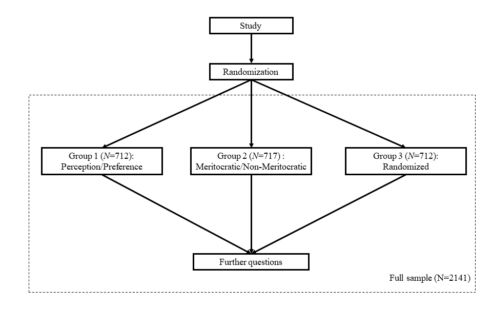
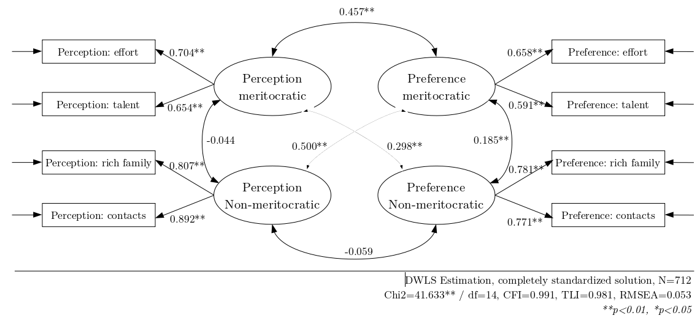

```{r eval=FALSE, include=FALSE}
# for render in pdf run rmarkdown::render_site("docs/paper.Rmd", output_format = "all")
# clean #in the yml
rmarkdown::render("paper.Rmd", output_format = "bookdown::pdf_document2")
rmarkdown::render("paper.Rmd", output_format = "bookdown::html_document2")
```

```{r setup, include=FALSE}
knitr::opts_chunk$set(
	echo = FALSE,
	fig.pos = "H",
	message = FALSE,
	warning = FALSE,
	cache = FALSE,
	out.width = "85%"
)
# knitr::opts_knit$set(base.url = "../") #relative path for .html output file
# knitr::opts_knit$set(root.dir = "../") #relative path for chunks within .rmd files
options(scipen=999)
rm(list=ls())
options(knitr.kable.NA = '')
options(knitr.graphics.error = FALSE)
Sys.setlocale("LC_ALL", "ES_ES.UTF-8")
```

# Introduction

Economic inequality and income concentration have become an issue of growing concern in the last years. This has been expressed in a series of social movements as well as diverse critical analyses regarding the development of capitalism and its consequences [@streeckPoliticsPublicDebt2014; @piketty_Capital_2014]. In this context, the study of views, preferences and perceptions of inequality has acquired relevance in the social sciences, in topics such as redistributive preferences [@alesina_Fairness_2005; @dimick_Models_2018], the legitimization of economic inequality [@schroder_Income_2017] and the functioning of meritocracy [@duru-bellat_whos_2012; @mijs_paradox_2019; @reynolds_perceptions_2014; @atriaEconomicElitesAttitudes2020]. Within this context, the ideal of meritocracy has been strongly challenged as an unfulfilled promise of modern societies that allows the perpetuation of social inequalities [@sandel_tyranny_2020; @goldthorpe_myth_2003].

In general, meritocracy is defined as a system of distribution of resources and rewards based on individual merit, which in its original conception is a combination of talent and effort [@young_rise_1962]. This traditional conception of merit places in a secondary position the possible interference of structural or non-meritocratic factors, such as inheritance, personal contacts, and luck [@breenClassInequalityMeritocracy1999; @saundersMightBritainBe1995; @yairMeritocracy2007; @landWeSatTable2006; @youngRiseMeritocracy1994]. Social psychology and sociology have studied the characteristics and consequences of beliefs in meritocracy, under the general hypothesis that a greater belief in meritocracy emphasizes the role of individual over structural factors in personal achievements, leading to greater legitimization of inequalities [@premingerMeritocracyServiceEthnocracy2020; @trumpWhenWhyEconomic2020; @hadjar_meritokratie_2008; @MadeiraPrimesConsequencesSystematic2019]. Such research has raised criticism of meritocracy as a moral standard of distribution given the preponderant weight of non-meritocratic elements upon individual status and social mobility[@sandelTyrannyMeritWhat2020a; @witteveenReconsideringMeritocraticPower2020; @arrow_meritocracy_2000; @goldthorpe_myth_2003; @markovits_Meritocracy_2019; @khan_Privilege_2013].

Due to the role that meritocratic beliefs play in the justification of individual achievement (or failure) in contemporary societies [@hadjar_meritokratie_2008, @markovits_meritocracy_2019; @sandel_tyranny_2020], multiple studies have evaluated the relationship between meritocratic beliefs and personal and/or contextual characteristics. For example, some studies have linked meritocracy to the reinforcement of socio-economic, gender, and ethnic stereotypes [@MadeiraPrimesConsequencesSystematic2019; @girerdNeoliberalismIdeologicalBarrier2020; @premingerMeritocracyServiceEthnocracy2020], as well as the effects of meritocratic beliefs in educational [@generettStoriesWeTell2020; @owensENGINESSOCIALMOBILITY2020] and organizational contexts [@perezAdvancingCareersMerit2020; @aielloNewEvidenceFirmuniversity2019]. Most of such studies so far have used indicators from existing standard surveys (as the International Social Survey Programme - ISSP) to measure meritocracy. However, as we will show later, the concepts used as well as the instruments for  measuring meritocracy vary extensively among studies. In many cases, similar phenomena are associated with different indicators, and conversely, often different phenomena are measured with similar indicators. Such trends not only limits the comparability of studies, but also the ability to understanding the effects of meritocratic beliefs across different lines of research.

Based on a critical analysis of different approaches to the measurement of meritocracy to date, this article proposes an instrument to both measure and relate two key aspects in the study of meritocracy: perceptions and preferences. Furthermore, as a second axis of analysis, it considers the elaboration of indicators regarding meritocratic and non-meritocratic aspects, demonstrating that they are not two poles of the same continuum as some previous studies would seem to suggest. The measurement system outlined is oriented to generate an instrument as simple and brief as possible, being suitable to be used in public opinion surveys and allowing to integrate meritocratic beliefs in the study of different social phenomena.

## The black-box of meritocratic beliefs {-#blackbox}

In the following we discuss four critical aspects in studies conceptualizing and measuring meritocracy and that are the basis of our scale proposal.

a. _Conceptual components_: Is merit only effort?

One recent definition of meritocracy by @mijs_paradox_2019 is the following: "when I discuss meritocracy beliefs, I am referring to citizens’ belief in the importance of hard work relative to structural factors." [@mijs_paradox_2019, pg.9]. In the subsequent operationalization, this is associated with the following question and indicator: "how important you think it is for getting ahead in life: (a) hard work", scored from 1 to 5 on a likert scale. The assumptions behind such definition are worth discussing in light of the conceptual meaning of meritocracy and its possibilities of operationalization.

The item used by @mijs_paradox_2019 is part of an items' battery present in several international surveys, usually called "reasons to get ahead". This battery displays a series of indicators related to what people consider important to get ahead in life: hard work, education, ambition, a wealthy family, the right connections, religion, race, and gender. Therefore, when considering only one of the items, it means that other aspects that could be associated with talent, such as education, would not be deemed as meritocratic. As he points out: "Hard work is arguably the most meritocratic part of Michael Young’s equation: ‘Merit = Intelligence + Effort’, for the simple fact that intelligence itself is influenced by a non-meritocratic factor: who your parents happen to be" (p.5).

In this measure of meritocratic beliefs, we can observe a couple of strong conceptual assumptions: effort would not depend on parental influence, and talent (as innate ability) is not meritocratic (contrary to Michael Youngs' original conceptualization). This conceptual and measurement-based assumption is found in other studies, that also assume effort to be the main and only aspect of meritocracy [@girerdNeoliberalismIdeologicalBarrier2020a; @bubakPerceptionsMeritocracyNote2019], raising the question: Is effort the only dimension behind the concept of meritocracy? The question of whether talent is or is not considered meritocratic is certainly an interesting topic to discuss from a philosophical point of view, but for those working on empirical studies it should be something that face empirical scrutiny. Besides, the consideration of talent as part of meritocracy certainly opens some interesting avenues of research, for instance in studies showing that for the elites meritocracy is more related to talent, whereas effort is something more characteristic of meritocracy of the middle and low classes ([citar Atria ABS]).

_b. Beliefs?_

Several approaches to the empirical study of meritocracy based on public opinion surveys, refer to the concept of _beliefs_, however different meanings and operationalizations usually underlie this concept. To illustrate this point, lets consider the most commonly used items for operationalizing meritocratic beliefs in survey research (as ISSP), which is the "reasons to get ahead" battery. It consists in a series of items asking "how important you think it is for getting ahead in life" and then lists several factors, such as effort, education, parental wealth, and contacts. Another version of this same battery used in several surveys - sometimes along the previous one - asks about "how important you think it _should_ be ...", then listing the same concepts.  Therefore, the question raised here is: Which one of both is a "belief"?  What _is_ or what it _should_ be?

The term belief has an ambiguous character in the literature, conceived as "idea-elements" by @converseNatureBeliefSystems1964 or "considerations" by @zallerNatureOriginsMass1992. As @kluegelBeliefsInequalityAmericans2017 pointed out about the scope of beliefs: "This usage encompasses such more specific social-psychological concepts as values, perceptions, and attitudes" (p.30). Therefore, beliefs cover almost anything related to subjective factors. To this regard, a relevant distinction in the field of inequality beliefs was made by @janmaatSubjectiveInequalityReview2013: "Perceptions refer to subjective estimates of existing inequality (i.e. thoughts about what is). Beliefs are here defined as normative ideas about just inequality (i.e. thoughts about what should be)"(p.359). Several papers dealing with meritocracy use the term beliefs (i.e. what should be), while actually referring to perceptions (i.e. what is). This occurs for instance in @reynolds_perceptions_2014, in which the term beliefs is used to talk about perceptions, whereas other authors use general terms such as attitudes [@kunovich_systems_2007]. The first attempt to shed light on this issue was made by @duru-bellat_whos_2012, who used the question "how important should the number of years spent in education and training be in deciding how much money people ought to earn?" as a proxy for "desired" meritocracy (beliefs). They then determined "perceived" meritocracy, using the questions: “Would you say that in your country, people are rewarded for their efforts?” and “... people are rewarded for their skills?”.

Is the belief in meritocracy a perception or a preference with normative meaning? In order to expand the analytical conceptual framework, we believe that both dimensions should be included in analyses, as proposed by @duru-bellat_whos_2012. This opens up the possibility of analyzing whether perceptions and preferences are actually related (i.e. have a high correlation), or whether they are independent aspects of the same phenomenon. As @son_hing_merit_2011-1 have pointed out, "People can believe that outcomes ought to be distributed on the basis of merit and yet vary in their perceptions of whether this is how society currently operates" (p. 435). In other words, normative beliefs should be considered while taking perceptions into account: a strong normative belief in meritocracy may mean something totally different to someone perceiving high meritocracy, when compared to someone perceiving low meritocracy. To avoid the confusion generated by the term "belief", we propose the terms meritocratic preferences ("what should be"), and meritocratic perceptions ("what is"), as they better reflect the two facets of meritocracy under scrutiny [@castillo_meritocracia_2019].

_c. Non-meritocratic aspects_

A number of studies have dealt with aspects opposed to meritocracy, as for instance the use of personal advantages (as contacts or having a wealthy family) to get ahead in life. For instance, @kunovich_systems_2007 used an items’ battery listing a number of factors in relation to “How important each should be in deciding pay...” (as @duru-bellat_whos_2012 for desired meritocracy). They consider factors such as education and responsibility as meritocratic, giving them a value of 1 if considered “essential” in the scale response, whereas factors such as having a family or children are valued 1 when rated as "not important at all" (i.e. reverse coded). The assumption behind this approach is that rejecting a supposed non-meritocratic aspect (as having family and/or children) implies a stronger belief in meritocracy. A similar approach of reverse-coding non-meritocratic items was taken by @newman_false_2015, using the same principles applied in the "Preference for the Merit Principle Scale" [@davey_preference_1999].

The assumption that meritocratic and non-meritocratic elements are poles of the same continuum was tested by @reynolds_perceptions_2014 using the "get ahead" perceptions' battery items mentioned above. They considered education, ambition, and hard work as meritocratic, and other factors such as family wealth and connections as non-meritocratic. Despite making and proving this distinction, however, the authors end up subtracting one dimension from the other, thus coming back to the assumption that they are two poles of the same continuum as @kunovich_systems_2007 did. Similarly, @roex_attitudes_2019 used ISSP indicators for perceived meritocracy and non-meritocracy to build a single score by reverse coding the non-meritocratic items. Therefore, the treatment of non-meritocratic items has been rather inconsistent across studies and the assumption that they are the simple opposite of meritocracy requires further empirical assessment.

_d. Accounting for measurement error_

Finally, most studies in meritocracy so far have not accounted for the issue of measurement error [@brownBookReviewTimothy2010; @bollenStructuralEquationsLatent1989] (Ansolabehere, S., Rodden, J., & Snyder Jr, J. M., 2008), as they use single indicators and/or simple average indexes for measuring meritocracy. Such strategy assumes that the latent construct is measured perfectly (i.e. no error or residual variance) by the indicators chosen, going as far as to propose that "... In choosing this strategy of index construction, we argue that support for meritocracy is not a latent variable" [@kunovich_systems_2007 p.653-654]. Some advances were made by @reynolds_perceptions_2014 through conducting a principal component analysis of meritocratic and non-meritocratic dimensions, but somewhat contradictorily, they chose a sum index despite proving a multidimensional latent structure.

## An instrument proposal {-#instrumentprop}

Based on the previous assumptions and limitations of the measurements of meritocracy, we propose and test an instrument with the following characteristics:

- _Multidimensionality_, incorporating previous distinctions between preferences and perceptions, as well as between meritocratic and non-meritocratic aspects.

- Multiple indicators for each dimension, in order to _account for measurement error_ in a confirmatory factor analysis context.

- Based on _previous indicators_ as much as possible, for the sake of keeping comparability between studies.

- _Brief_, as to be used in regular public opinion surveys. In this respect, it differs from the proposal of  "Preference for the Merit Principle Scale" [@davey_preference_1999], as they use 15 items for just one dimension (aside from the problem of reverse-coding non-meritocratic items).

The proposed conceptual and measurement framework is depicted in Figure \@ref(fig:merit-model):

```{r merit-model, echo=FALSE, fig.cap = "Model of perception and preferences for meritocracy and non-meritocracy", fig.align='center'}
knitr::include_graphics("input/images/generalf.png")
```
The columns "Perceptions" and "Preferences" represent the distinction between these two concepts, usually confused under the label "beliefs" [@castillo_meritocracia_2019]. Perceptions refer to the extent to which people observe that meritocracy functions or applies in their society, which relates to items such as "I think hard work is important to get ahead in society". Preferences refer to normative expectations that are usually linked to a "should" expression (e.g. whether hard work should be related to payment). The rows in Figure \@ref(fig:merit-model) consider the distinction between meritocratic and non-meritocratic dimensions [@reynolds_perceptions_2014]. These aspects have usually been treated as different ends of the same continuum in previous research, an assumption that requires empirical scrutiny. Non-meritocratic elements usually refer to the use of personal contacts or family advantages to get ahead in life.

Regarding the selection of indicators, most are taken or adapted from previous studies for the sake of comparability. For meritocratic indicators, we use effort and talent as the main components of the traditional concept of merit as defined by @young_rise_1962, whereas for non-meritocratic dimensions, we use wealthy parents and good contacts. Descriptions of the specific items are outlined in the methodology section.

The research hypotheses behind this conceptualization and measurement model are as follows:

* $H_1$. The perception of meritocracy is a latent variable based on indicators of the importance attributed to talent and effort to get ahead in life.

* $H_2$. The perception of non-meritocracy is a latent variable that derives from  indicators related to agreement with the statement that people with contacts and rich parents manage to get ahead.

* $H_3$. Meritocratic preferences are a latent variable based on the normative value of effort and talent.

* $H_4$. Non-meritocratic preferences are a latent variable based on the normative value of the use of personal contacts and having wealthy parents.

# Methodology


```{r message=FALSE, warning=FALSE, include=FALSE, echo=FALSE}
#RUN THIS BEFORE THE ANALYSIS
pacman::p_load(knitr)
table_format = if(is_html_output()) {
  "html"
} else if(is_latex_output()) {
  "latex"
}

table_format2 = if(is_html_output()) {
  T
} else if(is_latex_output()) {
  F
}
```

The analysis is organized in three studies. Study 1 serves as a background to our instrument proposal by attempting to operationalize the meritocracy dimensions with available secondary data. For this we use data from the International Social Survey Programme (ISSP). Although we are aware that the available indicators in this dataset do not allow a precise operationalization of the conceptual model, we know that this dataset is the most widely used in comparative meritocracy studies (as well as overall subjective inequality) and therefore it is certainly useful to look at its potentials and limitations to this regard. Study 2 is the core of this paper and consists of the proposal of a new scale for measuring meritocratic perceptions and preferences. Finally, in Study 3 we perform additional validity analysis of the meritocracy scale.

## Study 1: Measuring meritocracy with international secondary data

### Data

The data is the last available wave of the social inequality module from the International Social Survey Programme (ISSP), which is the most specialized international comparative survey in perceptions, attitudes and beliefs about inequality related issues. This wave corresponds to the year 2009 and covers attitudes towards a series of topics dealing with social inequality across 41 countries and 56021 individuals. Although there is data available from this module for previous waves (1987, 1992 and 1999), unfortunately there are several variables that are important for this research that were not included, particularly in 1987 and 1999, reason why we only use the 2009 wave.

### Variables

There are a series of indicators in the ISSP survey that in the following we attempt to classify in our meritocracy measurement scheme. However, it is important to mention  that the items were not originally designed as a specific measure of meritocracy. Still, as this database is one of the most widely used for international social research, many of the items have been used in previous research on meritocracy (and certainly will keep being used in the future). Therefore, before proposing a new measure of meritocracy we  give a first test to our proposed conceptualization using available data that not only covers several countries but also is validated by the research community.

The variables are presented below organized in perceptions and preferences:

- _Perception of meritocracy/non-meritocracy_: for operationalizing perceptions the closest set of ISSP's indicators comes from the question asking about perceptions for opportunities to get ahead, which are usually considered as "meritocratic beliefs" in previous research. The general heading of the battery is: _"To begin we have some questions about opportunities for getting ahead. Please tick one box for each of these to show how important you think it is for getting ahead in life."_ This is followed by a list of statements to be answered in a scale with the following levels numbered from 1 to 5: essential, very important, fairly important, not very important, not important at all.

The classification is based on criteria of internal motivation (meritocratic) and structural constraints (non-meritocratic). There were two items from the battery that were excluded from the analysis as they would not fit into the classification. The first one was "having good education yourself", since it was not clear whether this is could be due to individual motivation or system opportunities, and the second was "giving bribes", as introduced elements of criminality that were beyond a non-meritocratic perception.

- Preferences for meritocracy-non meritocracy: for the operationalization of normative preferences we used a list of items related to reasons for pay. The ISSP question was: _In deciding how much people ought to earn, how important should each of these things be, in your opinion_, rated in the same _essential-non important at all_ scale as the questions for meritocratic preferences.

Table \@ref(tab:table-issp) below summarise the items classified according to the proposal based on perception and preference regarding to the meritocratic/non-meritocratic dimensions:

```{r table-issp, echo=FALSE}
pacman::p_load(knitr, kableExtra, dplyr)
table_format = if(knitr::is_html_output()) {
  "html"
} else if(knitr::is_latex_output()) {
  "latex"
}

tableissp <- read.csv(file = "input/tables/table-issp.csv",header = 1,sep = ";",encoding = "UTF-8") # call file generated externally for the table
cnames <- c("Component", "Dimensions","Item")
cap <- "Items of the ISSP meritocratic perceptions and preferences measures"

knitr::kable(tableissp, table_format, booktabs = T, linesep = "",col.names = cnames, caption = cap) %>%
  kableExtra::kable_styling(
    full_width = F,
    latex_options = c("hold_position"),
    position = "center",
    font_size = 20,
    bootstrap_options=c("striped", "bordered")) %>%
  kableExtra::column_spec(column = 1, width = "2cm", ) %>%
  kableExtra::column_spec(column = 2,width = "5cm") %>%
  kableExtra::column_spec(column = 3,width = "12cm") %>%
  kableExtra::collapse_rows(columns = 1:2,valign = "middle")
```


### Methods

The estimation was performed using Confirmatory Factor Analysis (CFA). CFA was conducted using the `lavaan` R package (version 0.6-3; Rosseel, 2020), with diagonally weighted least squares (DWLS) estimation due to the items’ ordinal level of measurement (Kline, 2016; Rosseel, 2020). As recommended by Brown (2008), we assessed model fit by jointly considering the comparative fit index and Tucker-Lewis Index (CFI and TLI; acceptable fit > 0.95), Root of the average squared residual approximation (RMSEA; acceptable fit < 0.08),  Chi-square: (p-value; acceptable fit > 0.05, and Chi-square ratio > 3).

### Results

#### Descriptive analyses

<!-- (here summary descriptive table - @julio) -->

<!-- Table \@ref(tab:desc-issp) -->

```{r desc-issp, eval=FALSE, include=FALSE, results='asis'}
load(file = "input/data/proc/data_s1.RData")
pacman::p_load(dplyr)
table_format = if(knitr::is_html_output()) { #conditional instructions for kable
  "html" #if html set "html" in format
} else if(knitr::is_latex_output()) {
  "latex"#if latex set "latex" in format
}

fsize = if(knitr::is_html_output()) { #conditional instructions for kable
  20 # if html set table fontsize to 20
} else if(knitr::is_latex_output()) {
  12 # if latex set table fontsize to 12
}

data_s1 %>% 
  dplyr::select(hwork,ambition,wealthy,pareduc,
                race,gender,people,polcone,welljob,hardjob,family,child) %>% 
  psych::describe() %>% 
  as.data.frame() %>% 
  dplyr::select("Mean"=mean,"SD"=sd,"Min"=min,"Max"=max) %>% 
  round(2) ->desc.issp

row.names(desc.issp) <- c(
  "Importance: hard work",
  "Importance: having ambition",
  "Importance: wealthy family",
  "Importance: educated parents",
  "Importance: race",
  "Importance: gender",
  "Importance: knowing people",
  "Importance: political connections",
  "Reasons for pay: well job",
  "Reasons for pay: hard job",
  "Reasons for pay: support family",
  "Reasons for pay: has children"
)

sum.issp09<- knitr::kable(desc.issp,format =table_format,
                 booktabs= T,
                 align = "l",
                 linesep = "",
                 caption = "Descriptive statistics for the ISSP 2009 sample") %>%
  kableExtra::kable_styling(full_width = T,
                            font_size = 20,
                            position = "center",
                            latex_options = c("HOLD_position"));sum.issp09
```


Figure \@ref(fig:likert-issp) shows the distribution of responses across the indicators for each perception and preference in the meritocratic and non-meritocratic dimensions. On one side, we see that there is a certain degree of importance attributed to factors such as hard work and ambition in the process of getting ahead, concentrating 94.9% and 92.8% in the fairly important to essential categories.

By contrast, for the non-meritocratic aspects, parental background showed a more dispersed opinion, where 61.2% considers that coming from a wealthy family is important, and 76% considers that having educated parents is important.  On the other hand, the background dimension shows that people' opinions are generally in the opposite sense, in which 63.7% consider that a person's racial origin is not very important or not important at all in the process of getting ahead in life, while 35% consider it important, and this is nearly identical regarding the importance of gender. Lastly, we can observe differences in the networks dimension, in which 85.7% consider it to be important to know the right people in the process of getting ahead in life, contrasting with 50% who consider political connections to be important.

Regarding normative preferences, we observe how well a person performs his or her job and amount of effort involved concentrates 98% and 96.9% of the responses in the categories that attribute importance to these characteristics when evaluating the pay that people deserve. Finally, in relation to structural constrains, 83% attribute importance to the fact that supporting a family should be a relevant factor with respect to the pay obtained, while having children to support translates into 76.4% of importance in this dimension.


```{r build-likert}
load(file = "input/data/proc/data_s1.RData")
pacman::p_load(dplyr)
likert_issp<- data_s1 %>% 
  dplyr::select(hwork,ambition,wealthy,pareduc,
                race,gender,people,polcone,
                welljob,hardjob,family,child) %>% na.omit() #Subset variables
# Set labels for each variable
likert_issp <- sjlabelled::set_label(likert_issp,
                                     label = c("Hard work",
                                               "Having ambition",
                                               "Wealthy family",
                                               "Educated parents",
                                               "Race",
                                               "Gender",
                                               "Knowing people",
                                               "Political connections",
                                               "Well job",
                                               "Hard job",
                                               "Support family",
                                               "Has children")) 
#Reverse coding (ONLY) for plot
likert_issp <- sjmisc::rec(likert_issp, rec="rev", append=FALSE)
#Set value labels for plot
likert_issp <- 
  sjlabelled::set_labels(likert_issp,
                         labels = c("Essential","Very important","Fairly important",
                                    "Not very important","Not important at all"))

# Declare ggplot2 features
ggplot2::theme_set(ggplot2::theme(panel.background = ggplot2::element_rect(fill = "gray85",
                                                                           colour = "gray85"),
                                  panel.border = ggplot2::element_blank(),
                                  axis.text.y = ggplot2::element_text(size = 13,
                                                                      hjust = 1),
                                  title = ggplot2::element_text(size = 13,
                                                                face = "bold"),
                                  legend.text = ggplot2::element_text(size = 12),
                                  plot.caption = ggplot2::element_text(size = 10,
                                                                       face = "plain",
                                                                       hjust = 1)))
#Plot 1: Perception meritocratic
p1<- likert_issp %>%
  dplyr::select(hwork_r:ambition_r) %>%
  sjPlot::plot_likert(geom.colors = "PuBu",
                      title = "Perception meritocratic",
                        geom.size = c(0.62),
                        catcount = 5,
                        expand.grid = T,
                        values  =  "sum.outside",
                        reverse.colors = T,
                        reverse.scale = F,
                        show.n = FALSE) + 
  ggplot2::theme(legend.position = "none") 
#Plot 2: Perception Non-meritocratic
p2<-likert_issp %>%
  dplyr::select(wealthy_r:polcone_r) %>% 
  sjPlot::plot_likert(geom.colors = "PuBu",
                      title = "Perception Non-meritocratic",
                        geom.size = c(0.9),
                        catcount = 5,
                        expand.grid = T,
                        values  =  "sum.outside",
                        reverse.colors = T,
                        reverse.scale = F,
                        show.n = FALSE)  + 
  ggplot2::theme(legend.position = "none")
#Plot 3: Preference meritocratic
p3<-likert_issp %>% 
  dplyr::select(welljob_r:hardjob_r) %>% 
  sjPlot::plot_likert(geom.colors = "PuBu",
                      title = "Preference meritocratic",
                        geom.size = c(0.62),
                        catcount = 5,
                        expand.grid = T,
                        values  =  "sum.outside",
                        reverse.colors = T,
                        reverse.scale = F,
                        show.n = FALSE) + 
  ggplot2::theme(legend.position = "none")
#Plot 4: Preference Non-meritocratic
p4<-likert_issp %>% 
  dplyr::select(family_r:child_r) %>% 
  sjPlot::plot_likert(geom.colors = "PuBu",
                      title = "Preference Non-meritocratic",
                        geom.size = c(0.62),
                        catcount = 5,
                        expand.grid = T,
                        values  =  "sum.outside",
                        reverse.colors = T,
                        reverse.scale = F,
                        show.n = FALSE) +
  ggplot2::theme(legend.position = "none") 

#Legend: Extract legend for the final plot using ggpubr
leg<- ggpubr::as_ggplot(
  ggpubr::get_legend(
    dplyr::select(likert_issp, family_r:child_r) %>%
      sjPlot::plot_likert(geom.colors = "PuBu", catcount = 5) +
      ggplot2::scale_fill_brewer(
        breaks = c(5:1),
        direction = -1,
        labels = c("Not important at all","Not very important","Fairly important",
                   "Very important","Essential")) +
      ggplot2::theme(legend.position = "bottom")
    )
  )
```


```{r likert-issp,fig.height=11,fig.width=11,fig.cap="Distribution of responses in the ISSP meritocracy items", out.height='80%'}
#Final plot
cowplot::add_sub(
  cowplot::plot_grid(p1,p2,p3,p4,leg, #plot 1,2,3,4 and legend (bottom)
    align = "hv",
    axis = "a",
    nrow = 5, #5 plots
    ncol = 1, #1 column
    rel_heights = c(1,2,1,1,0.25) #fig size within plot
    ),
  label = paste0(
    "Source: Authors calculation based on International Social Survey Programme - Social Inequality 2009",
    " (n=",dim(likert_issp)[1],")"
    ),        # Caption: source and sample size 
  size = 10,  # Caption font size
  hjust = 0.25# Caption align 
  ) %>% 
  cowplot::ggdraw() 
```


In terms of the association between the indicators, Figure \@ref(fig:corr-issp) shows the polychoric correlation matrix. Firstly, we see that the correlations between the indicators are consistent with the structure of the initially proposed structure of dimensions distinguishing between the perception and preferences of meritocratic and non-meritocratic factors.  In general, the associations are positive between the perception and preference dimensions, such as the importance of hard work to get ahead and the importance of how hard the work is ($r$=0.34), however, they tend to be weak. A further aspect to consider is the relatively low correlation between dimensions concerning meritocratic and non-meritocratic aspects, (e.g. importance of hard work with educated parents, $r$=0.15). However, with respect to the non-meritocratic perception indicators, we can see that the associations demonstrate dimensionality, however, it is not entirely clear. In this regard, the indicators referring to parental characteristics have a positive and stronger association ($r$=0.56), but this association is much weaker in comparison to the other indicators of Non-meritocratic perception (e.g. Wealthy family and Gender, $r$=0.01).  The same holds true for the Gender and Race indicators ($r$=0.6), and also applies to both the indicators of knowing the right people and having political connections ($r$=0.55). On this point, we will return to it in the next section.


```{r corr-issp,fig.cap = "Perceptions & preferences for ISSP  meritocracy items' polychoric correlations", fig.align='center',fig.height=6,fig.width=8}
load(file = "input/data/proc/data_s1.RData")
pacman::p_load(dplyr)
# create polychoric correlation matrix
cor_issp<- 
  data_s1 %>%
  dplyr::select(hwork,ambition,wealthy,pareduc,
                race,gender,people,polcone,
                welljob,hardjob,family,child) %>% 
  lavaan::lavCor(., ordered=names(.)) 
diag(cor_issp) = NA #set diagonal values to NA
# Set Row names of the matrix
rownames(cor_issp) <- c("A. Hard work", 
                       "B. Having ambition",
                       "C. Wealthy family",
                       "D. Educated parents",
                       "E. Race",
                       "F. Gender",
                       "G. Knowing people",
                       "H. Political connections",
                       "I. Well job",
                       "J. Hard job",
                       "K. Support family",
                       "L. Has children")
#set Column names of the matrix
colnames(cor_issp) <-c("(A)", "(B)","(C)","(D)","(E)","(F)","(G)", 
                       "(H)", "(I)","(J)","(K)","(L)")

#Plot the matrix using corrplot
corrplot::corrplot(cor_issp,
  method = "color",
  addCoef.col = "#000390",
  type = "upper",
  tl.col = "black",
  col=colorRampPalette(c("white","#0068DC"))(12),
  bg = "white",
  na.label = "-",
  lower.col = "black")
```


#### Confirmatory Factor Analysis

This section presents the results of the confirmatory factor analysis. First, a four-dimensional model for meritocratic and non-meritocratic perception and preferences is estimated, considering all indicators of the non-meritocratic perception dimension as a single latent variable. Then, we estimate a model that follows the proposed four latent variable measurement approach, however, the non-meritocratic perception dimension is assumed as a second-order factor for the first order latent variables parental attributes, racial and gender background and networks.


```{r sum-fit-issp}
load(file = "input/data/proc/data_s1.RData")
pacman::p_load(dplyr, kableExtra, knitr)
table_format = if(knitr::is_html_output()) { #conditional instructions for kable
  "html" #if html set "html" in format
} else if(knitr::is_latex_output()) {
  "latex"#if latex set "latex" in format
}

fsize = if(knitr::is_html_output()) { #conditional instructions for kable
  20 # if html set table fontsize to 20
} else if(knitr::is_latex_output()) {
  12 # if latex set table fontsize to 12
}
# meassurement model: First order 
cfa_perpref1 <- ' 
	  # latent variables
	  percmerit =~ hwork + ambition
	  percnmerit=~ wealthy + pareduc +race + gender +people + polcone
	  prefmerit =~ welljob + hardjob
	  prefnmerit=~ family + child
	  '
# Model fit: First order 
fit_perpref1 <- lavaan::cfa(cfa_perpref1, data = data_s1,ordered = T)

# meassurement model: Second order 
cfa_perpref2 <- '
	  # latent variables
	  percmerit =~ hwork + ambition
	  parents =~ wealthy + pareduc
	  backgrd =~ race + gender
	  networks=~ people + polcone
	  percnmerit=~ parents + backgrd + networks
	  prefmerit =~ welljob + hardjob
	  prefnmerit=~ family + child
	  '
# Model fit: second order 
fit_perpref2 <- lavaan::cfa(cfa_perpref2, data = data_s1,ordered = T)

# extract fit indices from models and add to table
sum_fit_issp<- dplyr::bind_rows(
  lavaan::fitmeasures(fit_perpref1)[c("chisq","df","cfi","tli","rmsea")],
  lavaan::fitmeasures(fit_perpref2)[c("chisq","df","cfi","tli","rmsea")]
  )

# Customize object
sum_fit_issp$mod <- c("First order","Second order")
sum_fit_issp$nobs <- c(lavaan::nobs(fit_perpref2),lavaan::nobs(fit_perpref2))
sum_fit_issp$est <- c("DWLS","DWLS")
sum_fit_issp <- dplyr::select(sum_fit_issp,mod,nobs,est,dplyr::everything())
colnames <- c("Model","$N$","Estimator","$\\chi^2$","df","CFI","TLI","RMSEA")

# Create table
table_issp_fits <-
  knitr::kable(sum_fit_issp, format=table_format, digits=3, booktabs=T, 
               col.names=colnames,  
               caption = "Summary fit indices according to model", 
               escape = FALSE) %>%
  kableExtra::kable_styling(font_size = fsize,
                            full_width = F,
                            bootstrap_options=c("striped", "bordered"))
table_issp_fits
```

Table \@ref(tab:sum-fit-issp) shows the four-factor model fit allowing comparison of first and second-order factors. The model restricted to four first-order factor dimensions shows a regular fit (CFI=0.959, TLI=0.944, RMSEA=0.098, χ2(df=48)= 21308.535; more detail in Table \@ref(tab:tb-perpref1)) in contrast to the model considering a second-order factor for non-meritocratic perception that has a slightly better fit based on the standard fit measures (CFI=0.959, TLI=0.944, RMSEA=0.098, χ2(df=48)= 21308.535).


<!-- [diagrama SEM] -->

```{r meas02-issp, echo=FALSE, fig.cap = "Descriptive plot", fig.align='center',fig.cap="Confirmatory factor analysis of the ISSP indicators of Perceptions and Preferences for Meritocracy"}
knitr::include_graphics('output/images/cfa_issp_study1.PNG')
```

<!-- [tabla CFA] -->

Figure \@ref(fig:meas02-issp) shows the overall results for this model, evidencing an improvement in factor loadings as well as in the overall fit of the measurement model. On one hand, we see that perceptions are correlated with preferences, but this correlation is stronger for the meritocratic dimension of perception and preference ($r$=0.46) than for the non-meritocratic ($r$=0.27), which is much stronger when looking at the correlations between meritocratic and non-meritocratic, both in perception ($r$=0.04) and preference ($r$=0.13). These results show that, on one hand, the positive correlation between perception indicates that the two are not completely opposite poles of a continuum ($r$=0.30), which is reflected in the correlation between preferences ($r$=0.25). Furthermore, it is shown that the indicators of non-meritocratic perception refer to three other sub-dimensions and cannot be completely attributed to a an entirely common factor as has been employed in previous research.

## Study 2: The Perceptions and Preferences for Meritocracy Scale

### Data {-#data}

The data was obtained through an online questionnaire, which was part of a larger study on meritocracy and preferences developed in Chile in 2019 funded by the national scientific agency ANID. The questionnaire was programmed in Qualtrics and the fieldwork was conducted by an external online survey agency ([netquest.cl](www.netquest.cl)) between December 2019 and January 2020. The sample was selected from a non-probabilistic quota design in three large cities in Chile (Santiago, Concepción & Antofagasta). The quotas for gender, age, and education level were generated based on a survey by the Public Studies Center [@cepEncuestaCEPMayo2019], which is a well regarded counterpart agency of the ISSP (International Social Survey Programme) in Chile. A total sample of 2,141 people was collected, excluding those who did not answer the questions on the scale, and those who did not accept informed consent. There were no significant differences between our sample and the wider population for most socio-demographic characteristics, with the exception of educational level (see Table \@ref(tab:rep-samp) in appendix). As is often the case with online surveys, there were some limitations in achieving the quotas for lower educational levels **[citas - LUCHO]**.

### Study design

#### Instrument

The proposed scale of perceptions and preferences relating to meritocracy consisted of eight indicators that were grouped into the four dimensions listed earlier: Perceptions (meritocratic/non-meritocratic) and preferences (meritocratic/non-meritocratic). In order to achieve at least some comparability with previous studies, the questions were adapted from the items battery "reasons to get ahead" (ISSP/GSS), which has been widely used for operationalizing meritocracy in previous studies [@mijs_paradox_2019; @duru-bellat_whos_2012; @reynolds_perceptions_2014]. The aforementioned eight items, ordered according to dimensions, are presented in Table \@ref(tab:table-indicadores). These eight likert-type items have five response alternatives, ranging from "Completely disagree"(1) to "Completely agree" (5).

```{r include=FALSE}

# if (knitr::is_html_output()) {tb <- table_nums("tb",cap)} else {tb <- cap}
```

```{r table-indicadores, echo=FALSE}
pacman::p_load(knitr, kableExtra, dplyr)
table_format = if(knitr::is_html_output()) { #conditional instructions for kable
  "html" #if html set "html" in format
} else if(knitr::is_latex_output()) {
  "latex"#if latex set "latex" in format
}
tabitems <- read.csv(file = "input/tables/table01.csv",header = 1,sep = ",",encoding = "UTF-8") # call file generated externally for the table
cnames <- c("Component", "Dimensions","Item (english)" , "Item original (spanish)")
cap <- "Items of the perceptions and preferences for meritocracy scale."

kable(tabitems, table_format, booktabs = T, linesep = "",col.names = cnames, caption = cap) %>%
  kable_styling(
    full_width = T,
    latex_options = c("hold_position"),
    position = "center",
    font_size = 12,
    bootstrap_options=c("striped", "bordered")) %>%
  column_spec(column = 1, width = "1.5cm", ) %>%
  column_spec(column = 2,width = "2 cm") %>%
  collapse_rows(columns = 1:2,valign = "middle")
```

\pagebreak

#### Administration sets

With the objective of evaluating the effect of indicator ordering in the responses, three different versions of items' order were designed and randomly assigned to the respondents, as depicted in Figure \@ref(fig:appmod). The scale was presented to the first group (_n = 712_) in the order that appears in Table \@ref(tab:table-indicadores) according to perceptions and preferences. For the second group (_n = 717_), the order was reorganized according to perceptions and preferences over the same topic, e.g. for the topic of hard work, the item about perception was followed by the item about preference, and the same for the rest of the topics. Finally, for the third group (_n = 712_), the items were presented as completely randomized.

```{r appmod, echo=FALSE, fig.cap = "Survey flow", fig.align='center'}

```

### Methods

To test the scale's underlying constructs, we employed confirmatory factor analysis models (CFA). The models estimated one factor for each of the four proposed dimensions presented in Table \@ref(tab:table-indicadores). As in Study 1, CFA was conducted using the `lavaan` R package (version 0.6-3; Rosseel, 2020), with diagonally weighted least squares (DWLS) estimation due to the items’ ordinal level of measurement (Kline, 2016; Rosseel, 2020). The fit indexes and cut-off criteria were the same as the ones used in Study 1.

A pre-registration was made in the OSF platform, available at the following link: [https://osf.io/z45y2](https://osf.io/z45y2). Included in this pre-registration are the hypotheses regarding the four-dimensional conceptual model underlying the scale, the variable measurement levels, the statistical tests to be performed with their respective evaluation parameters, and other important aspects of the research design.

### Results

#### Descriptive analyses

The graphs presented in Figure \@ref(fig:plotlikert) display disaggregated and comparable information of the different response categories for each item. As it can be observed, in general there is more agreement in the perception of non-meritocratic items than in meritocratic ones, while in the case of preferences the opposite occurs. As far as preferences are concerned, the preponderant role of effort over talent as a criterion of meritocratic preference is noteworthy.

```{r produce-likert_s2, include=FALSE}
pacman::p_load(dplyr)
load(file = "input/data/proc/data_s2.RData")
names(data_s2)
dat_likert_s2 <- data_s2 %>% select(!group) # exclude group variable
dat_likert_s2 <- sjmisc::rec(dat_likert_s2, rec="rev", append=FALSE)
names(dat_likert_s2) # reverse coding for likert graph

table(data_s2$perc_effort)
table(dat_likert_s2$perc_effort_r) # check ok.
# update.packages("sjPlot") # please install version 2.8.9 or above
# plotlikert_s2<- sjPlot::plot_likert(dat_likert_s2,
#                        c(1, 1, 1, 1, 2, 2, 2, 2),
#                        groups.titles = c("Perceptions", "Preferences"),
#                        geom.colors = "PuBu",
#                        geom.size = 0.8,
#                        axis.labels = c("Effort", "Talent", "Rich Parents", "Contacts"),
#                        catcount = 4,
#                        cat.neutral = 3,
#                        grid.range  =  c (1.2 , 1.4),
#                        values  =  "sum.outside",
#                        reverse.colors = T,
#                        reverse.scale = F,
#                        show.n=FALSE)
ggplot2::theme_set(ggplot2::theme(panel.background = ggplot2::element_rect(fill = "gray85",
                                                                           colour = "gray85"),
                                  panel.border = ggplot2::element_blank(),
                                  axis.text.y = ggplot2::element_text(size = 13,
                                                                      hjust = 1),
                                  title = ggplot2::element_text(size = 13,
                                                                face = "bold"),
                                  legend.text = ggplot2::element_text(size = 12),
                                  plot.caption = ggplot2::element_text(size = 10,
                                                                       face = "plain",
                                                                       hjust = 1)))

#Plot 1: Perception 
p1<- 
  dplyr::select(dat_likert_s2,perc_effort_r:perc_netw_r) %>%
  sjPlot::plot_likert(geom.colors = "PuBu",
                      title = c("Perceptions"),                      
                      geom.size = 0.8,
                      axis.labels = c("Effort", "Talent", "Rich Parents", "Contacts"),
                      catcount = 4,
                      cat.neutral = 3,
                      grid.range  =  c (1.2 , 1.4),
                      values  =  "sum.outside",
                      reverse.colors = T,
                      reverse.scale = F,
                      show.n = FALSE) + 
  ggplot2::theme(legend.position = "none") 

#Plot 2: Preferences 
p2<-
  dplyr::select(dat_likert_s2,pref_effort_r:pref_netw_r) %>%
  sjPlot::plot_likert(geom.colors = "PuBu",
                      title = c("Preferences"),                      
                      geom.size = 0.8,
                      axis.labels = c("Effort", "Talent", "Rich Parents", "Contacts"),
                      catcount = 4,
                      cat.neutral = 3,
                      grid.range  =  c (1.2 , 1.4),
                      values  =  "sum.outside",
                      reverse.colors = T,
                      reverse.scale = F,
                      show.n = FALSE)  + 
  ggplot2::theme(legend.position = "none")

#Legend: Extract legend for the final plot using ggpubr
leg<- ggpubr::as_ggplot(
  ggpubr::get_legend(
  dplyr::select(dat_likert_s2,pref_effort_r:pref_netw_r) %>%
      sjPlot::plot_likert(geom.colors = "PuBu", 
                          catcount = 4,
                          cat.neutral = 3) +
    ggplot2::theme(legend.position = "bottom") +
    ggplot2::scale_fill_manual(
      values = c("#b3b3b3ff", "#f1eef6ff", "#bdc9e1ff","#74a9cfff","#0570b0ff"),
      breaks=c("neutral",4,3,2,1),
      labels=c("Neither agree nor disagree","Strongly disagree","Disagree",
               "Agree","Totally agree")
      )
    )
  )
```


```{r plotlikert, echo=FALSE, fig.align='center', fig.cap="Distribution of responses in the Merit Scale items", fig.height=8, fig.width=11}
#Final plot
cowplot::add_sub(
  cowplot::plot_grid(p1,p2,leg, #plot 1,2 and legend (bottom)
    align = "hv",
    axis = "a",
    nrow = 3, #2 plots
    ncol = 1, #1 column
    rel_heights = c(1,1,0.25) #fig size within plot
    ),
  label = paste0("Source: Authors calculations based on Study 1 sample"," (n=",dim(na.omit(dat_likert_s2))[1],")"
    ),        # Caption: source and sample size 
  size = 12,  # Caption font size
  hjust = -0.15# Caption align 
  ) %>% 
  cowplot::ggdraw() 
```

Attending now to the association among the scale items, Figure \@ref(fig:corpoly) shows items polychoric correlations. There are three main aspects to highlight from this correlation matrix.  Firstly, as expected the largest correlations are between indicators that correspond to the same factors behind the conceptual model (e.g., perception of meritocracy by effort and by talent, r=0.52). Secondly, among this correlations the highest are those between the non- meritocratic dimension buth in perceptions (r=0.73) and preferences (r=0.61). thirdly, both items for meritocratic preferences (E and F) are the ones that mostly correlate with the rest of the perceptual items, showing medium to high correlations. This is noteworthy because it indicates that even the perception of non-meritocracy would be related to larger meritocratic preferences. Finally, we observe that there are no considerable negative correlations between meritocratic and non-meritocratic aspects, undermining the assumptions of previous studies that suggested that these dimensions would be the opposite poles of one same continuum [@reynolds_perceptions_2014].

```{r corpoly, echo=FALSE, fig.cap = "Perceptions & preferences for meritcoracy items' polychoric correlations", fig.align='center'}
load(file = "input/data/proc/data_s2.RData")
pacman::p_load(dplyr)
# generate polychoric matrix
cor_s2<- data_s2 %>% dplyr::select(perc_effort,perc_talent,perc_wpart,perc_netw,pref_effort,pref_talent,pref_wpart,pref_netw) %>% lavaan::lavCor(., ordered=names(.))

diag(cor_s2) = NA

# windowsFonts(A = windowsFont("Times New Roman"))

rownames(cor_s2) <-c(
    "A. Perception Effort",
    "B. Perception Talent",
    "C. Perception Rich parents",
    "D. Perception Contacts",
    "E. Preferences Effort",
    "F. Preferences Talent",
    "G. Preferences Rich parents",
    "H. Preferences Contacts")
colnames(cor_s2) <-c("(A)", "(B)","(C)","(D)","(E)","(F)","(G)", "(H)")

corrplot::corrplot(cor_s2,
  method = "color",
  addCoef.col = "#000390",
  type = "upper",
  tl.col = "black",
  col=colorRampPalette(c("white","#0068DC"))(8),
  bg = "white",
  na.label = "-",
  lower.col = "black")


```

#### Confirmatory Factor Analysis

The present sections shows the results of the confirmatory factor analysis estimation. The model estimates four latent factors: perception meritocratic, perception non-meritocratic, preferences meritocratic and preferences non-meritocratic. Each factor is estimated based on two items of the scale as detailed in Table \@ref(tab:table-indicadores).

The first step in the analysis consists of comparing the model fit indicators for the three versions of the scale that were randomly assigned to the participants: order according to perceptions/preferences, order according to topics and random order (see Figure \@ref(fig:appmod)).

```{r model-generation-cfa}
# Libraries & data
pacman::p_load(lavaan)
load(file = "input/data/proc/data_s2.RData")
names(data_s2)

# model
model_cfa <- '
perc_merit =~ perc_effort+perc_talent
perc_nmerit=~perc_wpart +perc_netw
pref_merit =~ pref_effort+pref_talent
pref_nmerit=~pref_wpart +pref_netw
'

# estimation for each order set
fit_cfa1 <- cfa(model_cfa, data = data_s2[data_s2$group == 1,], ordered = TRUE, std.lv=FALSE)
fit_cfa2 <- cfa(model_cfa, data = data_s2[data_s2$group == 2,], ordered = TRUE, std.lv=FALSE)
fit_cfa3 <- cfa(model_cfa, data = data_s2[data_s2$group == 3,], ordered = TRUE, std.lv=FALSE)

```

```{r table-cfafits, echo=FALSE}
pacman::p_load(dplyr, kableExtra, knitr)

# extract fit indices from models and add to table
sum_fit<- dplyr::bind_rows(fitmeasures(fit_cfa1)[c("chisq","df","cfi","tli","rmsea")],
                    fitmeasures(fit_cfa2)[c("chisq","df","cfi","tli","rmsea")],
                    fitmeasures(fit_cfa3)[c("chisq","df","cfi","tli","rmsea")])

# Customize object
sum_fit$mod <- c("Version 1","Version 2","Version 3")
sum_fit$nobs <- c(nobs(fit_cfa1),nobs(fit_cfa2),nobs(fit_cfa3))
sum_fit$est <- c("DWLS","DWLS","DWLS")
sum_fit <- dplyr::select(sum_fit,mod,nobs,est,everything())
colnames <- c("Model","$N$","Estimator","$\\chi^2$","df","CFI","TLI","RMSEA")

# Create table
table_cfa_fits <-kable(sum_fit, format="html", digits=3, booktabs=T, col.names=colnames,  caption = "Summary fit indices according to order versions", escape = FALSE) %>% kable_styling(full_width = F, font_size = 12,bootstrap_options=c("striped", "bordered"))
table_cfa_fits
```

Table \@ref(tab:table-cfafits) shows the fit indicators of the models estimated for each of the three versions of the items' order described in the methodology. Regardless of the version, all models obtained adequate fit indicators, with CFI's above 0.95 and RMSEA's below 0.08. However, none of the models achieved a non-significant chi-square, something expected in large samples as the one used here. The first version order (perceptions-preferences) was the one obtaining best fit (CFI=0.993, TLI=0.995, RMSEA=0.034, $\chi2$(df=14)=42.276), whereas version 2 with the fixed order according to merit/non-merit items shows the comparatively worst indicators. The CFA fit indices for the completely randomized items' order (Model 3) it keeps all the indicators within the acceptable cut-off criteria and besides it controls for possible order effects in the administration of the instrument. The model and parameter estimates for this version are depicted in Figure \@ref(fig:meas02):

```{r meas02, echo=FALSE, fig.cap = "Confirmatory factor analysis of the Perceptions and Preferences for Meritocracy Scale", fig.align='center'}

# estimation for diagram: summary(fit_cfa3, standardized = TRUE, fit.measures=TRUE)

```

Attending to the correlations between the latent variables as depicted in Figure \@ref(fig:meas02), it is observed that meritocratic preferences are correlated with preferences, both meritocratic ($r=0.457$) and non-meritocratic ($r=0.500$). The correlation between both types of perceptions ($r=-0.044$) and both types preferences ($r=0.185$) are low, as well as between non-meritocratic preferences and perceptions ($r=-0.059$). This last finding gives further evidence regarding the lack of unidimensionality of meritocratic and non-meritocratic aspects: they do not appear as the opposite poles of the same continuum and based on this evidence the use of reverse-coding for non-meritocratic items as indicators of meritocracy should be avoided.

## Study 3: Additional validity analyses

We performed two further analyses in order to add evidence regarding the quality of the scale. Firstly we analyzed the convergent validity by exploring the association of the merit scale with related concepts and its correspondent measurements. Secondly, we test the internal consistency of the measurement model behind the scale comparing with a different sample through measurement invariance procedures .

### Convergent validity

#### Data

For this analysis we examined data from one wave of the same study described above, which was a three-wave panel survey. The last wave of the study included additional measures that allow testing the correlations of the merit scale with some related constructs as opportunity beliefs and personal wherewithal. After listwise deletion of missing cases in socio-demographics information, a total of 1422 individuals took part in the third wave: 668 (46.97%) women and 754 (53.03%) men. The ages of 50.57% of them are 45 years or older, and 36.28% held a tertiary degree.

#### Variables

The following scales were included for testing their correlations with the the 8-item meritocracy scale:

- Opportunity beliefs: We used two items of the social inequality module of the International Social Survey Programme. Studies use generally both indicators to measure meritocratic and non-meritocratic beliefs [@McCall2017Exposurerisinginequality; @mijs_paradox_2019].  One item measures the importance of individual factors in determining life outcomes by asking for the importance of hard work for getting ahead in life (M=3.76, SD=0.93). The second item asks for the importance of coming from a wealthy family and captures the importance of structural factors in getting ahead (M=2.75, SD=1.27). Participants responded to each item using a 1 (not important at all) to 5 (essential) response scale. We call the first item \textit{hard work} and the second one \textit{social origin}.

- Personal wherewithal: the questionnaire included The Neoliberal Beliefs Inventory (NBI), which considers four factors: Government Interference preferences, Competition preferences, System Inequality perception and Personal Wherewithal [@bay-chengTrackingHomoOeconomicus2015]. We used the factor _personal wherewithal_ that reflects meritocracy beliefs in terms of the importance of personal attributes as strength and skills to yield success. The construct consists of 8 items (e.g., “Any goal can be achieved with enough hard work and talent”, “I’ve benefited from working hard, so there’s no reason others can’t”, “Anyone who is willing to work hard can be succesful in Chile”). Participants answered the items using a 1 (totally disagree) to 6 (totally agree) scale. We simple computed mean scores, with higher scores indicating stronger support for meritocracy (M=3.32, SD=0.88, $\alpha$ = 0.89).

Both instruments cover mainly the perceptual side of the concept. Therefore, in general we expect larger correlation with meritocratic perceptions than with preferences. In the case of opportunity beliefs, the hard work item should correlate positively with meritocratic perception whereas the importance for coming from a wealthy family is expected to correlate positively with non-meritocratic perceptions. Regarding the second instrument of personal wherewithal, we also anticipate a positive correlation with meritocratic perception and low to null correlations with the other dimensions of the merit scale.

#### Results

We used polyserial correlations to evaluate relationships of meritocractic and non-meritocratic preferences and perceptions with the items of the opportunity beliefs battery. For personal wherewithal, we examined Pearson correlations.

Table \@ref(tab:val-conv) shows the polyserial and Pearson correlations between our meritocracy scale and common measures of meritocracy. The findings provide evidence for convergent validity for the scale. As we expected, preferences show very weak correlations. Findings also indicate that correlations of perceptions with opportunity beliefs are consistent with our expectations. The item for social origin shows a positive and moderate association with unmeritocratic perception (r=.354), and a negative and low correlation with meritocratic perception (-0.197). Regarding the item of hard work, the correlation with meritocratic perception is positive but weak (r=.187). One explanation for this result is that the support for hard work is very high among respondents---only 8.6 percent indicates _not very important_ or _not important at all_.


```{r val-conv}
pacman::p_load(kableExtra, polycor)

load(file="input/data/proc/data_s3_conv.RData")

pl1 <- polycor::polyserial(data_s3_conv$perc_merit,data_s3_conv$get_ah_1)
pl2 <- polycor::polyserial(data_s3_conv$pref_merit,data_s3_conv$get_ah_1)
pl3 <- polycor::polyserial(data_s3_conv$perc_nmerit,data_s3_conv$get_ah_1)
pl4 <- polycor::polyserial(data_s3_conv$pref_nmerit,data_s3_conv$get_ah_1)
valores1 <- round(c(pl1,pl2,pl3,pl4),4)


pl1b <- polycor::polyserial(data_s3_conv$perc_merit,data_s3_conv$get_ah_5)
pl2b <- polycor::polyserial(data_s3_conv$pref_merit,data_s3_conv$get_ah_5)
pl3b <- polycor::polyserial(data_s3_conv$perc_nmerit,data_s3_conv$get_ah_5)
pl4b <- polycor::polyserial(data_s3_conv$pref_nmerit,data_s3_conv$get_ah_5)
valores2 <- round(c(pl1b,pl2b,pl3b,pl4b),4)

pl1c <- cor(data_s3_conv$perc_merit,data_s3_conv$nbmerit)
pl2c <- cor(data_s3_conv$pref_merit,data_s3_conv$nbmerit)
pl3c <- cor(data_s3_conv$perc_nmerit,data_s3_conv$nbmerit)
pl4c <- cor(data_s3_conv$pref_nmerit,data_s3_conv$nbmerit)
valores3 <- round(c(pl1c,pl2c,pl3c,pl4c),4)


variables= c("Meritocratic Perception", "Meritocratic Preferences", "Unmeritocratic Perception","Unmeritocratic Preferences")

table01 <- cbind(variables, valores1, valores2, valores3)


kable(table01, col.names = c("Merit-Scale","Social Origin ", "Hard Work " , "Wherewithal"), full_width = T, linesep = "", caption = c("Polyserial and Pearson correlation whit other merit scales")) %>% kable_styling(
    full_width = T,
    position = "center",
    font_size = 14,
    bootstrap_options=c("striped", "bordered")) %>%
  column_spec(column = 1, width = "1.5cm", )
```


The measure of NBI for _personal wherewithal_ also provides evidence for the convergent validity of the merit scale. Results indicate a positive correlation of this measure with meritocratic preference (r=.392), suggesting that both variables capture similar concepts. The NBI's factor depicts a positive association with unmeritocratic preference (r=.208). This finding is consistent with literature, inasmuch as the belief for meritocray is associated with the justification of inequality [@McCall2017Exposurerisinginequality; @MadeiraPrimesConsequencesSystematic2019]. Furthermore, results of our confirmatory factor analysis indicate that meritocratic perceptions and unmeritocratic preferences show a positive and weak correlation.

### Measurement invariance

The modeling for invariance testing has been gaining more relevance in sociological survey studies, mainly due to the interest in the validity of measurement scales in comparative studies in various social and cultural contexts [@Davidovetal2014]. In this section we will use an analysis of invariance between groups, where the proposed factorial structure is expected to be independent of belonging to the sample corresponding to the original study, comparing it with another more recent study available and where the meritocracy scale was also incorporated.

The invariance measurement procedure consists of a series of nested models to which restrictions are progressively incorporated on the parameters of the measurement model. The literature generally suggests that this modeling should be done through four levels or types of progressive restriction [@Milfont2010; @millsap_Statistical_2011; @vandeschoot_checklist_2012]:

1. **Configural:** the model is estimated only indicating the factorial structure used in the CFA.

2. **Weak:** an equality restriction is applied to the factor loadings in the different groups, that is, the loadings are forced to be identical in both measurements.

3. **Strong:** equality restrictions are added to the intercepts of each indicator.

4. **Strict:** equality restrictions are added to the error variances of each indicator.

#### Data

For testing the invariance we compared the data described previously with a new data source coming from an online survey carried out during the first half of 2020. The characteristics of this sample in terms of application and coverage are equivalent to those of the previous study. The final sample obtained contains 1,242 cases, where 605 (48.71%) are women and 637 (51.28%) are men. 48.84% of them are 45 years of age or older, and 33.97% have tertiary education or higher.

#### Variables

The items of the meritocracy scale were identical to the original. The items were administrated in a randomized order (which corresponds to the application modality of Group 3 present in Figure \@ref(fig:appmod)).

#### Results

Table \@ref(tab:fcloads-inv) shows the results of the CFA estimation of the meritocracy scale in this new sample. As observed, the loadings and the fit indices show similar results as the ones presented for the original study above, which gives a first base with wich to start the invariance analysis.

The first step for invariance testing is the estimation of the configural model, which serves as the baseline for further comparison and it is expected to adequately meet the global fit criteria of a measurement model. Although the chi-square statistic is used as a global measure of fit,since its sensitivity to sample size it is recommended to use three additional fit indices: Comparative Fit Index (CFI), which should have a value greater than 0.95; Root Mean Square Error Approximation (RMSEA), which must be in the range of values ​​of 0.05 and 0.08; and the Standardized Root Mean Square Residuals (SRMR) which must be less than 0.08 [@vandeschoot_checklist_2012]. Besides, the literature on measurement invariance suggests some complementary approaches for the evaluation of the fit, from which we will consider the incremental adjustment of the fit indexes [@cheung_Evaluating_2002; @Milfont2010; @dimitrov_Testing_2010] and the ANOVA test for means comparison in nested models [@newsom_Longitudinal_2015].

```{r invargroup, echo=FALSE}
#---Load packages and data -------------------------------------#
pacman::p_load(sjPlot,dplyr,lavaan,semPlot,semTools,stargazer,
               corrplot,psych,knitr,kableExtra,stats)
load(file = "input/data/proc/data_s3_inv.RData")
pov01 <- data_s3_inv %>% filter(dataset=="pvw01")
fs01  <- data_s3_inv %>% filter(dataset=="fsw02")

#-----Meassurement model--------------------------------------#
model01 <- '
perc_merit  =~ perc_effort + perc_talent
perc_nmerit =~ perc_wpart  + perc_netw
pref_merit  =~ pref_effort + pref_talent
pref_nmerit =~ pref_wpart  + pref_netw'

#-----Invariance---------------------------------------------#
inv01<- measurementInvariance(model=model01,data=data_s3_inv,group="dataset",estimator = "ML",strict=TRUE,quiet = T)

conf  <- inv01$fit.configural
weak  <- inv01$fit.loadings
strong<- inv01$fit.intercepts
strict<- inv01$fit.residuals

tab01<- anova(conf,weak,strong,strict,SB.classic=TRUE) %>%
  as_tibble() %>%
  select("Chisq","Df","chisq_diff"=`Chisq diff`,"df_diff"=`Df diff`,"pvalue"=`Pr(>Chisq)`) %>%
  mutate(stars=gtools::stars.pval(pvalue),
         chisqt=paste0(round(Chisq,2)," (",Df,") "),
         decision=ifelse(pvalue>0.05,yes = "Accept",no = "Reject"),
         model=c("Configural","Weak","Strong","Strict"))

fit.meas<- bind_rows(fitmeasures(inv01$fit.configural,output ="matrix")[c("chisq","df","cfi","rmsea","rmsea.ci.lower","rmsea.ci.upper"),],
                     fitmeasures(inv01$fit.loadings,  output ="matrix")[c("chisq","df","cfi","rmsea","rmsea.ci.lower","rmsea.ci.upper"),],
                     fitmeasures(inv01$fit.intercepts,output ="matrix")[c("chisq","df","cfi","rmsea","rmsea.ci.lower","rmsea.ci.upper"),],
                     fitmeasures(inv01$fit.residuals, output ="matrix")[c("chisq","df","cfi","rmsea","rmsea.ci.lower","rmsea.ci.upper"),])

# compute differences in chisq, df, cfi and rmsea (90%, lower.ci - upper.ci )
fit.meas<- fit.meas %>%
  mutate(diff.chi2 = chisq    - lag(chisq,default = first(chisq)),
         diff.df   = df       - lag(df,   default = first(df)),
         diff.cfi  = cfi      - lag(cfi,  default = first(cfi)),
         diff.rmsea   = rmsea - lag(rmsea,default = first(rmsea))) %>%
  round(3) %>%
  mutate(rmsea.ci=paste0(rmsea," \n ", "(",rmsea.ci.lower,"-",rmsea.ci.upper,")"))


tab.inv<- bind_cols(tab01,fit.meas) %>%
  select(model,chisqt,cfi,rmsea.ci,diff.chi2,diff.df,diff.cfi,diff.rmsea,stars,decision) %>%
  mutate(diff.chi2=paste0(diff.chi2," (",diff.df,") ",stars)) %>%
  select(model,chisqt,cfi,rmsea.ci,diff.chi2,diff.cfi,diff.rmsea,decision)

#clean values
tab.inv[tab.inv == c("0 (0) ")] <- NA
tab.inv[tab.inv == c(0)] <- NA

### Check an alternative method
configural        <- cfa(model01, data=data_s3_inv, group = "dataset", estimator="ML")
weak.invariance   <- cfa(model01, data=data_s3_inv, group = "dataset",group.equal = "loadings", estimator="ML")
strong.invariance <- cfa(model01, data=data_s3_inv, group = "dataset",group.equal = c( "loadings", "intercepts"), estimator="ML")
strict.invariance <- cfa(model01, data=data_s3_inv, group = "dataset",group.equal = c( "loadings", "intercepts", "residuals"), estimator="ML")


table_format = if(is_html_output()) {
  "html"
} else if(is_latex_output()) {
  "latex"
}

col.nam <- c("Model","$\\chi^2 (\\text{df})$","CFI","RMSEA (90 CI)",
             "$\\Delta \\chi^2 (\\Delta \\text{df}$)","$\\Delta \\text{CFI}$","$\\Delta \\text{RMSEA}$","Decision")
footnote <- paste0("N = ","; Group 1, n = ",conf@Data@nobs[[1]],"; Group 2, n = ",conf@Data@nobs[[2]], ", **p < 0.001")

kable(tab.inv, col.names = col.nam, align = "l",
      booktabs=TRUE,format = table_format,escape = FALSE,
      caption = "Multiple Group meassurement invariance for Perceptions and Preferences for Meritocracy") %>%
  kable_styling(full_width = FALSE,latex_options = "HOLD_position",bootstrap_options=c("striped", "bordered")) %>%
  footnote(general = footnote, footnote_as_chunk = T)

```


Table \@ref(tab:invargroup) shows the results of the measurement invariance estimation. When attending to the traditional invariance test of $\Delta \chi^2 (\Delta \text{df})$, the results  support the invariance at the strong level meaning that the fit of the factor model of the merit scale is equivalent across samples when constraining factor loadings and intercepts to being equal. Such result is considered in general as evidence of invariance [citar paper Fischer en SJR], as strict forms of measurement invariance rarely hold [citar van der Schoot et al]. Still, the comparability of latents means requires strict invariance which in this case does not hold when considering $\Delta \chi^2 (\Delta \text{df})$. Nevertheless, the criteria of $\Delta \text{CFI}$ used for comparing models is close to the rejection criteria of >.01, whereas the $\Delta \text{RMSEA}$ fulfills the requirements of being below of the cut-off criteria as suggested by [ @chen 2007 ]. Therefore, using this last standard the level for strict invariance holds for the meritocracy scale.

# Conclusions

Studies that attempt to characterize and compare societies by their support for meritocratic beliefs have used different approaches. As most studies use secondary survey data, they tend to assume that the available indicators represent an underlying meritocratic construct. A review of these studies reveals several non-tested assumptions, as well as the use of similar indicators to represent different constructs and dimensions of meritocracy. As the existence of heterogeneous approaches certainly has consequences for the advancement of the study of meritocracy, this paper presented a comprehensive conceptual framework for the empirical study of meritocracy, building upon previous research. This framework was then tested against new survey data.

We identified four critical aspects regarding the measurement of meritocracy in previous studies: unidimensionality, the ambiguous use of the term “beliefs”, the use of non-meritocratic indicators as opposed to meritocratic indicators, and the consideration of measurement error. The proposed 8-item scale, “Perceptions and Preferences for Meritocracy”, was designed and tested in order to deal with these four issues. Our results indicate that perceptions and preferences seem to be two related but different dimensions, often confounded in previous research under the label of "beliefs". Meritocratic and non-meritocratic dimensions do not appear to constitute poles of the same continuum, as some previous studies have assumed. Regarding the possible effects of items order in the estimation of latent variable, we tested three different order versions and found evidence that suggest the use of the randomized version of the scale. Furthermore, we found evidence of convergent validity as well as measurement invariance that approach well the requirement of comparability between samples.

The four-dimensional framework and structure of the Perceptions and Preferences for Meritocracy scale opens several avenues for future research. For instance, distinguishing perceptions from preferences will allow us to evaluate the extent to which different societies are accustomed to, or satisfied with, the perceived level of meritocracy, in terms of differences between what is perceived and what is preferred. Additionally, given that non-meritocratic factors are not necessarily related to meritocratic ones, our framework makes it possible to assess the perceived legitimacy of practices such as the use of personal contacts and their interference (or not) with meritocratic ideals in different societies. The consideration of structural factors, both individual and societal, will allow us to advance future hypotheses relating to meritocratic legitimacy to a more comprehensive level than the current one, which is based solely on meritocratic perceptions. Furthermore, the impacts of different configurations of the four-dimensional framework on practices and behaviors such as corruption, civic involvement, and political alignment, is an area that requires additional research. Such future agendas could be specially relevant in times of economic crisis and growing inequalities, that could entail changes in the legitimation of the current distributive structure based on meritocratic ideals.


# References


<div id="refs"> </div>  <!-- Although <div> is an HTML tag, this method also works for other output formats such as PDF. -->


# (APPENDIX) Appendix {-}


`r if (knitr::is_latex_output()){ '\\appendix'}`


`r if (knitr::is_latex_output()){ '\\section{Appendix}'}`

## Appendix study 1


|                     | Sample  |   CEP  |
|---------------------|:-------:|:------:|
| __Gender__          |         |        |
| Men                 | 49,82%  | 50,52% |
| Women               | 50.18%  | 49,47% |
| __Age__             |         |        |
| 18 - 24             | 18,55%  | 18,17% |
| 25 - 34             | 18,86%  | 17,48% |
| 35 - 44             | 19.09%  | 19,98% |
| 45 - 54             | 17,96%  | 19,23% |
| 55 - or more        | 25,54%  | 25.11% |
| __Education__       |         |        |
| Primary  or less    | 2,93%   | 15,88% |
| High school          | 43,23%  | 37,04% |
| Non university      | 32,63%  | 28,93% |
| university or more  | 21,21%  | 18,13% |
Table: `r as.character(paste("(\\#tab:rep-samp)", "Representativeness of the study 1 sample"))`.

```{r tb-perpref1, echo=FALSE}
load(file = "input/data/proc/data_s1.RData")
pacman::p_load(dplyr,knitr,kableExtra)
options(knitr.kable.NA = '')
table_format = if(knitr::is_html_output()) { #conditional instructions for kable
  "html" #if html set "html" in format
} else if(knitr::is_latex_output()) {
  "latex"#if latex set "latex" in format
}

fsize = if(knitr::is_html_output()) { #conditional instructions for kable
  20 # if html set table fontsize to 20
} else if(knitr::is_latex_output()) {
  12 # if latex set table fontsize to 12
}

# First order model for Appendix
cfa_perpref1 <- '
	  # latent variables
	  percmerit =~ hwork + ambition
	  percnmerit=~ wealthy + pareduc +race + gender +people + polcone
	  prefmerit =~ welljob + hardjob
	  prefnmerit=~ family + child
	  '
# Fit First order model for Appendix
fit_perpref1 <- lavaan::cfa(cfa_perpref1, data = data_s1,
                            ordered = c("wealthy","pareduc","ambition","hwork",
                                        "people","polcone","race","gender",
                                        "respons","yeduc",
                                        "family","child",
                                        "welljob","hardjob"))
# Labels of First order model for Appendix
labs <- c(
  "Importance: hard work",
  "Importance: having ambition",
  "Importance: wealthy family",
  "Importance: educated parents",
  "Importance: race",
  "Importance: gender",
  "Importance: knowing people",
  "Importance: political connections",
  "Reasons for pay: well job",
  "Reasons for pay: hard job",
  "Reasons for pay: support family",
  "Reasons for pay: has children"
)
#Extract factor loadings
tb.load<- data.frame(round(cbind(lavaan::inspect(fit_perpref1,
                                                        what="std")$lambda),
                           digits = 3))
tb.load[tb.load==c(0.00)] <- NA #set to NA factor loadings of 0

for (i in names(tb.load)) {
  tb.load[,i] <- sprintf(tb.load[,i], fmt = '%#.3f') #set values as character
}
tb.load[tb.load=="NA"] <- "" #set NA values to "" (empty space)
#---extract fit measures-------#
fm01<- data.frame(t(data.frame(lavaan::fitmeasures(fit_perpref1, output ="matrix")[c("chisq","df","cfi","tli","rmsea"),]))); row.names(fm01) ="percnmerit"

#------chi2, df------#
fm04<- round(rbind(fm01),3) #select and round to 4 digits
fm04.1 <- fm04 %>% dplyr::select(chisq,df) #select chi2 and degrees of freedom
fm04.1$chisq <- round(x = fm04.1$chisq,digits = 1) # round Chi2 to 1 digit
fm04.1$df <- round(x = fm04.1$df,digits = 0) #round Df to 0 digits
fm04.1$chi2df <- paste0(fm04.1$chisq,"(",fm04.1$df,")") #Paste chi2(df)
fm04.1 <- dplyr::select(fm04.1,"chi2df") #select final column
for (i in names(fm04.1)) {
  fm04.1[,i] <- as.character(fm04.1[,i]) # transform all to character
}

#------CFI, RMSEA------#
fm04.2 <- fm04 %>% dplyr::select(cfi,tli,rmsea) # select CFI, TLI and RMSEA
for (i in names(fm04.2)) {                      # transform all to character
  fm04.2[,i] <- sprintf(fm04.2[,i], fmt = '%#.3f')
}

fm.df      <- dplyr::bind_cols(fm04.1,fm04.2) # factor loading and labels
fm.df$nobs <- c(lavaan::nobs(fit_perpref1))   # add number of observations
fm.df <- data.frame(t(fm.df)); colnames(fm.df) <- c("percnmerit") #transpose and set colnames


#------ merge ------#
tb.fm<- dplyr::bind_rows(tb.load,fm.df) #merge factor loadings and fit indices
tb.fm<- tb.fm %>% 
  dplyr::mutate(vars=c(labs,"$\\chi^2\\text{(df)}$","$\\text{CFI}$",
                       "$\\text{TLI}$","$\\text{RMSEA}$","$N$")) %>%
  dplyr::select(vars,everything()) #Change names of Fit meassures to latex symbols
tb.perpref1 <- tb.fm #final matrix for Table

# Table --------------------------------------------------------------------.
tb.foot <- paste0("Standardized factor loadings using DWLS estimator ; CFI = Comparative fit index ;TLI = Tucker-Lewis index; RMSEA = Root mean square error of approximation")
tb.col <- c("","Meritocratic","Non-meritocratic",
            "Meritocratic","Non-meritocratic")
tb.caption <- c(" Factor loadings and fit measures of the four first-order factor model in study 1")
tb.issp<- kable(tb.perpref1,escape = FALSE,digits = 3,
                align = "lcccc",
                col.names = tb.col, 
                caption = tb.caption, 
                booktabs = T,
                linesep = "",
                format = table_format) %>%
          kable_styling(latex_options = c("hold_position"),
                        bootstrap_options = c("striped", "bordered"),
                        position = "center",
                        font_size = 12) %>%
          add_header_above(header = c(" "=1,"Perception"= 2,"Preference"= 2)) %>%
          add_header_above(header = c(" "=1,"Factor loadings"= 4)) %>%
          row_spec(row = 12,hline_after = TRUE) %>%
          add_indent(c(13:17)) %>%
          footnote(general =tb.foot ,footnote_as_chunk = T,threeparttable = T);tb.issp
```

## Appendix study 3

```{r fcloads-inv, echo=FALSE}
table_format = if(knitr::is_html_output()) { #conditional instructions for kable
  "html" #if html set "html" in format
} else if(knitr::is_latex_output()) {
  "latex"#if latex set "latex" in format
}
table_format2 = if(knitr::is_html_output()) {
  T
} else if(knitr::is_latex_output()) {
  F
}
# Note: 
# This CFA corresponds to the sample from the Factorial Survey Study 
load(file = "input/data/proc/data_s3_inv.RData") #load data study 3
pacman::p_load(dplyr,knitr,kableExtra)
fs01  <- data_s3_inv %>% dplyr::filter(dataset=="fsw02") #subset sample

# Set model
model01 <- '
perc_merit  =~ perc_effort + perc_talent
perc_nmerit =~ perc_wpart  + perc_netw
pref_merit  =~ pref_effort + pref_talent
pref_nmerit =~ pref_wpart  + pref_netw'

# Model fit
fs1_o <- lavaan::cfa(model = model01,
             data = fs01,
             ordered = c("perc_effort","perc_talent",
                         "perc_wpart","perc_netw",
                         "pref_effort","pref_talent",
                         "pref_wpart","pref_netw"),std.lv=FALSE)

# Extract information for table
fm01<- data.frame(t(data.frame(lavaan::fitmeasures(fs1_o, output ="matrix")[c("chisq.scaled","df","cfi.scaled","rmsea.scaled"),]))); row.names(fm01) ="M1.1"

#------chi2, df------#
fm04.1 <- fm01 %>% dplyr::select(chisq.scaled,df) 
fm04.1$chisq.scaled <- round(x = fm04.1$chisq.scaled,digits = 1)
fm04.1$df <- round(x = fm04.1$df,digits = 0)
fm04.1$chi2df <- paste0(fm04.1$chisq.scaled,"(",fm04.1$df,")")
fm04.1 <- dplyr::select(fm04.1,"chi2df")

#------CFI, RMSEA------#
fm04.2 <- fm01 %>% dplyr::select(cfi.scaled,rmsea.scaled)
for (i in names(fm04.2)) {
  fm04.2[,i] <- sprintf(fm04.2[,i], fmt = '%#.3f')
}

#------ merge fit indices ------#
fm.df      <- dplyr::bind_cols(fm04.1,fm04.2)
fm.df$nobs <- c(lavaan::nobs(fs1_o)) 
fm.df      <- data.frame(t(fm.df))

#------ extract factor loadings ------#
loads01<- data.frame(round(lavaan::inspect(fs1_o,what="std")$lambda,digits = 3))
loads01[loads01==c(0.00)] <- NA; names(loads01) <- c(paste0("M1.",1:4))

for (i in names(loads01)) {
  loads01[,i] <- sprintf(loads01[,i], fmt = '%#.3f')
}
loads01[loads01=="NA"] <- ""

#------ labels for table ------#
labs <-c(
    "A. Perception Effort",
    "B. Perception Talent",
    "C. Perception Rich parents",
    "D. Perception Contacts",
    "E. Preferences Effort",
    "F. Preferences Talent",
    "G. Preferences Rich parents",
    "H. Preferences Contacts")

#------ merge ------#
tb.fm2<- bind_rows(loads01,fm.df)
tb.fm2<- tb.fm2 %>% 
  mutate(vars=c(labs,"$\\chi^2\\text{(df)}$","$\\text{CFI}$","$\\text{RMSEA}$","$N$")) %>%
  select(vars,everything())
tb.col  <- c(" ",
             "Meritocratic","Non-meritocratic",
             "Meritocratic","Non-meritocratic")
tb.caption <- "Factor loadings and fit measures for the second sample for study 3" 
tb.foot <- paste0("Standardized factor loadings using DWLS estimator ; CFI = Comparative fit index (scaled); RMSEA = Root mean square error of approximation (scaled)")
tb.fm02<- kable(tb.fm2,escape = FALSE,align = "lcccc",col.names = tb.col, caption = tb.caption, booktabs = T,linesep = "",format = table_format) %>%
          kable_styling(full_width = table_format2,
                        latex_options = c("hold_position"), 
                        position = "center",
                        font_size = 12,
                        bootstrap_options = c("striped", "bordered")) %>%
          add_header_above(header = c(" "=1,"Perception"= 2,"Preference"= 2)) %>%
          add_header_above(header = c(" "=1,"Factor loadings"= 4)) %>%
          row_spec(row = 8,hline_after = TRUE) %>%
          add_indent(c(9:12)) %>%
          footnote(general =tb.foot ,footnote_as_chunk = T);tb.fm02
```

