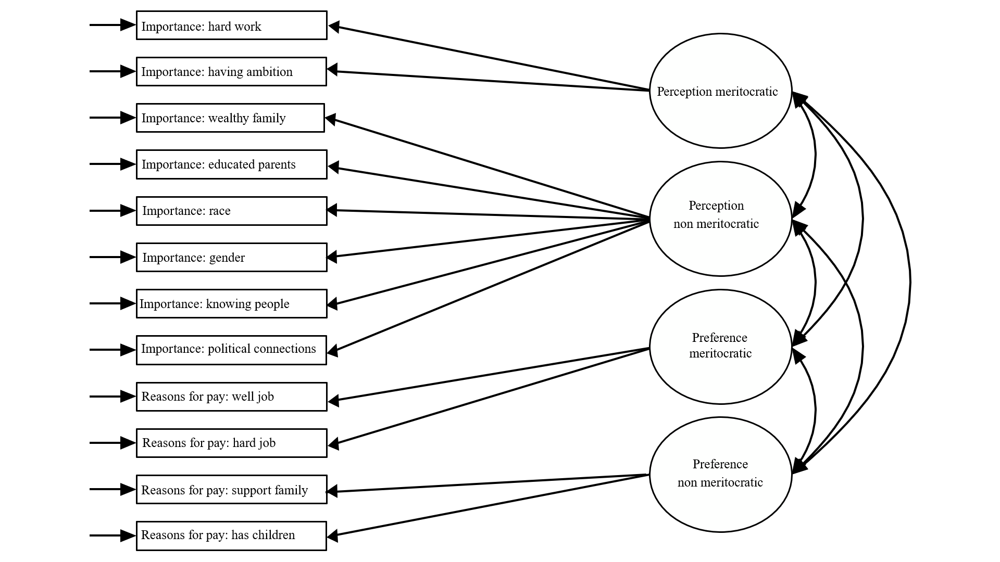

```{r eval=FALSE, include=FALSE}
# for render in pdf run rmarkdown::render_site("docs/paper.Rmd", output_format = "all")
# clean #in the yml
rmarkdown::render("docs/paper.Rmd", output_format = "bookdown::pdf_document2")
rmarkdown::render("docs/paper.Rmd", output_format = "bookdown::html_document2")
```

```{r setup, include=FALSE}
knitr::opts_chunk$set(
	echo = FALSE,
	fig.pos = "H",
	message = FALSE,
	warning = FALSE,
	cache = FALSE,
	out.width = "85%"
)
# knitr::opts_knit$set(base.url = "../") #relative path for .html output file
# knitr::opts_knit$set(root.dir = "../") #relative path for chunks within .rmd files
options(scipen=999)
rm(list=ls())
options(knitr.kable.NA = '')
options(knitr.graphics.error = FALSE)
Sys.setlocale("LC_ALL", "ES_ES.UTF-8")
```

```{r message=FALSE, warning=FALSE, include=FALSE, echo=FALSE}
#RUN THIS BEFORE THE ANALYSIS
pacman::p_load(knitr)

table_format = if(is_html_output()) {
  "html"
} else if(is_latex_output()) {
  "latex"
}

table_format2 = if(is_html_output()) {
  T
} else if(is_latex_output()) {
  F
}
```


## Study 1: Measuring meritocracy with international secondary data

### Data

The data used in the analysis corresponds to the last available wave of the social inequality module from the International Social Survey Programme (ISSP), which is the most specialized international comparative survey in perceptions, attitudes and beliefs about inequality related issues. This wave corresponds to the year 2009 and covers attitudes towards a series of topics dealing with social inequality across 41 countries and 56021 individuals. Although there is data available from this module for previous waves (1987, 1992 and 1999), unfortunately there are several variables that are important for this research that were not included, particularly in 1987 and 1999, reason why we only use the 2009 wave.

### Variables

There are a series of indicators in the ISSP survey that in the following we attempt to classify in our meritocracy measurement scheme. However, it is important to mention  that the items were not originally thought as a specific measure of meritocracy. Still, many of the items have been used in previous research on meritocracy (and certainly will keep being used in the future) and before proposing a new measure we consider to give a first test to our proposed conceptualization using available data that not only covers several countries but also is validated by the research community.

The variables are presented below organized in perceptions and preferences:

- _Perception of meritocracy/non-meritocracy_: for operationalizing perceptions the closest set of ISSP's indicators comes from the question asking about perceptions for opportunities to get ahead, which are usually considered as "meritocratic beliefs" in previous research. The general heading of the battery is: _"To begin we have some questions about opportunities for getting ahead. Please tick one box for each of these to show how important you think it is for getting ahead in life."_ This is followed by a list of statements to be answered in a scale with the following levels numbered from 1 to 5: essential, very important, fairly important, not very important, not important at all. Below the items are listed classified according to the meritocracy/non-meritocracy character:

  - Meritocratic perception:
    - How important is having ambition?
    - How important is hard work?

  - Non-meritocratic perception
    - How important is coming from a wealthy family?
    - How important is having well-educated parents
    - How important is knowing the right people
    - How important is having political connections
    - How important is a person's race?
    - How important is being born a man or a woman?

<br>
  The classification is based on criteria of internal motivation (meritocratic) and structural constraints (non-meritocratic). There were two items from the battery that were excluded from the analysis as they would not fit into the classification. The first one was "having good education yourself", since it was not clear whether this is could be due to individual motivation or system opportunities, and the second was "giving bribes", as introduced elements of criminality that were beyond a non-meritocratic perception.

- Preferences for meritocracy-non meritocracy: for operationalizing normative preferences we used a list of items related to reasons for pay. The ISSP question was: _In deciding how much people ought to earn, how important should each of these things be, in your opinion_, rated in the same _essential-non important at all_ scale as the questions for meritocratic preferences. The reasons are:

  - Meritocratic preferences
    - How well he or she does the job?
    - How hard he or she works at the job?

  - Non-meritocratic preferences
    - What is needed to support a family?
    - Whether the person has children to support?

<!-- (here summary descriptive table - @julio) -->

Table \@ref(tab:desc-issp)

```{r desc-issp, echo=FALSE, results='asis'}
load(file = "input/data/proc/merit_per_pref.rda")
pacman::p_load(dplyr)
merit_per_pref %>% 
  dplyr::select(ambition,hwork,wealthy,pareduc,people,polcone,
                race,gender,welljob,hardjob,family,child) %>% 
  psych::describe() %>% 
  as.data.frame() %>% 
  dplyr::select("Mean"=mean,"SD"=sd,"Min"=min,"Max"=max) %>% 
  round(2) ->desc.issp

row.names(desc.issp) <- c(
  "Importance: hard work",
  "Importance: having ambition",
  "Importance: wealthy family",
  "Importance: educated parents",
  "Importance: race",
  "Importance: gender",
  "Importance: knowing people",
  "Importance: political connections",
  "Reasons for pay: well job",
  "Reasons for pay: hard job",
  "Reasons for pay: support family",
  "Reasons for pay: has children"
)

sum.issp09<- knitr::kable(desc.issp,format =table_format,
                 booktabs= T,
                 align = "l",
                 linesep = "",
                 caption = "Descriptive statistics for the ISSP 2009 sample") %>%
  kableExtra::kable_styling(full_width = table_format2,
                            font_size = 15,
                            position = "center",
                            latex_options = c("HOLD_position"));sum.issp09
```

### Methods

The estimation was performed using Confirmatory Factor Analysis (CFA). CFA was conducted using the `lavaan` R package (version 0.6-3; Rosseel, 2020), with diagonally weighted least squares (DWLS) estimation due to the items’ ordinal level of measurement (Kline, 2016; Rosseel, 2020). As recommended by Brown (2008), we assessed model fit by jointly considering the comparative fit index and Tucker-Lewis Index (CFI and TLI; acceptable fit > 0.95), Root of the average squared residual approximation (RMSEA; acceptable fit < 0.08),  Chi-square: (p-value; acceptable fit > 0.05, and Chi-square ratio > 3).

### Results

```{r}
load(file = "input/data/proc/merit_per_pref.rda")
cfa_perpref1 <- '
	  # latent variables
	  percmerit =~ hwork + ambition
	  percnmerit=~ wealthy + pareduc +race + gender +people + polcone
	  prefmerit =~ welljob + hardjob
	  prefnmerit=~ family + child
	  '
fit_perpref1 <- lavaan::cfa(cfa_perpref1, data = merit_per_pref,
                            ordered = c("wealthy","pareduc","ambition","hwork",
                                        "people","polcone","race","gender",
                                        "respons","yeduc","family","child",
                                        "welljob","hardjob"))
```


<!-- [diagrama SEM] -->

Figure \@ref(fig:meas02-issp)

```{r meas02-issp, echo=FALSE, fig.cap = "Descriptive plot", fig.align='center',fig.cap="Meassurement model for Perceptions and Preferences in meritocracy"}

```

<!-- [tabla CFA] -->

Table \@ref(tab:tb-perpref1)

```{r tb-perpref1, echo=FALSE}
load(file = "input/data/proc/merit_per_pref.rda")
pacman::p_load(dplyr,knitr,kableExtra)
cfa_perpref1 <- '
	  # latent variables
	  percmerit =~ hwork + ambition
	  percnmerit=~ wealthy + pareduc +race + gender +people + polcone
	  prefmerit =~ welljob + hardjob
	  prefnmerit=~ family + child
	  '
fit_perpref1 <- lavaan::cfa(cfa_perpref1, data = merit_per_pref,
                            ordered = c("wealthy","pareduc","ambition","hwork",
                                        "people","polcone","race","gender",
                                        "respons","yeduc",
                                        "family","child",
                                        "welljob","hardjob"))
labs <- c(
  "How important is having ambition?",
  "How important is hard work?",
  "How important is coming from a wealthy family?",
  "How important is having welleducated parents",
  "How important is knowing the right people",
  "How important is having political connections",
  "How important is a person's race?",
  "How important is being born a man or a woman?",
  "How well he or she does the job?",
  "How hard he or she works at the job?",
  "What is needed to support a family?",
  "Whether the person has children to support?"
)

tb.load<- data.frame(round(cbind(lavaan::inspect(fit_perpref1,
                                                        what="std")$lambda),
                           digits = 2))
tb.load[tb.load==c(0.00)] <- NA

for (i in names(tb.load)) {
  # tb.load[,i] <- sjlabelled::as_character(tb.load[,i])
  tb.load[,i] <- sprintf(tb.load[,i], fmt = '%#.2f')
}
tb.load[tb.load=="NA"] <- ""
#-------#
fm01<- data.frame(t(data.frame(lavaan::fitmeasures(fit_perpref1, output ="matrix")[c("chisq","df","cfi","tli","rmsea"),]))); row.names(fm01) ="percnmerit"

#------chi2, df------#
fm04<- round(rbind(fm01),3)
fm04.1 <- fm04 %>% dplyr::select(chisq,df) 
fm04.1$chisq <- round(x = fm04.1$chisq,digits = 1)
fm04.1$df <- round(x = fm04.1$df,digits = 0)
fm04.1$chi2df <- paste0(fm04.1$chisq,"(",fm04.1$df,")")
fm04.1 <- dplyr::select(fm04.1,"chi2df")
for (i in names(fm04.1)) {
  fm04.1[,i] <- as.character(fm04.1[,i])
}

#------CFI, RMSEA------#
fm04.2 <- fm04 %>% dplyr::select(cfi,tli,rmsea) 
for (i in names(fm04.2)) {
  fm04.2[,i] <- sprintf(fm04.2[,i], fmt = '%#.3f')
}

fm.df      <- dplyr::bind_cols(fm04.1,fm04.2)
fm.df$nobs <- c(lavaan::nobs(fit_perpref1)) 
fm.df <- data.frame(t(fm.df)); colnames(fm.df) <- c("percnmerit")


#------ merge ------#
tb.fm<- dplyr::bind_rows(tb.load,fm.df)
tb.fm<- tb.fm %>% 
  dplyr::mutate(vars=c(labs,"$\\chi^2\\text{(df)}$","$\\text{CFI}$",
                       "$\\text{TLI}$","$\\text{RMSEA}$","$N$")) %>%
  dplyr::select(vars,everything())
tb.perpref1 <- tb.fm

# Table --------------------------------------------------------------------.
tb.foot <- paste0("Standardized factor loadings using DWLS estimator ; CFI = Comparative fit index ;TLI = Tucker-Lewis index; RMSEA = Root mean square error of approximation")
tb.col <- c("","Meritocratic","Non-meritocratic",
            "Meritocratic","Non-meritocratic")
tb.caption <- c(" Factor loadings and fit measures for ISSP 2009")
tb.issp<- kable(tb.perpref1,escape = FALSE,
                align = "lcccc",
                col.names = tb.col, 
                caption = tb.caption, 
                booktabs = T,
                linesep = "",
                format = table_format) %>%
          kable_styling(full_width = table_format2,
                        latex_options = c("hold_position"), 
                        position = "center",
                        font_size = 12) %>%
          add_header_above(header = c(" "=1,"Perception"= 2,"Preference"= 2)) %>%
          add_header_above(header = c(" "=1,"Factor loadings"= 4)) %>%
          row_spec(row = 12,hline_after = TRUE) %>%
          add_indent(c(13:17)) %>%
          footnote(general =tb.foot ,footnote_as_chunk = T);tb.issp
```
