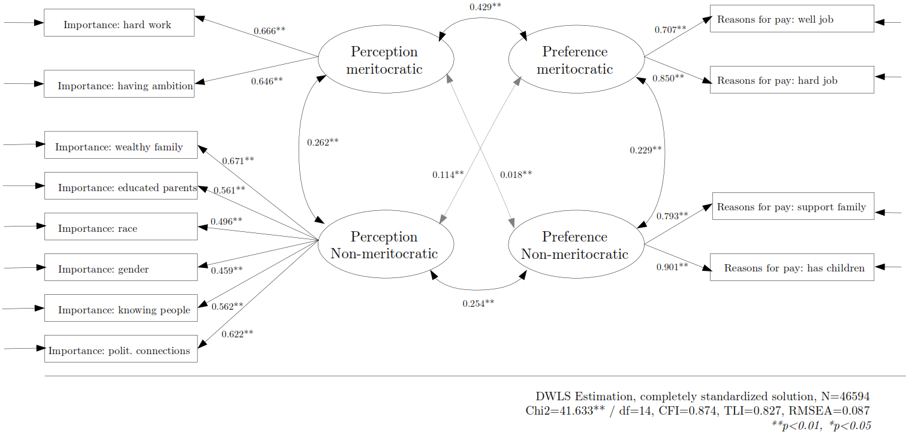

```{r eval=FALSE, include=FALSE}
# for render in pdf run rmarkdown::render_site("docs/paper.Rmd", output_format = "all")
# clean #in the yml
rmarkdown::render("docs/paper.Rmd", output_format = "bookdown::pdf_document2")
rmarkdown::render("docs/paper.Rmd", output_format = "bookdown::html_document2")
```

```{r setup, include=FALSE}
knitr::opts_chunk$set(
	echo = FALSE,
	fig.pos = "H",
	message = FALSE,
	warning = FALSE,
	cache = FALSE
)
# knitr::opts_knit$set(base.url = "../") #relative path for .html output file
# knitr::opts_knit$set(root.dir = "../") #relative path for chunks within .rmd files
options(scipen=999)
rm(list=ls())
options(knitr.kable.NA = '')
options(knitr.graphics.error = FALSE)
Sys.setlocale("LC_ALL", "ES_ES.UTF-8")
```

## Study 1: Measuring meritocracy with international secondary data

## Data

The data used in the analysis corresponds to the last available wave of the social inequality module from the International Social Survey Programme (ISSP), which is the most specialized international comparative survey in perceptions, attitudes and beliefs about inequality related issues. This wave corresponds to the year 2009 and covers attitudes towards a series of topics dealing with social inequality across 41 countries and 56021 individuals. Although there is data available from this module for previous waves (1987, 1992 and 1999), unfortunately there are several variables that are important for this research that were not included, particularly in 1987 and 1999, reason why we only use the 2009 wave.

## Variables

There are a series of indicators in the ISSP survey that in the following we attempt to classify in our meritocracy measurement scheme. However, it is important to mention  that the items were not originally thought as a specific measure of meritocracy. Still, many of the items have been used in previous research on meritocracy (and certainly will keep being used in the future) and before proposing a new measure we consider to give a first test to our proposed conceptualization using available data that not only covers several countries but also is validated by the research community.

The variables are presented below organized in perceptions and preferences:

- _Perception of meritocracy/non-meritocracy_: for operationalizing perceptions the closest set of ISSP's indicators comes from the question asking about perceptions for opportunities to get ahead, which are usually considered as "meritocratic beliefs" in previous research. The general heading of the battery is: _"To begin we have some questions about opportunities for getting ahead. Please tick one box for each of these to show how important you think it is for getting ahead in life."_ This is followed by a list of statements to be answered in a scale with the following levels numbered from 1 to 5: essential, very important, fairly important, not very important, not important at all. 


The classification is based on criteria of internal motivation (meritocratic) and structural constraints (non-meritocratic). There were two items from the battery that were excluded from the analysis as they would not fit into the classification. The first one was "having good education yourself", since it was not clear whether this is could be due to individual motivation or system opportunities, and the second was "giving bribes", as introduced elements of criminality that were beyond a non-meritocratic perception.

- Preferences for meritocracy-non meritocracy: for operationalizing normative preferences we used a list of items related to reasons for pay. The ISSP question was: _In deciding how much people ought to earn, how important should each of these things be, in your opinion_, rated in the same _essential-non important at all_ scale as the questions for meritocratic preferences.

Table \@ref(tab:table-issp) below summarise the items classified according to the proposal based on perception and preference regarding to the meritocratic/non-meritocratic dimensions:

```{r table-issp, echo=FALSE}
pacman::p_load(knitr, kableExtra, dplyr)
table_format = if(knitr::is_html_output()) {
  "html"
} else if(knitr::is_latex_output()) {
  "latex"
}

tableissp <- read.csv(file = "input/tables/table-issp.csv",header = 1,sep = ";",encoding = "UTF-8") # call file generated externally for the table
cnames <- c("Component", "Dimensions","Item")
cap <- "Items of the ISSP meritocratic perceptions and preferences measures"

kable(tableissp, table_format, booktabs = T, linesep = "",col.names = cnames, caption = cap) %>%
  kable_styling(
    full_width = F,
    latex_options = c("hold_position"),
    position = "center",
    font_size = 12,
    bootstrap_options=c("striped", "bordered")) %>%
  column_spec(column = 1, width = "1.5cm", ) %>%
  column_spec(column = 2,width = "2 cm") %>%
  collapse_rows(columns = 1:2,valign = "middle")
```    


# Methods

The estimation was performed using Confirmatory Factor Analysis (CFA). CFA was conducted using the `lavaan` R package (version 0.6-3; Rosseel, 2020), with diagonally weighted least squares (DWLS) estimation due to the items’ ordinal level of measurement (Kline, 2016; Rosseel, 2020). As recommended by Brown (2008), we assessed model fit by jointly considering the comparative fit index and Tucker-Lewis Index (CFI and TLI; acceptable fit > 0.95), Root of the average squared residual approximation (RMSEA; acceptable fit < 0.08),  Chi-square: (p-value; acceptable fit > 0.05, and Chi-square ratio > 3).

# Results

## Descriptive analyses

<!-- (here summary descriptive table - @julio) -->

<!-- Table \@ref(tab:desc-issp) -->

```{r desc-issp, eval=FALSE, include=FALSE, results='asis'}
load(file = "input/data/proc/merit_per_pref.rda")
pacman::p_load(dplyr)
table_format = if(knitr::is_html_output()) {
  "html"
} else if(knitr::is_latex_output()) {
  "latex"
}

table_format2 = if(knitr::is_html_output()) {
  T
} else if(knitr::is_latex_output()) {
  F
}

merit_per_pref %>% 
  dplyr::select(hwork,ambition,wealthy,pareduc,
                race,gender,people,polcone,welljob,hardjob,family,child) %>% 
  psych::describe() %>% 
  as.data.frame() %>% 
  dplyr::select("Mean"=mean,"SD"=sd,"Min"=min,"Max"=max) %>% 
  round(2) ->desc.issp

row.names(desc.issp) <- c(
  "Importance: hard work",
  "Importance: having ambition",
  "Importance: wealthy family",
  "Importance: educated parents",
  "Importance: race",
  "Importance: gender",
  "Importance: knowing people",
  "Importance: political connections",
  "Reasons for pay: well job",
  "Reasons for pay: hard job",
  "Reasons for pay: support family",
  "Reasons for pay: has children"
)

sum.issp09<- knitr::kable(desc.issp,format =table_format,
                 booktabs= T,
                 align = "l",
                 linesep = "",
                 caption = "Descriptive statistics for the ISSP 2009 sample") %>%
  kableExtra::kable_styling(full_width = table_format2,
                            font_size = 15,
                            position = "center",
                            latex_options = c("HOLD_position"));sum.issp09
```


Figure \@ref(fig:likert-issp) shows the distribution of responses across the indicators for each perception and preference in the meritocratic and non-meritocratic dimensions. On one side, we see that there is a certain degree of importance attributed to factors such as hard work and ambition in the process of getting ahead, concentrating 94.8% and 92.8% in the fairly important to essential categories. 

By contrast, for the non-meritocratic aspects, parental background showed a more dispersed opinion, where 61.2% considers that coming from a wealthy family is important, and 76% considers that having educated parents is important.  On the other hand, the background dimension shows that people' opinions are generally in the opposite sense, in which 64.2% consider that a person's racial origin is not very important or not important at all in the process of getting ahead in life, while 35% consider it important, and this is nearly identical regarding the importance of gender. Lastly, we can observe differences in the networks dimension, in which 85.5% consider it to be important to know the right people in the process of getting ahead in life, contrasting with 50% who consider political connections to be important. 

Regarding normative preferences, we observe how well a person performs his or her job and amount of effort involved concentrates 98% and 96.8% of the responses in the categories that attribute importance to these characteristics when evaluating the pay that people deserve. Finally, in relation to structural constrains, 83.3% attribute importance to the fact that supporting a family should be a relevant factor with respect to the pay obtained, while having children to support translates into 76.5% of importance in this dimension. 


```{r}
load(file = "input/data/proc/merit_per_pref.rda")
pacman::p_load(dplyr)
likert_issp<- merit_per_pref %>% 
  dplyr::select(hwork,ambition,wealthy,pareduc,
                race,gender,people,polcone,
                welljob,hardjob,family,child)

likert_issp <- sjlabelled::set_label(likert_issp,
                                     label = c("Hard work",
                                               "Having ambition",
                                               "Wealthy family",
                                               "Educated parents",
                                               "Race",
                                               "Gender",
                                               "Knowing people",
                                               "Political connections",
                                               "Well job",
                                               "Hard job",
                                               "Support family",
                                               "Has children"))


likert_issp <- sjmisc::rec(likert_issp, rec="rev", append=FALSE)
likert_issp <- 
  sjlabelled::set_labels(likert_issp,
                         labels = c("Essential","Very important",
                                    "Fairly important","Not very important",
                                    "Not important at all"))

plot_likert_issp<- sjPlot::plot_likert(likert_issp,
                        c(1, 1, 2, 2, 2, 2, 2, 2,3,3,4,4),
                        groups.titles = c("Perception meritocratic", "Perception Non-meritocratic",
                                          "Preference meritocratic", "Preference Non-meritocratic"),
                        geom.colors = "PuBu",
                        geom.size = 0.8,
                        catcount = 5,
                        # cat.neutral = 3,
                        grid.range  =  c(1.2 , 1.4),
                        values  =  "sum.outside",
                        reverse.colors = T,
                        reverse.scale = F,
                        show.n=FALSE)

```


```{r likert-issp,fig.height=10,fig.width=12,fig.cap="Distribution of responses in the ISSP meritocracy items"}
plot_likert_issp
```


In terms of the association between the indicators, Figure \@ref(fig:corr-issp) shows the polychoric correlation matrix. Firstly, we see that the correlations between the indicators are consistent with the structure of the initially proposed structure of dimensions distinguishing between the perception and preferences of meritocratic and non-meritocratic factors.  In general, the associations are positive between the perception and preference dimensions, such as the importance of hard work to get ahead and the importance of how hard the work is ($r$=0.34), however, they tend to be weak. A further aspect to consider is the relatively low correlation between dimensions concerning meritocratic and non-meritocratic aspects, (e.g. importance of hard work with educated parents, $r$=0.15). However, with respect to the non-meritocratic perception indicators, we can see that the associations demonstrate dimensionality, however, it is not entirely clear. In this regard, the indicators referring to parental characteristics have a positive and stronger association ($r$=0.56), but this association is much weaker in comparison to the other indicators of Non-meritocratic perception (e.g. Wealthy family and Gender, $r$=0.01).  The same holds true for the Gender and Race indicators ($r$=0.6), and also applies to both the indicators of knowing the right people and having political connections ($r$=0.55). On this point, we will return to it in the next section.


```{r corr-issp,fig.cap = "Perceptions & preferences for ISSP  meritocracy items' polychoric correlations", fig.align='center',fig.height=6,fig.width=8}
pacman::p_load(dplyr)
cor_issp<- 
  merit_per_pref %>%
  dplyr::select(hwork,ambition,wealthy,pareduc,
                race,gender,people,polcone,
                welljob,hardjob,family,child) %>% 
  lavaan::lavCor(., ordered=names(.))
diag(cor_issp) = NA
rownames(cor_issp) <- c("A. Hard work",
                       "B. Having ambition",
                       "C. Wealthy family",
                       "D. Educated parents",
                       "E. Race",
                       "F. Gender",
                       "G. Knowing people",
                       "H. Political connections",
                       "I. Well job",
                       "J. Hard job",
                       "K. Support family",
                       "L. Has children")
colnames(cor_issp) <-c("(A)", "(B)","(C)","(D)","(E)","(F)","(G)", 
                       "(H)", "(I)","(J)","(K)","(L)")
corrplot::corrplot(cor_issp,
  method = "color",
  addCoef.col = "#000390",
  type = "upper",
  tl.col = "black",
  col=colorRampPalette(c("white","#0068DC"))(12),
  bg = "white",
  na.label = "-",
  lower.col = "black")
```


## Confirmatory Factor Analysis

This section presents the results of the confirmatory factor analysis. First, a four-dimensional model for meritocratic and non-meritocratic perception and preferences is estimated, considering all indicators of the non-meritocratic perception dimension as a single latent variable. Then, we estimate a model that follows the proposed four latent variable measurement approach, however, the non-meritocratic perception dimension is assumed as a second-order factor for the first order latent variables parental attributes, racial and gender background and networks. 


```{r sum-fit-issp}
load(file = "input/data/proc/merit_per_pref.rda")
pacman::p_load(dplyr, kableExtra, knitr)

cfa_perpref1 <- '
	  # latent variables
	  percmerit =~ hwork + ambition
	  percnmerit=~ wealthy + pareduc +race + gender +people + polcone
	  prefmerit =~ welljob + hardjob
	  prefnmerit=~ family + child
	  '
fit_perpref1 <- lavaan::cfa(cfa_perpref1, data = merit_per_pref,ordered = T)

cfa_perpref2 <- '
	  # latent variables
	  percmerit =~ hwork + ambition
	  parents =~ wealthy + pareduc
	  backgrd =~ race + gender
	  networks=~ people + polcone
	  percnmerit=~ parents + backgrd + networks
	  prefmerit =~ welljob + hardjob
	  prefnmerit=~ family + child
	  '
fit_perpref2 <- lavaan::cfa(cfa_perpref2, data = merit_per_pref,ordered = T)

# extract fit indices from models and add to table
sum_fit_issp<- dplyr::bind_rows(
  lavaan::fitmeasures(fit_perpref1)[c("chisq","df","cfi","tli","rmsea")],
  lavaan::fitmeasures(fit_perpref2)[c("chisq","df","cfi","tli","rmsea")]
  )

# Customize object
sum_fit_issp$mod <- c("First order","Second order")
sum_fit_issp$nobs <- c(lavaan::nobs(fit_perpref2),lavaan::nobs(fit_perpref2))
sum_fit_issp$est <- c("DWLS","DWLS")
sum_fit_issp <- dplyr::select(sum_fit_issp,mod,nobs,est,dplyr::everything())
colnames <- c("Model","$N$","Estimator","$\\chi^2$","df","CFI","TLI","RMSEA")

# Create table
table_issp_fits <-
  knitr::kable(sum_fit_issp, format="html", digits=3, booktabs=T, 
               col.names=colnames,  
               caption = "Summary fit indices according to model", 
               escape = FALSE) %>%
  kableExtra::kable_styling(full_width = F, 
                            font_size = 15,
                            bootstrap_options=c("striped", "bordered"))
table_issp_fits
```

Table \@ref(tab:sum-fit-issp) shows the four-factor model fit allowing comparison of first and second-order factors. The model restricted to four first-order factor dimensions shows a regular fit (CFI=0.959, TLI=0.944, RMSEA=0.098, χ2(df=48)= 21308.535; more detail in Table \@ref(tab:tb-perpref1)) in contrast to the model considering a second-order factor for non-meritocratic perception that has a slightly better fit based on the standard fit measures (CFI=0.959, TLI=0.944, RMSEA=0.098, χ2(df=48)= 21308.535).  


<!-- [diagrama SEM] -->

```{r meas02-issp, echo=FALSE, fig.cap = "Descriptive plot", fig.align='center',fig.cap="Confirmatory factor analysis of the ISSP indicators of Perceptions and Preferences for Meritocracy"}

```

<!-- [tabla CFA] -->

Figure \@ref(fig:meas02-issp) shows the overall results for this model, evidencing an improvement in factor loadings as well as in the overall fit of the measurement model. On one hand, we see that perceptions are correlated with preferences, but this correlation is stronger for the meritocratic dimension of perception and preference ($r$=0.46) than for the non-meritocratic ($r$=0.27), which is much stronger when looking at the correlations between meritocratic and non-meritocratic, both in perception ($r$=0.04) and preference ($r$=0.13). These results show that, on one hand, the positive correlation between perception indicates that the two are not completely opposite poles of a continuum ($r$=0.30), which is reflected in the correlation between preferences ($r$=0.25). Furthermore, it is shown that the indicators of non-meritocratic perception refer to three other sub-dimensions and cannot be completely attributed to a an entirely common factor as has been employed in previous research.


# Appendix

Table \@ref(tab:tb-perpref1)

```{r tb-perpref1, echo=FALSE}
load(file = "input/data/proc/merit_per_pref.rda")
pacman::p_load(dplyr,knitr,kableExtra)
options(knitr.kable.NA = '')
table_format = if(knitr::is_html_output()) {
  "html"
} else if(knitr::is_latex_output()) {
  "latex"
}

table_format2 = if(knitr::is_html_output()) {
  T
} else if(knitr::is_latex_output()) {
  F
}

cfa_perpref1 <- '
	  # latent variables
	  percmerit =~ hwork + ambition
	  percnmerit=~ wealthy + pareduc +race + gender +people + polcone
	  prefmerit =~ welljob + hardjob
	  prefnmerit=~ family + child
	  '
fit_perpref1 <- lavaan::cfa(cfa_perpref1, data = merit_per_pref,
                            ordered = c("wealthy","pareduc","ambition","hwork",
                                        "people","polcone","race","gender",
                                        "respons","yeduc",
                                        "family","child",
                                        "welljob","hardjob"))
labs <- c(
  "Importance: hard work",
  "Importance: having ambition",
  "Importance: wealthy family",
  "Importance: educated parents",
  "Importance: race",
  "Importance: gender",
  "Importance: knowing people",
  "Importance: political connections",
  "Reasons for pay: well job",
  "Reasons for pay: hard job",
  "Reasons for pay: support family",
  "Reasons for pay: has children"
)

tb.load<- data.frame(round(cbind(lavaan::inspect(fit_perpref1,
                                                        what="std")$lambda),
                           digits = 3))
tb.load[tb.load==c(0.00)] <- NA

for (i in names(tb.load)) {
  tb.load[,i] <- sprintf(tb.load[,i], fmt = '%#.3f')
}
tb.load[tb.load=="NA"] <- ""
#-------#
fm01<- data.frame(t(data.frame(lavaan::fitmeasures(fit_perpref1, output ="matrix")[c("chisq","df","cfi","tli","rmsea"),]))); row.names(fm01) ="percnmerit"

#------chi2, df------#
fm04<- round(rbind(fm01),3)
fm04.1 <- fm04 %>% dplyr::select(chisq,df) 
fm04.1$chisq <- round(x = fm04.1$chisq,digits = 1)
fm04.1$df <- round(x = fm04.1$df,digits = 0)
fm04.1$chi2df <- paste0(fm04.1$chisq,"(",fm04.1$df,")")
fm04.1 <- dplyr::select(fm04.1,"chi2df")
for (i in names(fm04.1)) {
  fm04.1[,i] <- as.character(fm04.1[,i])
}

#------CFI, RMSEA------#
fm04.2 <- fm04 %>% dplyr::select(cfi,tli,rmsea) 
for (i in names(fm04.2)) {
  fm04.2[,i] <- sprintf(fm04.2[,i], fmt = '%#.3f')
}

fm.df      <- dplyr::bind_cols(fm04.1,fm04.2)
fm.df$nobs <- c(lavaan::nobs(fit_perpref1)) 
fm.df <- data.frame(t(fm.df)); colnames(fm.df) <- c("percnmerit")


#------ merge ------#
tb.fm<- dplyr::bind_rows(tb.load,fm.df)
tb.fm<- tb.fm %>% 
  dplyr::mutate(vars=c(labs,"$\\chi^2\\text{(df)}$","$\\text{CFI}$",
                       "$\\text{TLI}$","$\\text{RMSEA}$","$N$")) %>%
  dplyr::select(vars,everything())
tb.perpref1 <- tb.fm

# Table --------------------------------------------------------------------.
tb.foot <- paste0("Standardized factor loadings using DWLS estimator ; CFI = Comparative fit index ;TLI = Tucker-Lewis index; RMSEA = Root mean square error of approximation")
tb.col <- c("","Meritocratic","Non-meritocratic",
            "Meritocratic","Non-meritocratic")
tb.caption <- c(" Factor loadings and fit measures for ISSP 2009")
tb.issp<- kable(tb.perpref1,escape = FALSE,digits = 3,
                align = "lcccc",
                col.names = tb.col, 
                caption = tb.caption, 
                booktabs = T,
                linesep = "",
                format = table_format) %>%
          kable_styling(full_width = table_format2,
                        latex_options = c("hold_position"), 
                        position = "center",
                        font_size = 12) %>%
          add_header_above(header = c(" "=1,"Perception"= 2,"Preference"= 2)) %>%
          add_header_above(header = c(" "=1,"Factor loadings"= 4)) %>%
          row_spec(row = 12,hline_after = TRUE) %>%
          add_indent(c(13:17)) %>%
          footnote(general =tb.foot ,footnote_as_chunk = T);tb.issp
```
